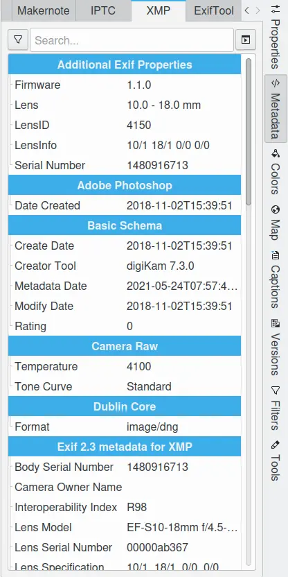

.. meta::
   :description: digiKam Right Sidebar Metadata View
   :keywords: digiKam, documentation, user manual, photo management, open source, free, learn, easy, sidebar, metadata, exif, iptc, xmp, makernotes, exiftool

.. metadata-placeholder

   :authors: - digiKam Team

   :license: see Credits and License page for details (https://docs.digikam.org/en/credits_license.html)

.. _metadata_view:

Metadata View
=============

.. contents::

Metadata are data about the images or files, like technical data of camera setting during shooting, author info, copyrights, keywords, captions, and coordinates of location.

The metadata sidebar is composed of five sub tabs **Exif**, **Makernote**, **IPTC**, **XMP**, and **ExifTool** Metadata, as shown in these four tabs, can be modified and enhanced in a number of ways elsewhere:

    - With the :ref:`Camera interface <camera_import>`.

    - The :ref:`Metadata Editor <metadata_editor>`.

    - The :ref:`Geolocation tool <geoeditor_overview>`.

    - Copying :ref:`database information to files metadata <maintenance_metadata>`.

    - Copying :ref:`file's metadata to the database <maintenance_database>`.

.. figure:: images/sidebar_metadataexif.webp
    :alt:
    :align: center

    The Metadata View From Right Sidebar Displaying Exif Information

For each metadata section, a bar is available on the top of view with:

    - A menu from the left button to use different levels to display contents through:

        - **No Filter**: display all markers.
        - **Photograph**: display only more important marker for photograph.
        - **Custom**: a customized selection of marker set in configuration dialog (see Settings entry).

    - A really nice feature is the live search box on the middle end of bar. As you type in a keyword, the metadata on top of it will be successively filtered until you narrow down and what you are looking for. It is a quick way of accessing specific information.

    - A menu from the right button to export contents:

        - **Copy to clipboard**: share text information in memory to copy and paste in other application.
        - **Save to file**: save chunk of information in data file.
        - **Print data**: export information in PDF file or to your printer.

.. note::

    The metadata view preserve the filter settings depending of the file selected. This allow to compare quickly metadata contents between items to identify the differences.

.. _exif_tags:

Exif Tags
~~~~~~~~~

Exif stands for `Exchangeable image file format <https://en.wikipedia.org/wiki/Exif>`_. It was designed specifically for digital cameras. It allows a large amount of information about the photograph to be stored. This information describes the camera which took the image along with the settings (including date and time) in use when the image was taken. An in-line thumbnail can be included.

Exif format contains a set of marker sections named *Image File Directories* (IFD). The sections likely to be found in a normal Exif file are as follows:

    - **Image Information**: contains general information about the image.

    - **Embedded Thumbnail**: contains information about the embedded thumbnail image.

    - **Photograph Information**: contains extended information about the photograph.

    - **Interoperability**: contains information to support interoperability between different Exif implementations.

You can review embedded Exif information for the selected image from the first sidebar tab. The Exif Viewer is purely informational: nothing you do with it will cause any change to the Exif sections. If there are more entries than space available, just scroll down with the mouse wheel.

Some vendors add additional Exif sections, such as Canon, Fujifilm, Nikon, Minolta, and Sigma. These sections contain vendor and model specific notes. These will be displayed on the **Makernote** tab.

.. _markernotes_tags:

Makernote Tags
~~~~~~~~~~~~~~

The Exif standard defines a Makernote tag, which allows camera manufacturers to place any custom format metadata in the file. This is used increasingly by camera manufacturers to store a myriad of camera settings not listed in the Exif standard, such as shooting modes, post-processing settings, serial number, focusing modes, etc. but this tag format is proprietary and manufacturer specific.

You can review embedded Makernote information for the selected image in this sidebar tab. The Makernote Viewer is purely informational: nothing you do with it will cause any change to the Makernote sections.

.. figure:: images/sidebar_metadatamakernotes.webp
    :alt:
    :align: center

    The Metadata View From Right Sidebar Displaying Markernote Information

.. _iptc_tags:

IPTC Tags
~~~~~~~~~

The `International Press Telecommunications Council <http://www.iptc.org>`_, is a consortium of the world's major news agencies and news industry vendors. It develops and maintains technical standards for improved news exchange that are used by virtually every major news organization in the world.

The IPTC was established in 1965 by a group of news organizations to safeguard the telecommunications interests of the world's press. Since the late 1970s IPTC's activities have primarily focused on developing and publishing industry standards for the interchange of news data.

In particular, the IPTC defined a set of metadata attributes that can be applied to images. These were defined originally in 1979, and revised significantly in 1991 to be the *Information Interchange Model* (IIM), but the concept really advanced in 1994 when Adobe defined a specification for actually embedding the metadata into digital image files - known as *IPTC headers*.

You can review embedded IPTC information for the selected image in this sidebar tab. The IPTC Viewer is purely informational: nothing you do with it will cause any change to the IPTC sections.

.. figure:: images/sidebar_metadataiptc.webp
    :alt:
    :align: center

    The Metadata View From Right Sidebar Displaying IPTC Information

.. _xmp_tags:

XMP Tags
~~~~~~~~

The `Extensible Metadata Platform <https://fr.wikipedia.org/wiki/Extensible_Metadata_Platform>`_ (XMP) is an ISO standard, originally created by Adobe Systems Inc., for the creation, processing and interchange of standardized and custom metadata for digital documents and data sets.

XMP standardizes a data model, a serialization format and core properties for the definition and processing of extensible metadata. It also provides guidelines for embedding XMP information into popular image, video and document file formats, without breaking their readability by applications that do not support XMP.

Although metadata can alternatively be stored in a sidecar file, embedding metadata avoids problems that occur when metadata is stored separately.

XMP is given to replace IPTC as well.

You can review embedded XMP information for the selected image in this sidebar tab. The XMP Viewer is purely informational: nothing you do with it will cause any change to the XMP sections.

    The Metadata View From Right Sidebar Displaying XMP Information

.. _exiftool_view:

ExifTool View
~~~~~~~~~~~~~

`ExifTool <https://en.wikipedia.org/wiki/ExifTool>`_ is a free and open-source program for reading, writing, and manipulating image, audio, video, and PDF metadata. It is platform independent as a command-line Perl application. Prior, digiKam use Exiv2 library to handle metadata, but it can use also ExifTool as an alternative to incorporate different types of digital workflows not supported by Exiv2.

ExifTool supports many types of metadata including Exif, IPTC, XMP, JFIF, GeoTIFF, ICC Profile, Photoshop IRB, FlashPix, AFCP and ID3, as well as the manufacturer-specific metadata formats of many digital cameras.

You can review information decoded by ExifTool for the selected image in this sidebar tab. The ExifTool Viewer is purely informational: nothing you do with it will cause any change to the information.

.. figure:: images/sidebar_metadataexiftool.webp
    :alt:
    :align: center

    The Metadata View From Right Sidebar Displaying ExifTool Information
