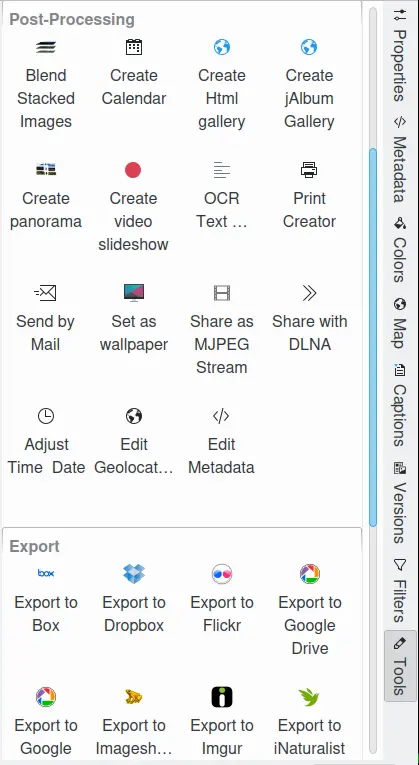

.. meta::
   :description: digiKam Right Sidebar Tools View
   :keywords: digiKam, documentation, user manual, photo management, open source, free, learn, easy, tools, post-processing, export

.. metadata-placeholder

   :authors: - digiKam Team

   :license: see Credits and License page for details (https://docs.digikam.org/en/credits_license.html)

.. _tools_view:

Tools View
=============

.. contents::

The tools view in the Right Sidebar displays a list of actions that can be applied to the selected images. The actions are displayed as list of icons sorted by category. This view give a quick preview of all of the actions available from the main menu. For example, applying the OCR Text Converter tool to a selection of 5 thumbnails in the Image Area will apply an OCR engine to recognize text in all 5 images.

    The Tools View From Right Sidebar

