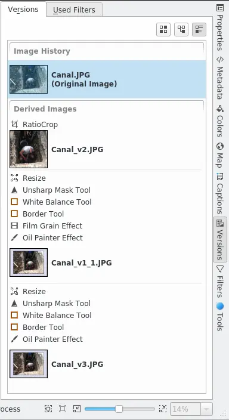

.. meta::
   :description: digiKam Right Sidebar Versions View
   :keywords: digiKam, documentation, user manual, photo management, open source, free, learn, easy

.. metadata-placeholder

   :authors: - digiKam Team (see Credits and License for details)

   :license: Creative Commons License SA 4.0

.. _versions_view:

Versions View
=============

.. contents::

The Versions tab shows the history and the saved versions of a photograph. With the three buttons in the top right corner you can choose between a simple list of the saved versions, a tree view and a combined list that shows the versions together with the actions performed with the selected photograph.

.. figure:: images/sidebar_versionstree.webp

The tree view shows the parent and child versions of the selected image. Here the second and the fifth version derive directly from the original image, the third and forth version are children of the second version.

The combined list shows the versions together with the actions/filters applied to them. Here the second version was created by resizing the original, applying the unsharp mask, correcting the white balance and finally adding a frame with the border tool. The child versions are grouped in Derived Versions and Related Versions. Related Versions arise if you modify the original and save the changes with Save As New Version.

To learn how to control what is stored as a separate version and which versions are displayed in the Image Area see :ref:`Image Versioning Settings <editor_settings>`.
