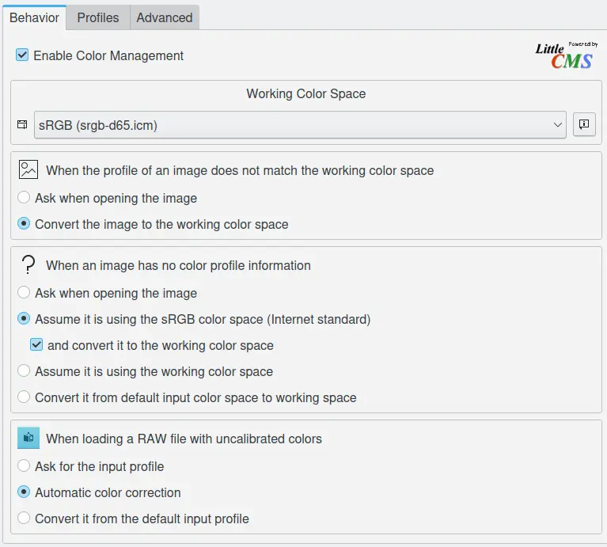
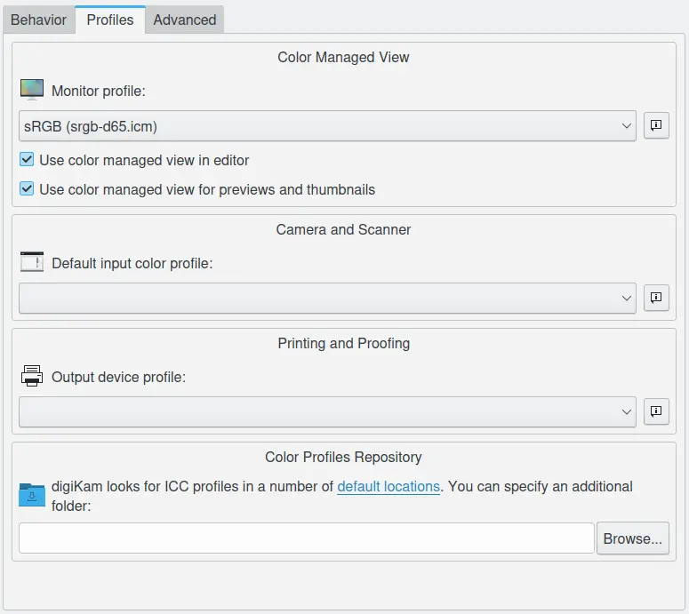
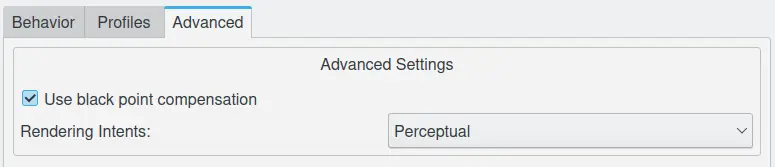

.. meta::
   :description: digiKam Color Management Settings
   :keywords: digiKam, documentation, user manual, photo management, open source, free, learn, easy, configure, setup, color management, icc, profile

.. metadata-placeholder

   :authors: - digiKam Team

   :license: see Credits and License page for details (https://docs.digikam.org/en/credits_license.html)

.. _cm_settings:

Color Management Settings
=========================

.. contents::

Overview
--------

digiKam is color-management enabled application. RAW files - as they come - are not color managed at all. Your camera provides the data it has captured in a raw format and will let you manage all the processing. Every camera has its specifics as to how it captures color information, therefore you will need to apply a specific profile to the images you want to process. Please refer to the section :ref:`ICC color profile management <color_management>` for more details an explanations.

Basically, a profile *maps* the color information and gives information on how one should render them. It gives also information to LCMS backend and digiKam on how to translate the color information from one color space to an other in order to keep the colors as accurate as possible across all rendering media.

Behavior Settings
-----------------

The **Behavior** view ask when opening an image in Image Editor or when you use the Color Management tool with RAW files.

    The Color Management Behavior Configuration Page 

**Enable Color Management** is the lead option to turn on/off this feature.
    
You have to provide a **Working Color Space** profile (linear profiles such as sRGB, ECI-RGB, LStar-RGB, Adobe-RGB or CIE-RGB). If you want to print your images, you may want to opt for Adobe RGB, if it is only for web publishing, sRGB is better (Adobe RGB will be displayed slightly dull in non color managed enabled software such as browsers). However you may change this later of course (by attributing another profile), therefore Adobe RGB can be a good choice for storing and image handling as you can always change it to sRGB before releasing an image for your blog. Note: Do not use non-linear profiles as they will change the color-balance.

The tree next sections from this view set the rules for different use cases:

    - **When the profile of an image does not match the working color space**: this condition provide two options listed below.
    
        - **Ask when opening the image**: If an image has an embedded color profile not matching the working space profile, digiKam will ask if you want to convert to the working space, keep the embedded profile or discard the embedded profile and assign a different one.

        - **Convert the image to the working color space**: If an image has an embedded color profile not matching the working space profile, digiKam will convert the image's color information to the working color space. This changes the pixel data, but not the appearance of the image.

    - **When an image has no color profile information**: this condition provide four options listed below.
    
        - **Ask when opening the image**: If an image has no embedded color profile, digiKam will ask which color space shall be used to interpret the image and to which color space it shall be transformed for editing.

        - **Assume it is using the sRGB color space**: in this case, the image is target for an Internet usage. The **and convert it to the working color space** allows to force conversion to the **Working Color Space** previously defined.

        - **Assume it is using the working color space**: in this case, the image is not target for a specific usage, and **Working Color Space** is used for the conversion.

        - **Convert it from default input color space to working space**: in this case, the convertion to the **Working Color Space** will be done to include the **Default input color profile** defined in the next settings view.

    - **When loading a RAW file with uncalibrated colors**: this condition provide tree options listed below.
    
        - **Ask for the input profile**: digiKam propmt a question to the user to select right **Input color profile** to use.

        - **Automatic color correction**: digiKam will perform an automatic colors auto-correction based of image historgram analysis.

        - **Convert it from the default input profile**: digiKam will use the **Default input color profile** defined in the next settings view.

Profiles Settings
-----------------

The ICC **Profiles Settings**: here you are given the ability to provide *default* choices for your profiles. Everything is adaptable later-on at the opening of a RAW file.

    The Color Management Profiles Configuration Page 

The **Monitor profile** option allows to select the color profile for your screen.
    
The **Use color managed view** is an alternative to using desktop color management. Only your image in editor will be color managed, not your entire screen. You can at any time toggle this option everywhere in digiKam. This can slow down rendering of the image, depending on the speed of your computer.

**Use color managed view for previews and thumbnails**: with this option, you can also use the color managament to render previews and thumbnails in Icon-View, Light-Table, and Import Tool; 

The **Default Input color profile** should match the camera maker and model you are using. *Not all profiles are created equal*, there are some that have no tone mapping/gamma correction included (For example Canon camera). In some conditions gamma can be not corrected for 16 bit depth conversion, which means that you have to do the tone mapping yourself.

The **Output device profile** should match the profile for your output device, usually your printer. This profile will be used to do a :ref:`soft proof <soft_proof>`, so you will be able to preview how an image will be rendered via an output device. It enables you to emulate, granted that you have a profile for it, how your image will render for a particular device. It is useful before printing for instance because your printer has a smaller gamut than your camera and some colors might look saturated. You may want to fix this manually instead of relying on the "blind" algorithm of your printer. 

The **Color Profiles Repository**: digiKam looks for ICC profiles in a number of default locations e.g. :file:`/usr/share/color/icc` or. Set this to the folder where you store extra profiles e.g :file:`/home/user/.color/icc`. digiKam will scan these folders when starting up.

Advanced Settings
-----------------

**Use black point compensation**: this setting is a way to make adjustments between the maximum black levels of digital files and the black capabilities of various digital devices.

**Rendering Intents**: this setting provide four options listed below.

    - **Perceptual**: causes the full gamut of the image to be compressed or expanded to fill the gamut of the destination device, so that gray balance is preserved but colorimetric accuracy may not be preserved. In other words, if certain colors in an image fall outside of the range of colors that the output device can render, the image intent will cause all the colors in the image to be adjusted so that the every color in the image falls within the range that can be rendered and so that the relationship between colors is preserved as much as possible. This intent is most suitable for display of photographs and images, and is the default intent.

    - **Relative Colorimetric**: is defined such that any colors that fall outside the range that the output device can render are adjusted to the closest color that can be rendered, while all other colors are left unchanged. Proof intent does not preserve the white point.

    - **Absolute Colorimetric**: causes any colors that fall outside the range that the output device can render to be adjusted to the closest color that can be rendered, while all other colors are left unchanged. This intent preserves the white point and is most suitable for spot colors (Pantone, TruMatch, logo colors, etc.).

    - **Saturation**: preserves the saturation of colors in the image at the possible expense of hue and lightness. Implementation of this intent remains somewhat problematic, and the ICC is still working on methods to achieve the desired effects. This intent is most suitable for business graphics such as charts, where it is more important that the colors be vivid and contrast well with each other rather than a specific color.

    The Color Management Advanced Configuration Page 

.. note::

    For most cameras it is pretty obvious what color profile they propose for the type at hand, not so for the Canon's. Here is a table of camera/profiles matches, it is non-authoritative of course:

    ================== ==============
    Camera             Profile series
    ================== ==============
    Canon 1D mark II   6051
    Canon 1D mark II   6111
    Canon 1Ds          6021
    Canon 1Ds mark II  6081
    Canon 5D           6091
    Canon 10D          6031
    Canon 20D          6061
    Canon 30D          6112
    Canon 40D          6101
    Canon 300D         6031
    Canon 350D         6111 or 6071
    Canon 400D         6131
    ================== ==============

    The Canon profile extension betray the target style: F for Faithful Style, L for Landscape Style, N for Neutral Style, P for Portrait Style, S for Standard Style.

Here you find a typical :ref:`RAW workflow <rawprocessing_workflow>` scenario with Image Editor.
