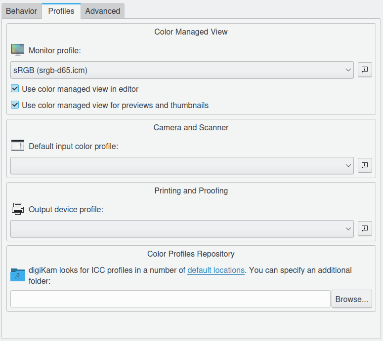
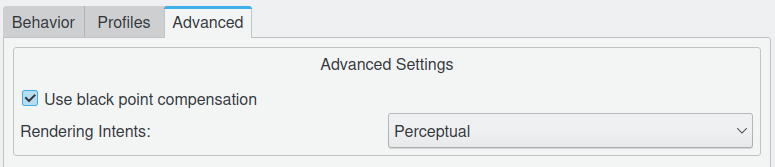

.. meta::
   :description: digiKam Color Management Settings
   :keywords: digiKam, documentation, user manual, photo management, open source, free, learn, easy

.. metadata-placeholder

   :authors: - Gilles Caulier <caulier dot gilles at gmail dot com>

   :license: Creative Commons License SA 4.0

.. _cm_settings:

Color Management Settings
=========================

.. contents::

digiKam is color-management enabled. RAW files - as they come - are not color managed at all. Your camera provides the data it has captured in a raw format and will let you manage all the processing. Every camera has its specifics as to how it captures color information, therefore you will need to apply a specific profile to the images you want to process. Please refer to the section ICC color profile management for more details an explanations.

Basically, a profile "maps" the color information and gives information on how one should render them. It gives also information to LCMS and digiKam on how to translate the color information from one color space to an other in order to keep the colors as accurate as possible across all rendering media.

.. figure:: images/setup_cm_behavior.png

Behavior Ask when opening an image in image editor / Launch Color Management tool with RAW files

Color Profiles Directory : set this to the folder where you store all your profiles e.g. "/usr/share/color/icc" or "/home/user/.color/icc". digiKam will scan this folder when starting up.

ICC Profiles Settings : here you are given the ability to provide "default" choices for your profiles. Everything is adaptable later-on at the opening of a RAW file.

    The Use color managed view is an alternative to using Xcalib or Argyll. Only your image will be color managed, not your entire screen!

    You have to provide a workspace profile (linear profiles such as sRGB, ECI-RGB, LStar-RGB, Adobe-RGB or CIE-RGB). If you want to print your images, you may want to opt for Adobe RGB, if it is only for web publishing, sRGB is better (Adobe RGB will be displayed slightly dull in non color managed enabled software such as browsers). However you may change this later of course (by attributing another profile), therefore Adobe RGB can be a good choice for storing and image handling as you can always change it to sRGB before releasing an image for your blog. Note: Do not use non-linear profiles as they will change the color-balance.

    The input profile should match the camera maker and model you are using. 'Not all profiles are created equal', there are some that have no tone mapping/gamma correction included (Canon). In some conditions gamma can be  not corrected for 16 bit depth conversion, which means that you have to do the tone mapping yourself.

    There are some other options such as the soft proof profile which enables you to emulate, granted that you have a profile for it, how your image will render for a particular device. It is useful before printing for instance because your printer has a smaller gamut than your camera and some colors might look saturated. You may want to fix this manually instead of relying on the "blind" algorithm of your printer. 

For most cameras it is pretty obvious what color profile they propose for the type at hand, not so for the Canon's. Here is a table of camera/profiles matches, it is non-authoritative of course:

================== ==============
Camera             Profile series
================== ==============
Canon 1D mark II   6051
Canon 1D mark II   6111
Canon 1Ds          6021
Canon 1Ds mark II  6081
Canon 5D           6091
Canon 10D          6031
Canon 20D          6061
Canon 30D          6112
Canon 40D          6101
Canon 300D         6031
Canon 350D         6111 or 6071
Canon 400D         6131
================== ==============

The Canon profile extension betray the target style: F for Faithful Style, L for Landscape Style, N for Neutral Style, P for Portrait Style, S for Standard Style.

Here you find a typical RAW workflow scenario.

