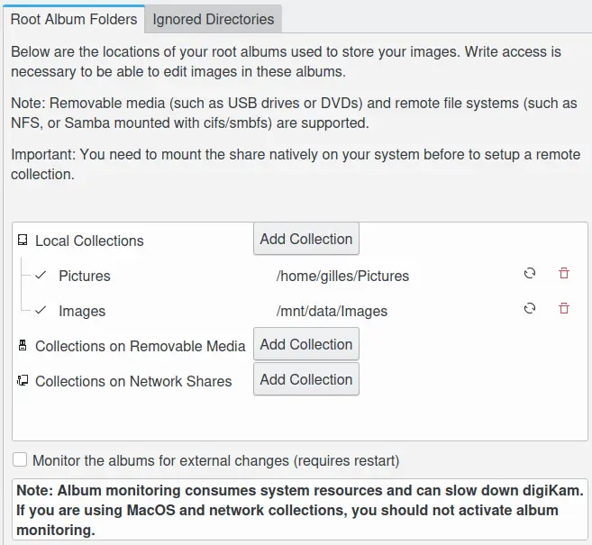

.. meta::
   :description: digiKam Collections Settings
   :keywords: digiKam, documentation, user manual, photo management, open source, free, learn, easy

.. metadata-placeholder

   :authors: - digiKam Team

   :license: see Credits and License page for details (https://docs.digikam.org/en/credits_license.html)

.. _collections_settings:

Collections Settings
====================

.. contents::

This view manages your Album Collections. Each Collection represents a root folder containing your photographs or videos. Usually the root folder will contain sub folders. All these folders we call Albums. How to work with them, create, delete, rename them etc. is described in detail in the Albums View section.

