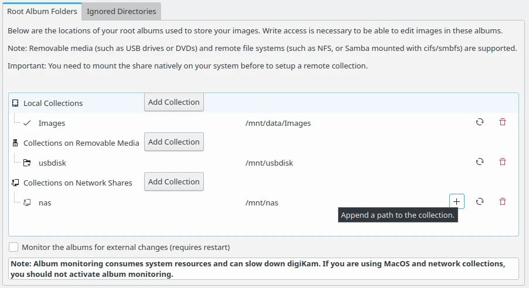
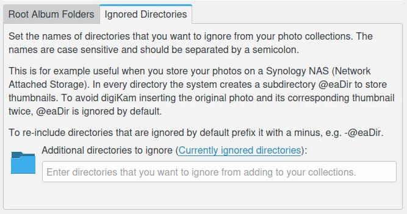

.. meta::
   :description: digiKam Collections Settings
   :keywords: digiKam, documentation, user manual, photo management, open source, free, learn, easy, collection, setup, configure

.. metadata-placeholder

   :authors: - digiKam Team

   :license: see Credits and License page for details (https://docs.digikam.org/en/credits_license.html)

.. _collections_settings:

Collections Settings
====================

.. contents::

This view manages your **Album Collections** handled by the database. Each Collection represents a **Root Album Folder** containing your photographs or videos. Usually the root folder will contain sub folders. All these folders we call **Albums**. How to work with them, create, delete, rename them etc. is described in detail to :ref:`the Album section <albums_view>`.

The **Root Album Folders** list three types of collection which can be referenced in digiKam:

    - **Local Collections**: there are root album folders stored physically on your computer drives.

    - **Collections on Removable Media**: there are root album folders stored on media which can be removed from your computer, as USB keys, external drives, DVD.

    - **Collections on Network Shares**: there are root album folders stored remote file systems as Samba or NFS and mounted natively on your system. 

For each type, the **Add Collection** button allows to append an entry in the list. Entry properties are the root album folder **name** and the root album folder **path**. To edit the properties of an entry, use the **update button** on the right of the path.To remove an entry, use the **red trash button** on right side. 

.. note::

    File write acess in collection is necessary to change items and metadata.

    The digiKam Collections Configuration Page with the List of Root Album Folders

The **Ignored Directories** view allows to setup the list of the directories to ignore while scanning collection contents. The directory names are case sensitive and must be separated by semicolon.

    The digiKam Collections Configuration Page with the List of Ignored Directories
