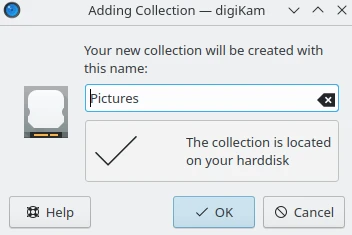
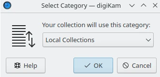
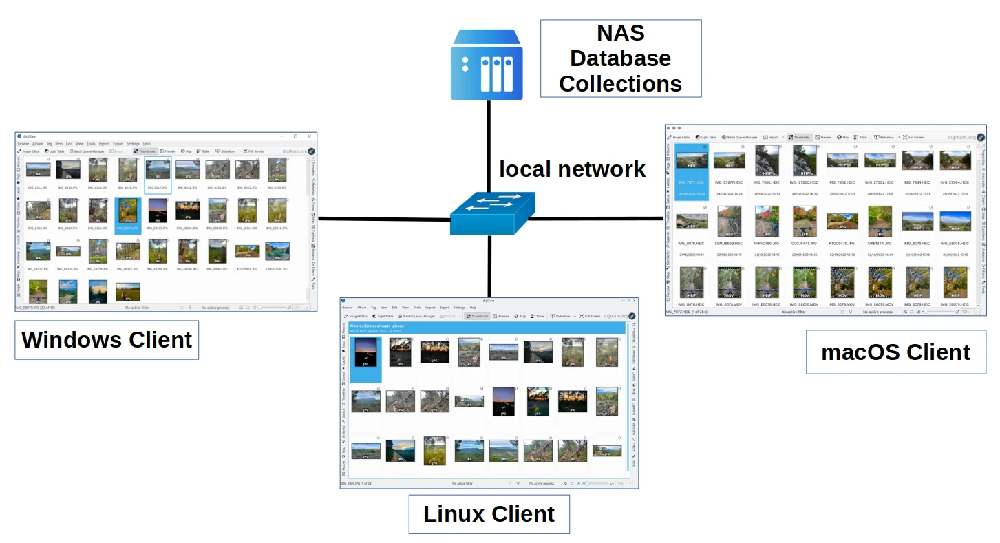

.. meta::
   :description: digiKam Collections Settings
   :keywords: digiKam, documentation, user manual, photo management, open source, free, learn, easy, collection, setup, configure

.. metadata-placeholder

   :authors: - digiKam Team

   :license: see Credits and License page for details (https://docs.digikam.org/en/credits_license.html)

.. _collections_settings:

Collections Settings
====================

.. contents::

Setup Root Album Folders
------------------------

This view manages your **Album Collections** handled by the database. Each Collection represents a **Root Album Folder** containing your photographs or videos. Usually the root folder will contain sub folders. All these folders we call **Albums**. How to work with them, create, delete, rename them etc. is described in detail to :ref:`the Album section <albums_view>`.

.. figure:: images/setup_collection_entries.webp
    :alt:
    :align: center

    The digiKam Collections Configuration Page with the List of Root Album Folders

The **Root Album Folders** list three types of collection which can be referenced in digiKam:

    - **Local Collections**: these are root album folders stored physically on your computer drives.

    - **Collections on Removable Media**: these are root album folders stored on media which can be removed from your computer, as USB keys, external drives, DVD.

    - **Collections on Network Shares**: these are root album folders stored remote file systems as Samba or NFS and mounted as native on your system.

For each type, the **Add Collection** button allows to append an entry in the list. Entry properties are the root album folder **Name** and the root album folder **Path**. You can change the collection name by double clicking with the mouse over the text on the left of an entry from the list.

    The digiKam Collections Configuration Page Appending a Root Album Folder

To edit the properties of an entry, use the **Update button** on the right side of the path. To remove an entry, use the **Red trash button** on right side.

    The digiKam Collections Configuration Page Editing Category of a Root Album Folder

.. important::

    The **Monitor the Albums for External Changes** option will trigger the database to update information. This can be a time-consuming operation especially under macOS and with network file system.

.. note::

    **File write access** in collection is necessary to change items contents and metadata.

.. _network_shares:

The Network Shares Specificity
------------------------------

For the **Collections on Network Shares**, the **Plus button** on the right side of the path allows to append a new mount path to a registered collection entry. This feature resolve the problematic collections and database data shared over a local network (here using a `Network Attached Storage - NAS <https://en.wikipedia.org/wiki/Network-attached_storage>`_), and accedes by different digiKam clients (here a Windows, Linux, and macOS). As each client will mount the shared collection to different paths on local computers, this allows to host all paths in the database referring to the same main shared collection path. As all client computers will share the same database, all information hosted in database and managed with each digiKam clients will not be duplicated on the NAS.

The configuration can be set following steps listed below:

    - On the **Linux** client, user adds the first entry to the network collection: :file:`/mnt/nas`

    - On the **macOS** client, with the "+" icon user now adds its base path to the collection: :file:`/Volumes/data/NAS`

    - On the **Windows** client, user adds the shared path: :file:`X:\\NAS-digiKam`

Later, other extra digiKam clients would also be conceivable if the NAS has a different mount point or used by `UNC path <https://en.wikipedia.org/wiki/Path_(computing)>`_. On each digiKam clients it's important that all base paths then refer to the same network shared collection in the setup dialog.

.. important::

    This kind of resources shared on the local network do not permit to use each client at the same time with a common database.

    Collection and Database Shared on Local Network Using NAS to 3 Different digiKam Clients

.. warning::

    digiKam does not support virtual placeholder folders as OneDrive or GoogleDrive within the image collection specified in setup.

.. _ignored_directories:

Ignore Directories from your Collections
----------------------------------------

The **Ignored Directories** view allows to setup the list of the directories to ignore while scanning collection contents. The directory names are case sensitive and must be separated by semicolon.

.. figure:: images/setup_ignored_directories.webp
    :alt:
    :align: center

    The digiKam Collections Configuration Page with the List of Ignored Directories
