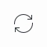

.. meta::
   :description: digiKam Collections Settings
   :keywords: digiKam, documentation, user manual, photo management, open source, free, learn, easy, collection, setup, configure

.. metadata-placeholder

   :authors: - digiKam Team

   :license: see Credits and License page for details (https://docs.digikam.org/en/credits_license.html)

.. _collections_settings:

:ref:`Collections Settings <setup_application>`
===============================================

.. contents::

The **Collections** options for digiKam are set from :menuselection:`Settings --> Configure digiKam... --> Collections page`.

Setup Root Album Folders
------------------------

This view allows you to specify where your **Album Collections** are stored. Each Collection represents a **Root Album Folder** containing your photographs or videos. (This is also where digiKam stores its databases if you are using SQLite.) Usually the root folder will contain sub folders. All these folders we call **Albums**. How to work with albums, including creation, deletion, renaming etc., is described in detail in :ref:`the Album <albums_view>` section of this manual.

.. figure:: images/setup_collection_entries.webp
    :alt:
    :align: center

    The digiKam Collections Configuration Page with the List of Root Album Folders

The **Root Album Folders** list three types of collection which can be referenced in digiKam:

    - **Local Collections**: these are root album folders stored physically on your computer drives.

    - **Collections on Removable Media**: these are root album folders stored on media which can be removed from your computer, such as USB keys, external drives, DVDs.

    - **Collections on Network Shares**: these are root album folders stored on remote file systems such as Samba or NFS that are mounted as native on your system.

The **Add Collection** button for each type allows you to append an entry to the list. Entry properties are the root album folder **Name** and the root album folder **Path**. You can change the collection name by double clicking with the mouse in the leftmost text in an entry from the list.

.. figure:: images/setup_collection_new.webp
    :alt:
    :align: center

    The digiKam Collections Configuration Page Appending a Root Album Folder

To edit or update the properties of an entry, use the **Update Path** button |updatepath| on the right side of the path. digiKam will ask for the category and will update the UUID for this entry. Use this function when the local disk hosting the collection has been changed, or when the network collection has not been created properly or has been deleted.

.. figure:: images/setup_collection_category.webp
    :alt:
    :align: center

    The digiKam Collections Configuration Page Editing Category of a Root Album Folder

To remove an entry, use the **Red Trash Button** on the right side. digiKam will ask to confirm this step before removing the entry.

.. important::

    The **Monitor the Albums for External Changes** option will trigger the database to update based on file system information. This can be a time-consuming operation especially under macOS and with network file system.

.. note::

    **File write access** for the collection is required in order to change item contents and metadata.

.. _network_shares:

The Network Shares Specificity
------------------------------

For the **Collections on Network Shares**, the **Plus button** on the right side of the path allows you to append a new mount path to a registered collection entry. This feature resolves the problem with collections and database data shared over a local network (here using a `Network Attached Storage - NAS <https://en.wikipedia.org/wiki/Network-attached_storage>`_), and works for different digiKam clients (here a Windows, Linux, and macOS). Each client will mount the shared collection to different paths on the client's local computer, and this allows each host to have a unique database with all paths referring to the same main shared collection. As all client computers will share the same database, all information hosted in the database and managed with each digiKam clients will not be duplicated on the NAS.

The configuration can be set with the following steps listed below:

    - On the **Linux** client, user adds the first entry to the network collection: :file:`/mnt/nas`

    - On the **macOS** client, with the "+" icon user now adds its base path to the collection: :file:`/Volumes/data/NAS`

    - On the **Windows** client, user adds the shared path: :file:`X:\\NAS-digiKam`

Later, other extra digiKam clients would also be conceivable if the NAS has a different mount point or used by `UNC path <https://en.wikipedia.org/wiki/Path_(computing)>`_. On each of the digiKam clients it's important that all base paths in the setup dialogs then refer to the same network shared collection.

.. important::

    The kind of resources shared on the local network do not permit the use of multiple clients at the same time with a common database.

.. figure:: images/setup_collection_network_shares.webp
    :alt:
    :align: center

    Collection and Database Shared on Local Network Using NAS to 3 Different digiKam Clients

.. warning::

    digiKam does not support virtual placeholder folders such as OneDrive, GoogleDrive, or iCloud within the image collection specified in setup. The main problem with cloud drives appears when a change is made. A process to synchronize the collection and the database is started, but digiKam does not have access to the files until the network operation is completed. Depending on the network bandwidth and cloud server loading, the time to update can take too long.

.. _ignored_directories:

Ignore Directories from your Collections
----------------------------------------

The **Ignored Directories** view allows you to setup the list of the directories to ignore while scanning collection contents. The directory names are case sensitive and must be separated by semicolons. The list of ignored directories does not include paths that digiKam ignores by default, such as directories that start with a dot. Press on the **Currently ignored directories** link to show the list of directories that digiKam ignores by default.

.. figure:: images/setup_ignored_directories.webp
    :alt:
    :align: center

    The digiKam Collections Configuration Page with the List of Ignored Directories

.. note::

    Only directory names are excluded, paths are not supported. This is intentional.
