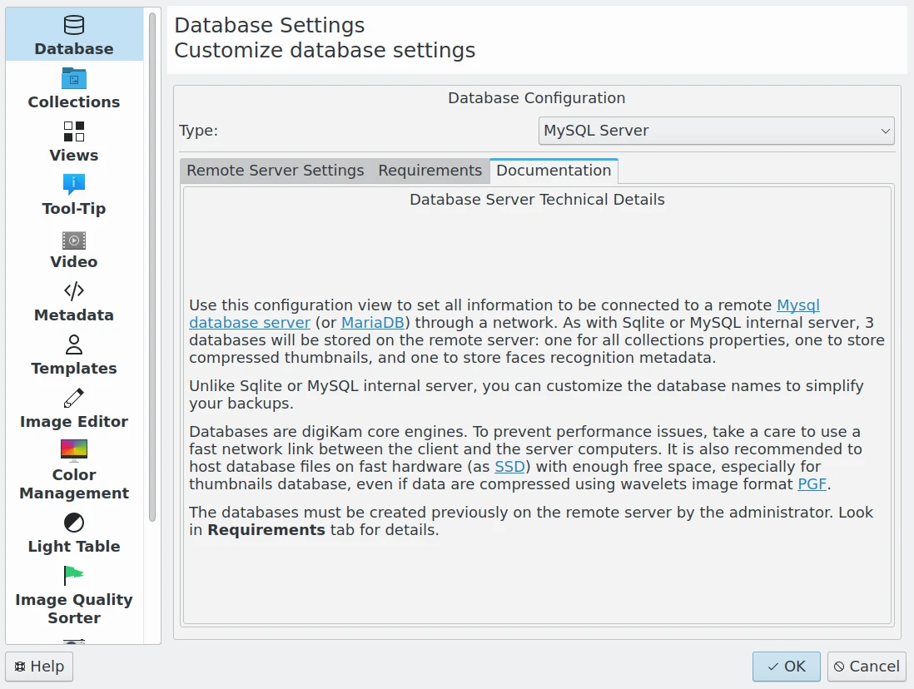

.. meta::
   :description: Overview to digiKam Setup Dialog
   :keywords: digiKam, documentation, user manual, photo management, open source, free, learn, easy

.. metadata-placeholder

   :authors: - Gilles Caulier <caulier dot gilles at gmail dot com>

   :license: Creative Commons License SA 4.0

.. _config_overview:

Overview
========

.. contents::

digiKam tries to give you as much control over how it works as possible. There are many options that change the behavior of the application. To access these settings select Settings → Configure digiKam... from the menubar. The configuration dialog is separated by categories displayed in separated pages. You can change between these pages by clicking on the icons on the left-hand side of the dialog.

