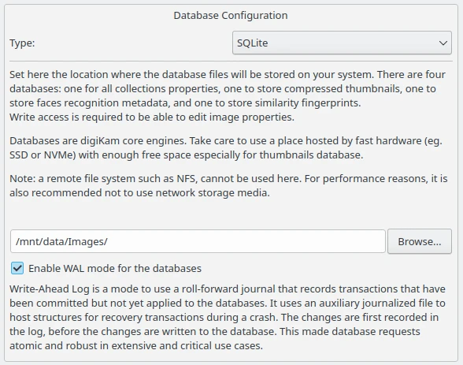
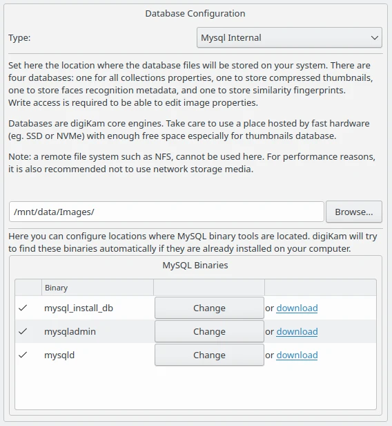
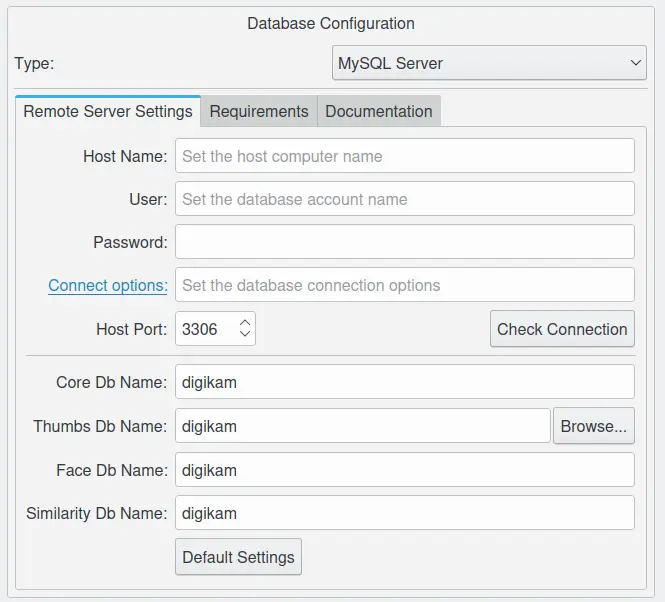
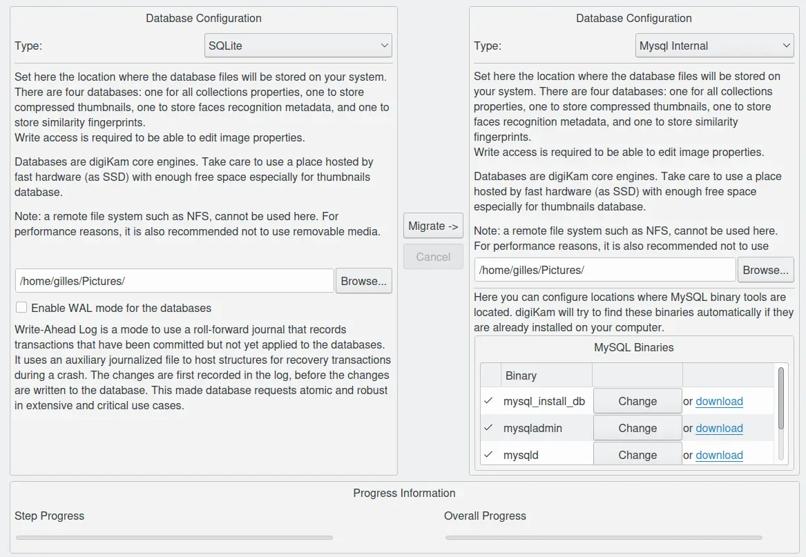
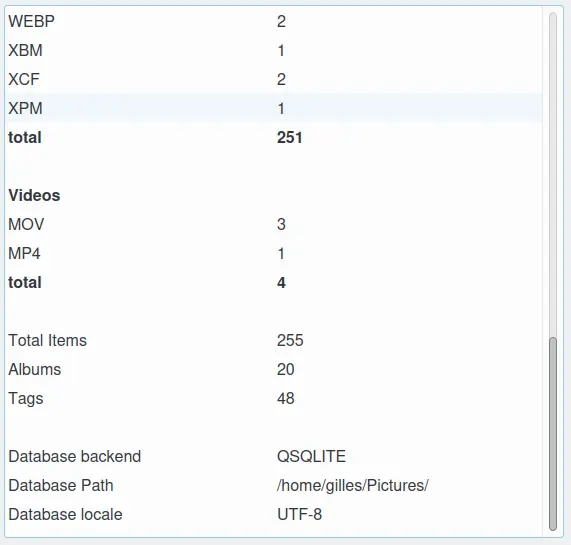

.. meta::
   :description: digiKam Database Settings
   :keywords: digiKam, documentation, user manual, photo management, open source, free, learn, easy, database, setup, mysql, mariadb, sqlite, migration, local, remote, server

.. metadata-placeholder

   :authors: - digiKam Team

   :license: see Credits and License page for details (https://docs.digikam.org/en/credits_license.html)

.. _database_settings:

Database Settings
=================

.. contents::

.. note::

    For an introduction of internal data storage, please refer to :ref:`Introduction of digiKam Databases <database_intro>` section.

.. _sqlite_database:

The Sqlite Database
-------------------

`SQLite <https://sqlite.org/>`_ is a relational database management system, written in C programming library. SQLite is not directly comparable to client/server SQL database engines such as MySQL, Oracle or PostgreSQL. Rather, it is an embedded SQL database engine, i.e. it is embedded in an end program. SQLite reads and writes directly to ordinary disk files. For device-local storage with low writer concurrency and less than a terabyte of content, SQLite is almost always a better solution. SQLite is fast and reliable and it requires no configuration or maintenance. It keeps things simple. SQLite "just works".

By default, digiKam uses SQLite as its back-end for storing important metadata and thumbnails. Three SQLite files used for storing them are named respectively:

    - Core: :file:`digikam4.db`.

    - Thumbs: :file:`thumbnails-digikam.db`.

    - Similarity: :file:`similarity.db`.

    - Faces: :file:`recognition.db`.

To make your application run fast and smoothly, it is recommended to check and optimize your databases once in awhile. This could be achieved with the menu option :menuselection:`Tools --> Maintenance...` and the stage **Perform Database Cleaning**. See this
:ref:`Maintenance tool section <maintenance_database>` for details. A recommended tool is `Sqlite Browser <https://sqlitebrowser.org/>`_, a high quality and easy to use visual tool for managing database objects. For Ubuntu and its derivatives, it could be retrieved using `sudo apt install sqlitebrowser`. Now you can switch to the directory where databases are stored and visualize the database contents.

.. note::

    Take care to use a place hosted by fast hardware (such as SSD) with enough free space especially for thumbnails database. A remote file system such as NFS cannot be used here. For performance and technical reasons relevant of SQLite, you cannot use removable media.

SQLite database files could be found in your *collection* folder, which you have added to digiKam. (By default, if you add your “Pictures” collection, the database files will be present in :file:`~/Pictures` folder).

    The digiKam Sqlite Configuration Page

.. _mysql_database:

The **WAL** SQlite mode is a very important option that we recommend to turn on with large databases to optimize transactions and improve performances.

The MySQL Database
------------------

MySQL Versus SQLite
~~~~~~~~~~~~~~~~~~~

`MySQL <https://en.wikipedia.org/wiki/MySQL>`_ is an open-source, relational database management system, written in C and C++. Original development of MySQL by Michael Widenius and David Axmark beginning in 1994. Sun Microsystems acquired MySQL in 2008, which was later acquired by Oracle in 2010. MySQL currently works on almost all system platforms (Linux, Microsoft Windows, OS X, SunOS …).

`MariaDB <https://en.wikipedia.org/wiki/MariaDB>`_ server is a community developed fork of MySQL server. Started by core members of the original MySQL team, MariaDB actively works with outside developers to deliver the most featureful, stable, and sanely licensed open SQL server in the industry.

MariaDB has actually overtaken MySQL, because of few basic reasons:

    - MariaDB development is more open and vibrant.

    - More cutting edge features.

    - More storage engines.

    - Better performance.

    - Compatible and easy to migrate.

digiKam also provides support for popular MySQL database engine. Of course, you might wonder why you’d want to switch to MySQL when SQLite already does a good job of managing the data? MySQL offers many advantages for storing digiKam data, especially when collections include **more than 100,000 items**. With such large collections, SQLite introduces latency which slows down the application.

Using MySQL as digiKam’s database back-end allows you to store the data on local as well as remote server. Local, to replace the local SQLite storage and latter, to use a shared computer through network. Using MySQL as digiKam’s database back-end allows you to store the data on a remote server. This way, you can use multiple digiKam installations (For instance,on your notebook and PC) to access and manage your photo collections. You can also use MySQL tools to backup and analyze digiKam’s data.

To switch from SQLite to MySQL database, go to :menuselection:`Settings --> Configure digiKam...` and then under **Database** section, select a database from the drop down list.

    - **MySQL Internal**: This allows to run an internal database server on your system. digiKam uses Unix socket for the connection.

    - **MySQL Server**: Use this if you’ve your data on remote server and you’re on a different machine trying to access the collection.

.. _mysql_internal:

The MySQL Internal Server
~~~~~~~~~~~~~~~~~~~~~~~~~

While using a large collection, of size **greater than 100,000 items**, the application tends to slow down. To avoid the delay and maintain efficiency, digiKam provides option of using **MySQL Internal**. To be clear, this isn’t an actual server, or a public network. Instead, it is a server that runs only while application is running.

Internal server creates a separate database that can be accessed (only while application is running) using the command:

.. code-block:: text

    mysql --socket=/home/[user_name]/.local/share/digikam/db_misc/mysql.socket digikam

Internal server uses tree MySQL Binary Tools: :file:`mysql_install_db`, :file:`mysqladmin`, and :file:`mysqld`. You can configure their locations in the configuration dialog. digiKam will try to find these binaries automatically if they’re installed on your system.

    The digiKam Mysql Internal Configuration Page

.. _mysql_remote:

The MySQL Remote Server
~~~~~~~~~~~~~~~~~~~~~~~

Obviously, to use digiKam with a remote MySQL, you would require a MySQL server. Or, you could also install MariaDB, which serves the purpose well. (Could be installed easily using `this link <https://www.cherryservers.com/blog/how-to-install-and-start-using-mariadb-on-ubuntu-20-04>`_.)

Follow the instructions below, if you don’t have a dedicated user account and a digiKam database already set up. Run the commands in MySQL server, after replacing *password* with correct one.

.. note::

    You can select any database name. (Here it is, *digikam*). Just remember to fill in the database name correctly in Core, Thumbs, Similarity, and Face database names from the dialog box shown below.

.. code:: sql

    CREATE USER ''@'%' IDENTIFIED BY 'password';
    GRANT ALL ON *.* TO ''@'%' IDENTIFIED BY 'password';
    CREATE DATABASE digikam;
    GRANT ALL PRIVILEGES ON digikam.* TO ''@'%';
    FLUSH PRIVILEGES;

.. note::

    If you have an enormous collection, it's recommended to start the MySQL server with `mysql --max_allowed_packet = 128M`

Now, in digiKam, go to :menuselection:`Settings --> Configure digiKam...` and then under **Database** section, select MySQL Server from the drop down list.

    The digiKam Remote Mysql Configuration Page

Enter the IP address of your MySQL server in the **Host Name** field and specify the correct port in the **Host Port** field (the default port is 3306).

In the **Core Db Name** field, enter the name of the first database for storing photo metadata.

Specify the name of the second database for storing wavelets compressed thumbnails in the **Thumbs Db Name** field.

The third database is dedicated to store fuzzy search finger-prints. Use the **Similarity Db Name** field for that.

The last database is dedicated to store face histograms for recognition purpose. Use the **Face Db Name** field for that.

To be connected safety to the remote server, enter your MySQL identification using **User** and **Password** fields.

To check whether the database connection works properly, press the **Check Connection** button. If everything works as it’s supposed to, switch to the **Collections** sections, and add the directories containing your photos. Hit **OK**, and wait till digiKam populates the databases with data from photos. This can take a while if you have a lot of items to register in database.

There are some tips and recommendation to obtain the best results with a remote MySQL database server.

With slow network, digiKam hangs a lot of time especially when album contains many items (>1000). This solution relies on network performances. Problem has been reproducible using Wifi connection, for instance. Switching to Ethernet must solves the problem.

Also, if you have an enormous collection, you should start the MySQL server with `mysql --max_allowed_packet = 128M`. If you’re well acquainted with using MySQL, you could also change your settings in :file:`my.ini` or :file:`~/.my.cnf` files.

.. _database_migration:

Database Migration
------------------

The photo management application comes up with an exclusive tool “Database Migration”, that allows users to migrate their data. Suppose, you’re using SQLite and you wish to move all data to MySQL database, migration tool will help you do so. It can help you migrate data from SQLite to MySQL and vice versa.

To migrate to another database, go to :menuselection:`Settings --> Database Migration...`. A dialog box appears:

    The digiKam Database Migration Tool

Now choose appropriate database types you want to convert to. Finally, click on Migrate button to convert the database from SQLite to MySQL (or vice versa). Depending of the database size this operation can take a while.

.. _database_backup:

Database Backup Recommendation
------------------------------

For security reasons, planing a database backup using crontab over the network can help against device dysfunctions. A NAS or an external drive can also be used for that.

Each database can be named with a different name, not only *digikam*. This allows to users to backup only what is needed. For instance, naming **Core** database as *digiKam_Core*, allows to isolate only this table (the most important file). **Thumbnails**, **Similarity** and **Face Recognition** databases can always be regenerated for scratch.

The chapter about digiKam :ref:`Maintenance Tools <maintenance_tools>` will explain how to maintain in time the database contents and how to synchronize the collections with databases information (and vice versa).

.. _database_stats:

Database Statistics
-------------------

digiKam provides a unique tool to show the statistics from your collections. It includes count of images, videos (including individual count by image format), tags etc. Also, includes the **Database Backend** (QSQLITE or QMYSQL) and the **Database Path** (where your collection is located).

You can view your statistics by going to :menuselection:`Help --> Database Statistics...`. A dialog box like this will appear:

    The digiKam Database Statistics Dialog
