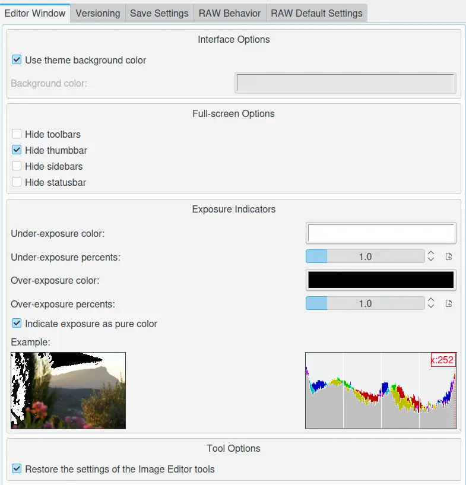
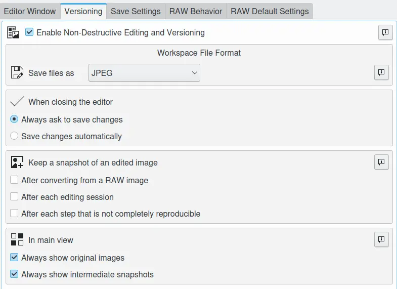
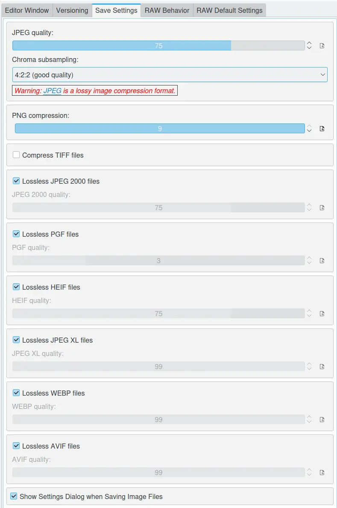
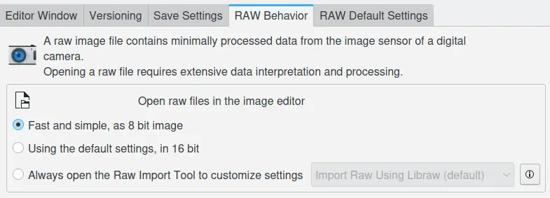
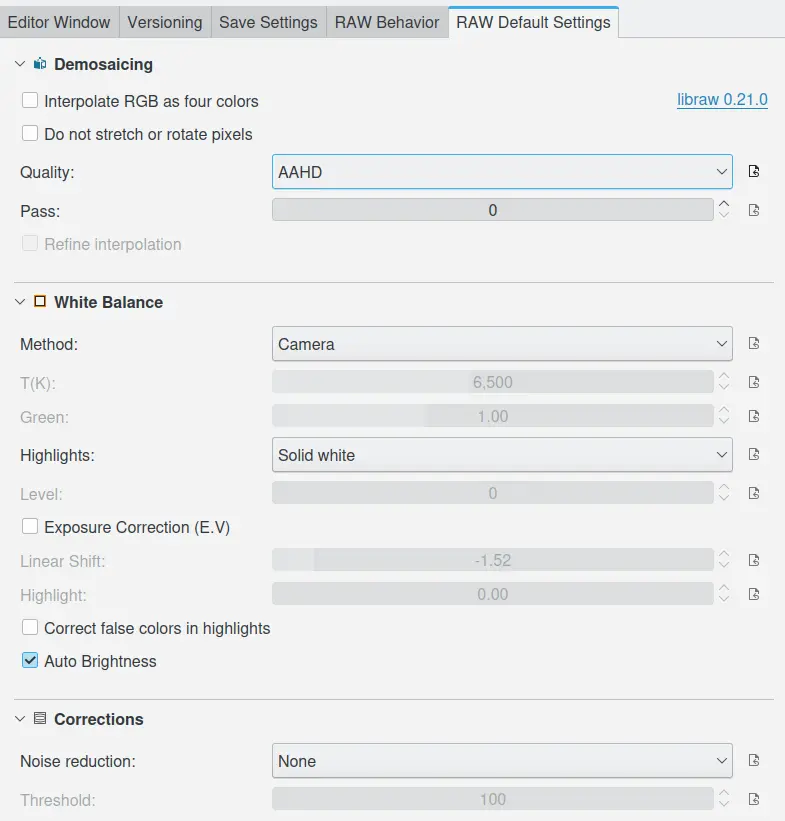

.. meta::
   :description: digiKam Image Editor Settings
   :keywords: digiKam, documentation, user manual, photo management, open source, free, learn, easy, setup, configure, image, editor, corrections, raw, workflow, demosaicing, versioning, save, white, balance

.. metadata-placeholder

   :authors: - digiKam Team

   :license: see Credits and License page for details (https://docs.digikam.org/en/credits_license.html)

.. _editor_settings:

Image Editor Settings
=====================

.. contents::

Editor Window Settings
----------------------

By default the Image Editor will use a black background behind photographs when they are displayed. If you prefer a different background color, with the options **Use theme background color** and **Background color** you can choose one here.

You can also turn off the different elements when the Image Editor is in full screen mode, as the ToolBar, the Thumbbar, the Sidebar, and the Statusbar.

**Over-exposure**  and **under-exposure** settings can highlight areas of an image to indicated by dark and light marker colors that can be defined here. In the editor this viewing mode can be switched on and off with :kbd:`F10` and :kbd:`F11` respectively. The thresholds for over-exposure and under-exposure can be set by the adjustment bars "... percents". Check Indicate exposure as pure color if you want only pure black (RGB 0,0,0) indicated as under-exposure and only pure white (RGB 8 bit 255,255,255 respectively RGB 16 bit 65535, 65535, 65535) indicated as over-exposure.

The option **Restore the settings of the Image Editor tools** can be used to restore the settings of the Image Editor tools from the last session. Otherwise, the default settings will be used.

    The digiKam Image Editor Windows Configuration Page

.. _versioning_settings:

Image Versioning Settings
-------------------------

Non-Destructive Editing and Versioning gives you the freedom of editing your images, trying out whatever you want without worrying that you might regret later what you did. digiKam takes care of the original and every important intermediate step if you want.

    The digiKam Image Versioning Configuration Page

In the checkbox at the top you can **Enable Non-Destructive Editing and Versioning** feature globaly.

In the first field **Save files as**, you can choose the file format used for saving the intermediate steps and the final result. Remember that **JPEG** is a lossy format. So if you need to start over from an intermediate step it wouldn't be really non-destructive. If you can afford it in terms of space on the harddisk and loading/saving speed you better choose a lossless format like **PNG** or **PGF** for instance. Please click the information button on the right side for more detailed information.

In the next field you can decide whether the application will save changes automatically **When Closing Editor** or should ask first.

In the third field named **Keep a snapshot of an edited image**, you decide on which occasions you want the editor to save intermediate steps. Please click the information button on the right side for more detailed information.

In the last field you can adjust whether you want only the last version to be shown from the Icon-View visible **In Main View** (default, none of the boxes checked) or if you also want to see icons of the original version and/or intermediate steps.

.. _saveimage_settings:

Save Image Options
------------------

When changes are made to JPEG files and they are saved back to the hard disk the JPEG file must be re-encoded. Each time a JPEG file is encoded a decision must be made on the level of **JPEG quality** that is to be applied. Unfortunately the level of quality applied is not recorded in the image file. This means that the Image Editor cannot use the same quality ratio when saving an altered image as was used for the original image. You can change the default level of quality that the Image Editor will apply when it saves altered images by moving the JPEG quality slider (1: low quality / 100: high quality and no compression). At the time of writing, metadata is supported.

**Chroma subsampling** is the practice of encoding images by implementing more resolution for luminance information than for color information. Please read this Wikipedia article for a full explanation.

    The digiKam Default File Save Configuration Page

With **PNG compression** option, you can reduce PNG image files size. This operation does not reduce image quality because PNG uses a lossless algorithm. The only effect is that image data needs more time to compress/decompress. If you have a fast computer you can change this value to use a high compression factor (1: low compression / 9: high compression), and metadata is supported.

With **Compress TIFF** option, you can toggle to use Deflate compression algorithm with TIFF image files. This will reduce TIFF image files sizes. It has no image quality effect because Deflate is a lossless algorithm and metadata is supported.

With the **LossLess JPEG 2000** files option allows for lossless storage, or, if the lossy options is selected, even then the quality for comparative files size is much better than normal JPEG, and metadata is supported.

With the **LossLess PGF files** option allows for lossless storage, or, if the lossy options is selected, even then the quality for comparative files size is much better than normal JPEG-2000 and very fast to process encoding decoding. At the time of writing, metadata is supported.

With the **LossLess HEIF files** option allows for lossless storage, or, if the lossy options is selected, even then the quality for comparative files size is much better than normal JPEG-2000, but it slower to encode and decode and it support only 8-12 bits colors depth. This image format dedicated to remplace JPEG on smartphone, not all metadata is supported.

With the **LossLess WEBP files** option allows for lossless storage, or, if the lossy options is selected, even then the quality for comparative files size is much better than normal JPEG-2000, but it only support 8 bits colors depth. This image format dedicated to replace PNG and JPEG on the Internet, not all metadata is supported.

With the **LossLess AVIF files** option allows for lossless storage, or, if the lossy options is selected, even then the quality for comparative files size is much better than normal JPEG-2000, but it slower to encode and decode and it support only 8-12 bits colors depth. This image format dedicated to be a concurent of HEIF, not all metadata is supported.

When the option **Show Settings Dialog when Saving Image Files** is checked, digiKam will show a dialog where settings can be changed when saving image files, else default settings are used when saving image files.

.. _setup_raw:

RAW Behavior
------------

In the early versions of digiKam the Image Editor was just a viewer for photographs, but it is rapidly developing into a very useful photo manipulation tool. This dialog allows you to control how the Image Editor will behave when opening RAW files.

    The digiKam RAW Behavior Configuration Page

**Fast and simple, as 8 bit image**: RAW files will be decoded to 8-bit color depth with a BT.709 gamma curve and a 99th-percentile white point. This mode is faster than 16-bit decoding. In 8-bit mode only the Auto Brightness setting will be taken into account.

**Use the default settings, in 16 bit**: If enabled, all RAW files will be decoded to 16-bit color depth using a linear gamma curve and according to the settings in the RAW Default Settings tab. To prevent dark image rendering in the editor, it is recommended to use Color Management in this mode.

**Always open the Raw Import Tool to customize settings**: With this option checked the Raw Import Tool will open at the Right Side Bar in the Image Editor so that you can set individual parameters for every image you open.

RAW Default Settings
--------------------

    The digiKam Default RAW Decoding Configuration Page

Demosaicing
~~~~~~~~~~~

A demosaicing algorithm is a digital image process used to interpolate a complete image from the partial raw data received from the color-filtered image sensor internal to many digital cameras in form of a matrix of colored pixels. Also known as CFA interpolation or color reconstruction.

**Interpolate RGB as four colors**: The default is to assume that all green pixels are the same. If even-row green pixels of the CCD sensor are more sensitive to ultraviolet light than odd-row this difference causes a mesh pattern in the output; using this option solves this problem with minimal loss of detail. To resume, this option blurs the image a little, but it eliminates false 2x2 mesh patterns with VNG quality method or mazes with AHD quality method.

**Do not stretch or rotate pixels**: For Fuji Super CCD cameras, show the image tilted 45 degrees. For cameras with non-square pixels, do not stretch the image to its correct aspect ratio. In any case, this option guarantees that each output pixel corresponds to one RAW pixel.

**Quality**: digiKam offer us three alternatives: bi-linear, VNG interpolation, AHD interpolation. It seems that AHD interpolation (for Adaptive Homogeneity-Directed) is the best choice for quality according to some test that I have performed and the paper of the person that implemented it. VNG interpolation (Variable Number of Gradients) was the first algorithm used by libraw but suffers from color artifacts on the edge. Bilinear is interesting if you are looking for speed with a acceptable result.

**Pass**: Set here the passes used by the median filter applied after interpolation to Red-Green and Blue-Green channels. This setting is only available for specific Quality options: Bilinear, VNG, PPG, AHD, DCB, and VCD & AHD.

**Refine interpolation**: For DCB, turn on the enhance interpolated colors filter. For and VCD/AHD, turn on the enhanced effective color interpolation (EECI) refine to improve sharpness.

White Balance
~~~~~~~~~~~~~

**Method**: Four options are available here: Default D65, Camera, Automatic and Manual. “Default D65” reflects normal daylight conditions. “Camera” uses the camera's custom white-balance settings if set. “Automatic” The default is to use a fixed color balance based on a white card photographed in sunlight. “Manual” will adjust colors according to the T(K) (color temperature in degrees Kelvin) and Green settings.

**Highlights**: This is the story of the three highlight options. Default is here to consider highlights (read: part of your images that are burned due to the inability of your camera to capture the highlights) as plain / solid white (solid white option). You can get some fancy results with the unclip option which will paint the highlights in various pinks. At last you can try to consider recovering some parts of the missing information from the highlights (reconstruct option). This is possible because the blue pixels tends to saturate less quickly than the greens and the reds. digiKam will try to reconstruct the missing green and red colors from the remaining none saturated blue pixels. Of course here everything is a question of tradeoff between how much color or white you want. If you select Reconstruct as the option, you will be given the choice to set a level. A value of 3 is a compromise and can/should be adapted on a per image basis.

**Exposure Correction (E.V)**: Turn on the exposure correction before interpolation.

**Correct False Colors In Highlights**: If enabled, images with overblown channels are processed much more accurately, without 'pink clouds' (and blue highlights under tungsten lamps).

**Auto Brightness**: If disable, use a fixed white level and ignore the image histogram to adjust brightness.

Corrections
~~~~~~~~~~~

**Noise Reduction**: While demosaicing your image you can additionally ask for noise reduction (at a slight speed penalty). This option applies a noise reduction algorithm while the image still is in CIE Lab color space. Because the noise is only applied to the Luminosity layer (the "L" of the Lab), it should not blur your image as traditional noise reduction algorithms do in RGB mode. So, if you converted an image from RAW and it appears noisy, rather than applying a denoiser, go back and re-convert with this option enabled. The defaults are: Threshold = 100. Higher values will increase the smoothing, lower will decrease smoothing.

**Enable Chromatic Aberration (CA) Correction**: If you know the CA of your lenses you can set the red and blue correction values here. This is certainly the optimal method for CA correction as it is done during RAW conversion.
