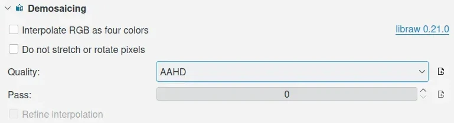
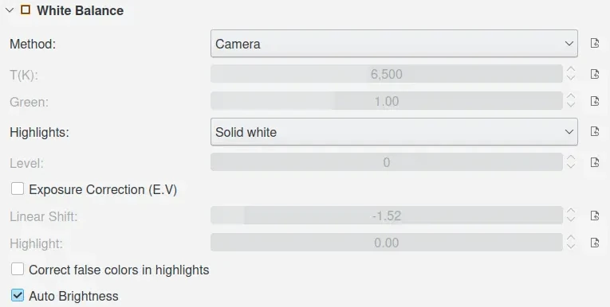
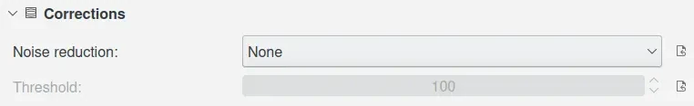

.. meta::
   :description: digiKam Image Editor Settings
   :keywords: digiKam, documentation, user manual, photo management, open source, free, learn, easy, setup, configure, image, editor, corrections, raw, workflow, demosaicing, versioning, save, white, balance

.. metadata-placeholder

   :authors: - digiKam Team

   :license: see Credits and License page for details (https://docs.digikam.org/en/credits_license.html)

.. _editor_settings:

:ref:`Image Editor Settings <setup_application>`
================================================

.. contents::

The **Image Editor** options for digiKam are set from :menuselection:`Settings --> Configure digiKam... --> Image Editor page`.

.. _window_settings:

Editor Window Settings
----------------------

By default the Image Editor will use a black background behind photographs when they are displayed. You can change the background color by using the **Use theme background color** and **Background color** options.

You can also control the display of different UI elements when the Image Editor is in full screen mode, such as the ToolBar, the Thumbbar, the Sidebar, and the Status bar.

**Over-exposure** and **under-exposure** settings can highlight areas of an image with dark and light marker colors that can be defined here. In the editor this viewing mode can be switched on and off with :kbd:`F11` and :kbd:`Ctrl+F11` respectively. The thresholds for over-exposure and under-exposure can be set by the adjustment bars, measured in percentage of full scale. For example, 2% of full scale for an 8-bit image is about 5 counts. So setting the over-exposure percents to 2.0 will highlight any pixels with an individual channel value between 251 and 255. Check **Indicate exposure as pure color** if you want only pure black (RGB 0,0,0) indicated as under-exposure and only pure white (RGB 8 bit 255,255,255 respectively RGB 16 bit 65535, 65535, 65535) indicated as over-exposure.

The option **Restore the settings of the Image Editor tools** can be used to restore the settings of the Image Editor tools from the last session. Otherwise, the default settings will be used.

.. figure:: images/setup_editor_iface.webp
    :alt:
    :align: center

    The digiKam Image Editor Windows Configuration Page

.. _versioning_settings:

Image Versioning Settings
-------------------------

Non-Destructive Editing and Versioning gives you the freedom of editing your images, trying out whatever you want without worrying that you might regret later what you did. You can use digiKam's versioning capabilities to take care of the original and every important intermediate step if you want. Use the **Enable Non-Destructive Editing and Versioning** checkbox at the top of the Versioning page, to enable the feature.

.. figure:: images/setup_editor_version.webp
    :alt:
    :align: center

    The digiKam Image Versioning Configuration Page

In the first field **Save files as**, you can choose the file format used for saving the intermediate steps and the final result. Remember that **JPEG** is a lossy format. So if you need to start over from an intermediate step it wouldn't be really non-destructive. If you can afford it in terms of space on the hard disk and loading/saving speed you are better off choosing a lossless format like **PNG** or **PGF** for instance. Please click the information button on the right side for more detailed information.

In the next field you can decide whether the application will save changes automatically **When Closing Editor** or should ask first.

In the third field named **Keep a snapshot of an edited image**, you decide on which occasions you want the editor to save intermediate steps. Please click the information button on the right side for more detailed information.

In the last field you can adjust whether you want only the last version to be shown from the Icon-View visible **In Main View** (default, none of the boxes checked) or if you also want to see icons of the original version and/or intermediate steps.

.. _saveimage_settings:

Save Image Settings
-------------------

When changes are made to JPEG files and saved back to the hard disk, the JPEG file must be re-encoded. Each time a JPEG file is encoded a decision must be made on the level of **JPEG quality** that is to be applied. Unfortunately the level of quality applied is not recorded in the image file. This means that the Image Editor cannot use the same quality ratio when saving an altered image as was used for the original image. You can change the default level of quality that the Image Editor will apply when it saves altered images by moving the JPEG quality slider (1: low quality / 100: high quality and no compression). JPEG metadata is fully supported.

**Chroma subsampling** is the practice of encoding images by implementing more resolution for luminance information than for color information. Please read `this Wikipedia article <https://en.wikipedia.org/wiki/Chroma_subsampling>`_ for a full explanation.

.. figure:: images/setup_editor_save.webp
    :alt:
    :align: center

    The digiKam Default File Save Configuration Page

The **PNG compression** option reduces PNG image file size. This operation does not reduce image quality because PNG uses a lossless algorithm. The only effect is that image data needs more time to compress/decompress. If you have a fast computer you can change this value to use a high compression factor (1: low compression / 9: high compression), and metadata is supported.

The **Compress TIFF** option controls the use of the Deflate compression algorithm with TIFF image files. This will reduce TIFF image files sizes. It has no image quality effect because Deflate is a lossless algorithm and metadata is supported.

The **LossLess JPEG 2000** option allows for lossless storage, or lossy storage if disabled. The quality of lossy storage is much better than normal JPEG for comparative file sizes, and metadata is supported.

The **LossLess PGF files** option allows for lossless storage, or lossy storage if disabled. The quality of lossy storage is much better than normal JPEG-2000 for comparative file sizes, the encoding/decoding process is very fast, and metadata is supported.

The **LossLess HEIF files** option allows for lossless storage, or lossy storage if disabled. The quality of lossy storage is much better than normal JPEG-2000 for comparative file sizes, but it is slower to encode and decode, and it supports only 8-12 bit color depth. This image format is designed to replace JPEG on smartphones. Not all metadata is supported.

The **LossLess WEBP files** option allows for lossless storage, or lossy storage if disabled. The quality of lossy storage is much better than normal JPEG-2000 for comparative file sizes, but it only supports 8-bit color depth. This image format is designed to replacing PNG and JPEG on the Internet. Not all metadata is supported.

The **LossLess AVIF files** option allows for lossless storage, or lossy storage if disabled. The quality of lossy storage is much better than normal JPEG-2000 for comparative file sizes, but it is slower to encode and decode and it supports only 8-12 bit color depth. This image format dedicated to be concurrent with HEIF. Not all metadata is supported.

When the option **Show Settings Dialog when Saving Image Files** is checked, digiKam will show a dialog where settings can be changed when saving image files. Otherwise, default settings are used when saving image files.

.. _setup_raw:

RAW Behavior
------------

In the early versions of digiKam the Image Editor was just a viewer for photographs, but it is rapidly developing into a very useful photo manipulation tool. This dialog allows you to control how the Image Editor will behave when opening RAW files.

.. figure:: images/setup_editor_raw_behavior.webp
    :alt:
    :align: center

    The digiKam RAW Behavior Configuration Page

**Fast and simple, as 8 bit image**: RAW files will be decoded to 8-bit color depth with a BT.709 gamma curve and a 99th-percentile white point. This mode is faster than 16-bit decoding. In 8-bit mode only the Auto Brightness setting will be taken into account.

**Use the default settings, in 16 bit**: If enabled, all RAW files will be decoded to 16-bit color depth using a linear gamma curve and according to the settings in the **RAW Default Settings** tab. To prevent dark image rendering in the editor, it is recommended to use Color Management in this mode.

**Always open the Raw Import Tool to customize settings**: with this option you can select which Raw Import Tool will be used to open RAW files. Excepted for the LibRaw option which is always enabled, the external program paths must be found using the PATH variable from the system to see the relevant option turned on in this menu. Supported Raw processing tools include:

    - **Import RAW using LibRaw**: the default plugin for digiKam provides a fully integrated module in the Right Side Bar of the Image Editor where you can set individual parameters for every image you open.

    .. figure:: images/setup_editor_raw_import.webp
        :alt:
        :align: center

        The digiKam RAW Import Tool Processing a Nikon NEF File

    - **RawTherapee**: this application must be installed on your computer. `RawTherapee <https://en.wikipedia.org/wiki/RawTherapee>`_ is application software for processing photographs in the RAW image formats created by many digital cameras. It comprises a subset of image editing operations specifically aimed at non-destructive post-production of raw photos and is primarily focused on improving a photographer's workflow by facilitating the handling of large numbers of images.

    - **ART**: this application must be installed on your computer. `ART <https://art.pixls.us/>`_ is a derivative version of the RawTherapee application.

    - **UFRaw**: this application must be installed on your computer. `UFRaw <https://en.wikipedia.org/wiki/UFRaw>`_ is an application which can read and manipulate photographs in the RAW image formats created by many digital cameras.

    - **DarkTable**: this application must be installed on your computer. `Darktable <https://en.wikipedia.org/wiki/Darktable>`_ is a free and open-source photography application program and RAW developer. It comprises a subset of image editing operations specifically aimed at non-destructive RAW image post-production.

    .. figure:: videos/setup_editor_raw_behavior.webp
        :width: 500px
        :alt:
        :align: center

        Screencast of RAW Import Tool Pre-Processing a Digital Negative in DarkTable

.. _setup_rawdefault:

RAW Default Settings
--------------------

.. note::

    These default settings are used only with the LibRaw interface.

Demosaicing
~~~~~~~~~~~

    The digiKam Default RAW Demosaicing Configuration View

A `demosaicing algorithm <https://en.wikipedia.org/wiki/Demosaicing>`_ is a digital image process used to interpolate a complete image from the partial raw data received from the color-filtered image sensor array internal to many digital cameras in the form of a matrix of colored pixels. Demosaicing is also known as CFA interpolation or color reconstruction.

**Interpolate RGB as four colors**: The default is to assume that all green pixels are the same. If even-row green pixels of the sensor are more sensitive to ultraviolet light than odd-row green pixels, this difference causes a mesh pattern in the output; using this option solves this problem with minimal loss of detail. To summarize, this option blurs the image a little, but it eliminates false 2x2 mesh patterns with either VNG or AHD interpolation.

**Do not stretch or rotate pixels**: Turns off automatic rotation corrections, so it will show images from a Fuji Super CCD camera tilted at a 45 degree angle. And turns off automatic corrections for non-square pixels, which will create distorted aspect ratios for cameras with non-square pixels. The benefit is that this option guarantees that each output pixel corresponds to one RAW pixel.

**Quality**: digiKam offer many alternative interpolation algorithms. The most common are **Bilinear**, **VNG**, and **AAHD** interpolations. It seems that AAHD (for Ameliored Adaptive Homogeneity-Directed) is the best choice for quality according to some tests that we have performed and the paper of the person that implemented it. This improved method based on **AHD** interpolation, selects the direction of interpolation so as to maximize a homogeneity metric, thus typically minimizing color artifacts. VNG (for Variable Number of Gradients) was the first algorithm used by libraw but suffers from color artifacts on the edge. Bilinear is interesting if you are looking for the fastest acceptable result. **PPG** (for Patterned-Pixel-Grouping) is a pixel grouping interpolation that uses assumptions about natural scenery in making estimates. It has fewer color artifacts on natural images than the VNG method. Consider **DCB** and **DHT** interpolation as experimental method.

**Pass**: Sets the number of passes used by the median filter applied after interpolation to Red-Green and Blue-Green channels.

**Refine interpolation**: For DCB interpolation only, turn on the enhance interpolated colors filter to improve sharpness.

White Balance
~~~~~~~~~~~~~

    The digiKam Default RAW White Balance Configuration View

**Method**: Four options are available here: **Default D65**, **Camera**, **Automatic**, and **Manual**. *Default D65* reflects normal daylight conditions. *Camera* uses the camera's custom white-balance settings if set. *Automatic* uses by default a fixed color balance based on a white card photographed in sunlight. *Manual* will adjust colors according to the color temperature in degrees Kelvin (**T(K)**) and **Green** sets the green component to remove any magenta color cast.

**Highlights**: Default is here to consider highlights (read: part of your images that are saturated due to the inability of your camera to capture the highlights) as plain / **Solid white**. You can get some fancy results with the unclip option which will paint the highlights in various pinks. Or you can try to recover some parts of the missing information from the highlights with the **Rebuild** option. This is possible because the blue pixels tend to saturate less quickly than the greens and the reds. digiKam will try to reconstruct the missing green and red colors from the remaining non-saturated blue pixels. Of course everything here is a question of a tradeoff between how much color or white you want. If you select **Rebuild** as the option, you will be given the choice to set a **Level**. A value of 3 is a compromise and can/should be adapted on a per image basis. **Unclip** leaves highlight unclipped in various shades of pink, and **Blend** mixes clipped and unclipped values together for a gradual fade to white.

**Exposure Correction (E.V)**: Turn on the exposure correction before interpolation. The main setting is the **Linear Shift** that is measured in E.V. The amount of **Highlight** preservation can be also adjusted, but only if the shift correction is greater than 1.0 E.V.

**Correct False Colors In Highlights**: If enabled, images with overblown channels are processed much more accurately. This can help eliminate 'pink clouds' and blue highlights under tungsten lamps.

**Auto Brightness**: If disabled, use a fixed white level and ignore the image histogram to adjust brightness.

Corrections
~~~~~~~~~~~

    The digiKam Default RAW Corrections Configuration View

**Noise Reduction** can be applied while demosaicing your image at a slight speed penalty. This option applies a noise reduction algorithm while the image is still in CIE Lab color space. Because the noise is only applied to the Luminosity layer (the *L* of the Lab), it should not blur your image as much as traditional noise reduction algorithms do in RGB mode. If you converted an image from RAW and it appears noisy, rather than applying a denoiser, go back and re-convert with this option enabled.

You can select a noise reduction method to apply during RAW decoding. **None** does not apply the noise reduction. **Wavelets** applies a wavelets-based correction method, after interpolation, to reduce noise while preserving real details. **FBDD** for Fake Before Demosaicing Denoising is an experimental noise reduction method applied before interpolation.

The default **Threshold** value is 100. Higher values will increase smoothing, and lower values will decrease it.
