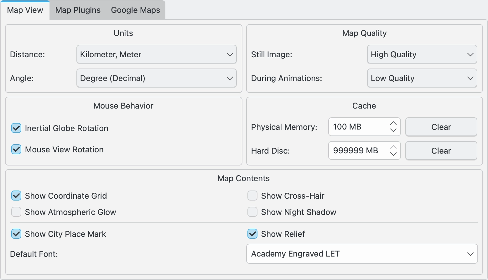
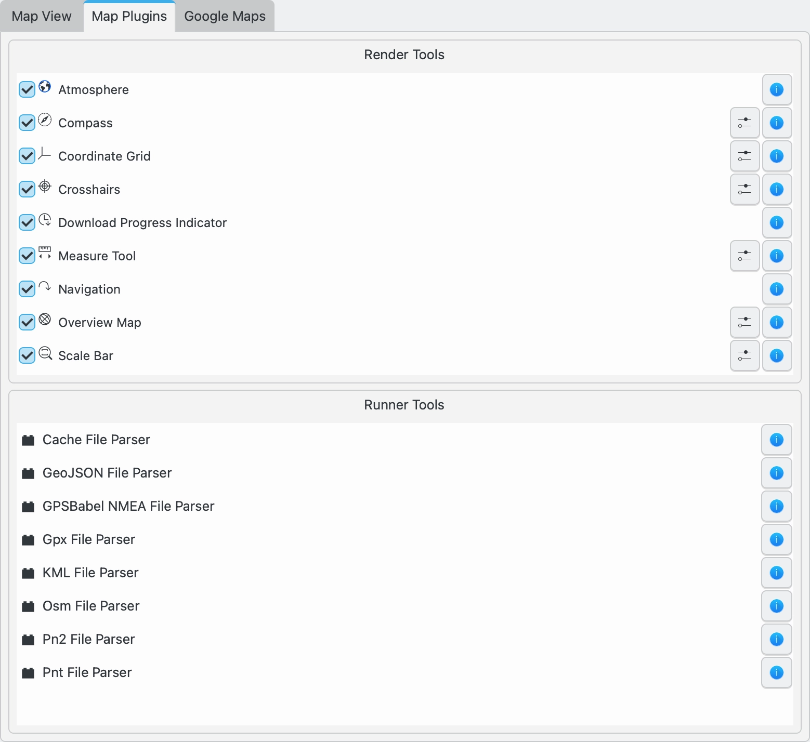
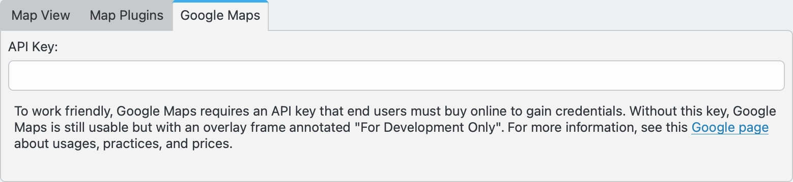

.. meta::
   :description: digiKam Geolocation Settings
   :keywords: digiKam, documentation, user manual, photo management, open source, free, learn, easy, geolocation, map

.. metadata-placeholder

   :authors: - digiKam Team

   :license: see Credits and License page for details (https://docs.digikam.org/en/credits_license.html)

.. _geolocation_settings:

:ref:`Geolocation Settings <setup_application>`
===============================================

.. contents::

The **Geolocation** options for digiKam are set from :menuselection:`Settings --> Configure digiKam... --> Geolocation page`. These settings control the multiple map views within digiKam.

.. _geolocation_mapview:

Map View Settings
-----------------

The **Map View** tab allows you to control the displays and behaviors within the digiKam map views.

    The digiKam Geolocation Map View Settings Page

The options that can be set in this page include:
    - Units
        - **Distance** sets the distance units (km, miles, nautical miles) used in the map displays.
        - **Angle** set the angle units (decimal degrees, DMS, UTM) used in the map displays.
    - Map Quality
        - **Still Image** sets the quality (resolution) of the map display when the display is still.
        - **During Animations** sets the quality (resolution) of the map display when during animations. Higher quality will be slower.
    - Mouse Behavior
        - **Inertial Globe Rotation**
        - **View Rotation**
    - Cache
        - **Physical Memory**
        - **Hard Disc**
    - Map Contents
        - **Show Coordinate Grid**
        - **Show Cross-Hair**
        - **Show Atmospheric Glow**
        - **Show Night Shadow**
        - **Show City Place Mark**
        - **Show Relief**
        - ** Default Font**

.. _geolocation_mapplugins:

Map Plugins Settings
--------------------

The **Map Plugins** tab lists all of the map plugins installed in digiKam, and allows the user to toggle on or off those plugins that control map overlays. Settings are also available to further customize some of the overlays.

    The digiKam Geolocation Map Plugins Settings Page

The map render tools that produce the overlays include: Atmosphere, Compass, Coordinate Grid, Crosshairs, Download Progress Indicator, Measure Tool, Navigation, Overview Map, and a Scale Bar.

The runner plugins used to parse GPS files are also listed.

.. _geolocation_googlemap:

Google Maps Settings
--------------------

The **Google Maps** tab allows you to enter an API key to use Google Maps. Google Maps is usable without this key, but will overlay the maps with the words "For Development Only". See `this page <https://mapsplatform.google.com/pricing/>`_ for more information.

    The digiKam Geolocation Google Map Settings Page
