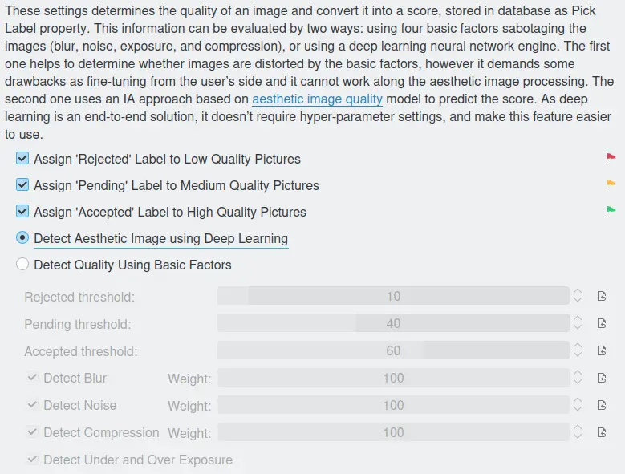

.. meta::
   :description: digiKam Image Quality Sorting Settings
   :keywords: digiKam, documentation, user manual, photo management, open source, free, learn, easy, aesthetic neural, network, quality, blur, noise, compression, exposure, labels, rejected, pending, accepted, workflow

.. metadata-placeholder

   :authors: - digiKam Team

   :license: see Credits and License page for details (https://docs.digikam.org/en/credits_license.html)

.. _imgqsort_settings:

Image Quality Sorting Settings
==============================

.. contents::

These settings refer to the Image Quality Sorter tool which you can access via :menuselection:`Tools --> Maintenance`. This tool is based on **neural network** to classify items by the aesthetic quality and assign a **Pick Label** value accordingly. By default the automatic sorting is enabled to simplify the workflow, but you can turn off this feature and use customized settings based on basic factors.

    The digiKam Image Quality Sorter Settings Page

In the manual configuration mode, the four **Detect ...** options you can choose which kind of fault should be factored in by the Image Quality Sorter. Talking about factoring in: the factors for blur, noise and compression can set with the help of the three **... Weight** adjustment bars on the right.

With the three **Assign ... Label ...** options you can decide to which image quality level a label should be assigned. Un-checking all three of them renders the Image Quality Sorter useless, of course. The thresholds for these levels can be set through the three **... threshold** adjustment bars. It will normally take some testing and trying out to find the settings that suits your needs. Note that the input, i.e. the images the process has to investigate, will have quite some influence. It's a difference whether you choose an album containing images which are all more or less o.k. and have only minor differences or if you present a collection of pictures where some of the pictures really have some bad blur, noise, ... You also have to consider at which point of your workflow you want to perform this operation. Right after importing the files from your camera is probably a good idea.

With the topmost of the adjustment bars you can adjust the speed of the process in three steps. Slow speed **1** should lead to better results.

For more details about the Maintenance Quuality Sorter tool, see :ref:`this section <maintenance_quality>` from the manual.
