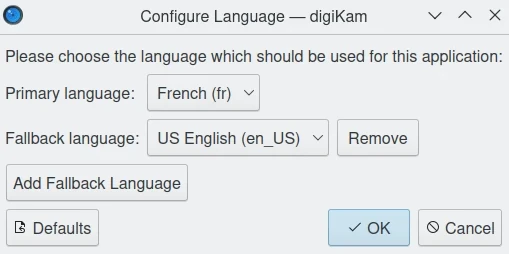
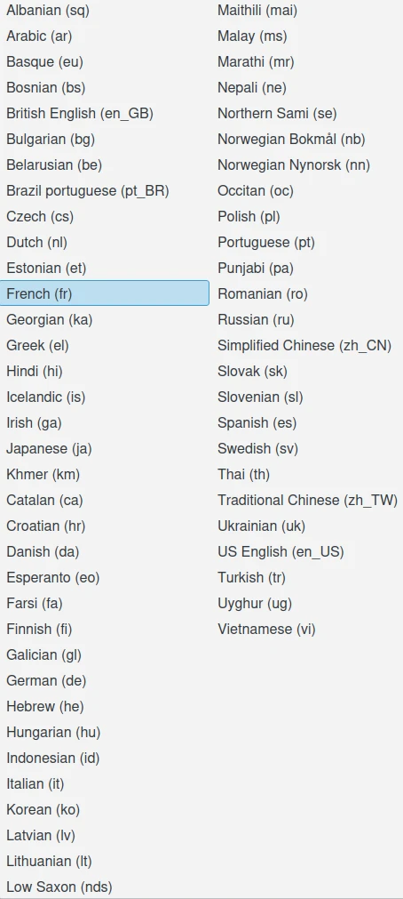

.. meta::
   :description: digiKam Languages Settings
   :keywords: digiKam, documentation, user manual, photo management, open source, free, learn, easy, camera, configuration, setup, languages, translations, internationalization

.. metadata-placeholder

   :authors: - digiKam Team

   :license: see Credits and License page for details (https://docs.digikam.org/en/credits_license.html)

.. _languages_settings:

Languages Settings
==================

.. contents::

digiKam is translated in many languages and you can change the internationalization of application from the :menuselection:`Settings --> Configure Languages` main menu item.

This opens a dialog where you can edit the **Primary language** and the **Fallback language**. First one is the main collection of translations used to render internationalized strings in the application, and this will be your native language. The second one is used to fill the translations if internationalization of some strings are missing from the primary.

    The digiKam Languages Configuration Dialog

Translating an application as digiKam is a long task and require a lots of verification to be validated and published in production. Each language is maintained by independent teams which push works at different times, which cannot be sync with the application release date.

.. note::

    You can set more than one fallback languages to translate application, the lead one is on the top of this list.

Selecting a language by the drop-down menu must propose a large list of entries. There are currently more than 70 language teams, providing translations for a wide variety of languages, including some that are often not supported by proprietary software.

    The List of Languages Available to Internationalize the Application

.. important::

    To take effect, a language settings change requires to restart the application session.
