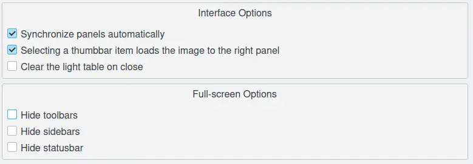

.. meta::
   :description: digiKam Light Table Settings
   :keywords: digiKam, documentation, user manual, photo management, open source, free, learn, easy

.. metadata-placeholder

   :authors: - Gilles Caulier <caulier dot gilles at gmail dot com>

   :license: Creative Commons License SA 4.0

.. _lighttable_settings:

Light Table Settings
====================

.. contents::

The setting of the digiKam Light Table can be set to default values on this page so that every time you open the Light Table, these settings are activated (if possible, because for images having different sizes the synchronous mode does not work).

Synchronize panels automatically refers to the Synchronize button on the Light Table toolbar which is to say that you can still switch off this option there. If the next option is not checked you have to load the images from the thumbbar to the two panels of the Light Table by drag+drop or with the On left or On right buttons.
