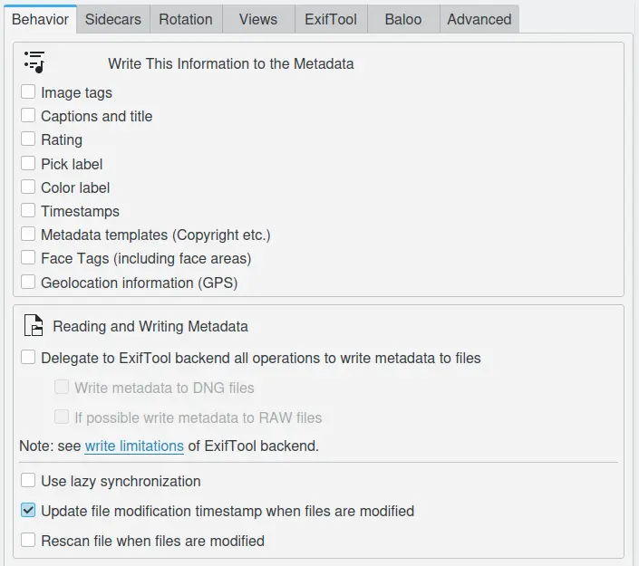
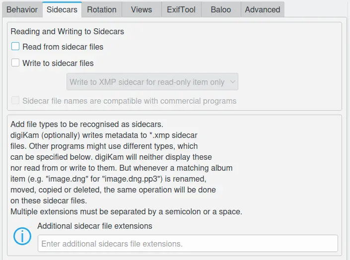
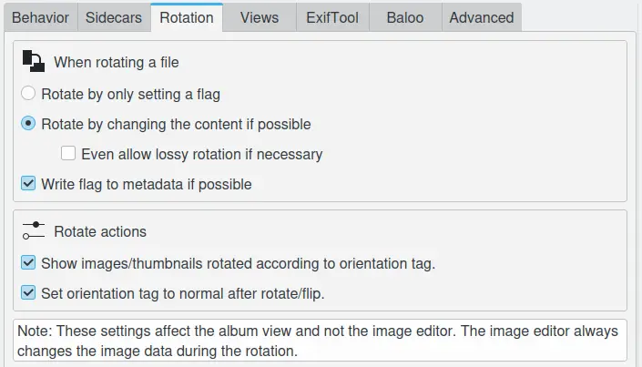
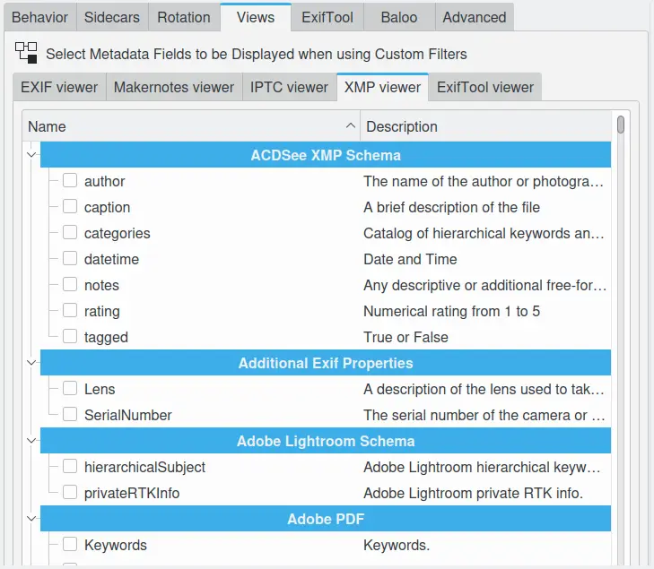
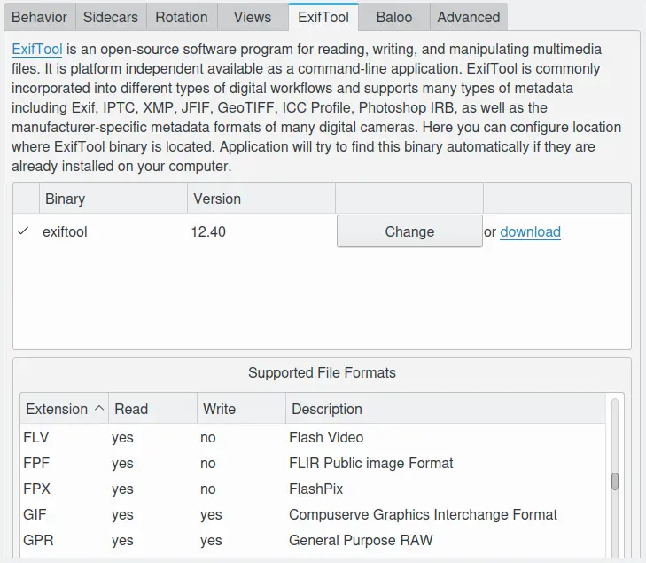
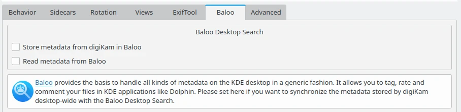
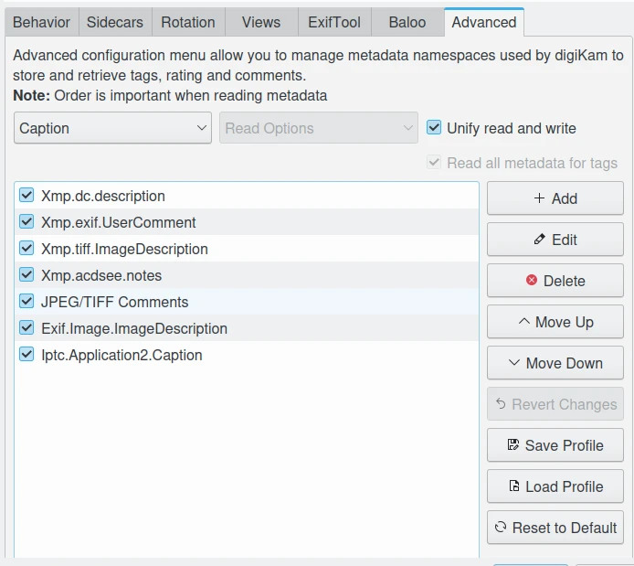

.. meta::
   :description: digiKam Metadata Settings
   :keywords: digiKam, documentation, user manual, photo management, open source, free, learn, easy

.. metadata-placeholder

   :authors: - digiKam Team

   :license: see Credits and License page for details (https://docs.digikam.org/en/credits_license.html)

.. _metadata_settings:

Metadata Settings
=================

.. contents::

Image files can have some metadata embedded into the image file format. These metadata can be stored in a number of standard formats as JPEG, TIFF, PNG, JPEG2000, PGF, and RAW files. Metadata can be read and written in the `Exif <https://en.wikipedia.org/wiki/Exif>`_, `IPTC <https://en.wikipedia.org/wiki/IPTC_Information_Interchange_Model>`_, and `XMP <https://en.wikipedia.org/wiki/Extensible_Metadata_Platform>`_ formats if they are present in the file.

.. _metadata_behavior:

Behavior Settings
-----------------

The **Behavior** tab allows you to select what information digiKam will write to the metadata and control how digiKam will deal with this embedded information.

    The digiKam Metadata General Behavior Settings Page

.. note::

    If the **Lazy Synchronization** option is turned on, digiKam will only write metadata when user clicks on the **Apply Pending Changes To Metadata** icon in the status bar or when application is shutdown.

.. _metadata_sidecars:

Sidecars Settings
-----------------

The **Sidecars** tab allows user to control whether digiKam will read and write from/to XMP sidecars or not. Filename for the sidecars set to :file:`filename.ext.xmp`. For example, :file:`image1.dng` will have a sidecar file named :file:`image1.dng.xmp`.

    The digiKam Metadata Sidecar Behavior Settings Page

.. note::

    If the box **Read from sidecar files** is checked, digiKam will only read the sidecar while ignoring the embedded metadata.

.. _metadata_rotation:

Rotation Settings
-----------------

    The digiKam Metadata Rotation Behavior Settings Page

**Show images/thumbnails rotated according to orientation tag**: this will use any orientation information that your camera has included in the Exif information to automatically rotate your photographs so that they are the correct way up when displayed. It will not actually rotate the image file, only the display of the image on the screen. If you want to permanently rotate the image on file, you can click with the right mouse button on the thumbnail and select **Auto-rotate/flip according to Exif orientation**. The image will then be rotated on disk and the tag will be reset to "normal". If your camera routinely gets this orientation information wrong you might like to switch this feature off.

**Set orientation tag to normal after rotate/flip**: the auto-rotate option automatically corrects the orientation of images taken with digital cameras that have an orientation sensor. The camera adds an orientation tag to the image's Exif metadata. digiKam can read this tag to adjust the image accordingly. If you manually rotate an image, these metadata will be incorrect. This option will set the orientation tag to *Normal* after an adjustment, assuming that you rotated it to the correct orientation. Switch this off if you don't want digiKam to make changes to the orientation tag, when you rotate or flip the image.

.. _metadata_viewers:

Views Settings
--------------

These settings allows to customize the metadata contents displayed in Exif, Makernotes, Iptc, XMP, and Exiftool viewers from the right sidebar. For more details see :ref:`this section <metadata_view>` from the manual.

    The digiKam Settings For The Metadata Viewers

.. _metadata_exiftool:

ExifTool Settings
-----------------

ExifTool is a backend engine that digiKam can use to process operations on metadata, as view, read, and write. This panel only show the detection of the ExifTool binary program, and the supported formats with the respective read and write features.

    The digiKam Settings For The ExifTool Backend

.. note::

    To replace the Exiv2 backend by ExifTool with all read and write metadata operations, see the :ref:`Metadata Behavior <metadata_behavior>` section of this manual.

.. _metadata_advanced:

Baloo Settings
--------------

**Baloo** is the file indexing and file search framework for **KDE Plasma** under Linux, with a focus on providing a very small memory footprint along with an extremely fast searching. Baloo is not an application, but a daemon to index files.

    The digiKam Settings For The Baloo Metadata Search Engine

This page allows to share metadata stored in digiKam database with the Baloo search engine. Extra applications as **KDE Dolphin** file manager can use the Baloo interface to provide file search results with items managed by the digiKam database.

.. note::

    This page is only available under Linux, not Windows and macOS. The KDE Plasma **Files Indexer** feature must be enabled in the KDE Plasma control Panel.

Advanced Settings
-----------------

The **Advanced** tab allows you to manage namespaces used by digiKam to store and retrieve tags, ratings and comments. This functionality is often used by advanced users to synchronize metadata between different software. Please leave the default settings if you are not sure what to do here.

The categories that you can manage with these advanced settings are:

    - **Caption**: all languages-alternative comments (supported by XMP only), else the simple comments values (Exif and IPTC).
    - **Color Label**: the color labels properties to apply on items in your workflow.
    - **Rating**: the stars properties to apply on items in your workflow.
    - **Tags**: the nested keywords hierarchy to apply on items in your workflow (supported by XMP only), else the simple flat list of keywords (Exif and IPTC).
    - **Title**: all languages-alternative titles (supported by XMP only), else the simple title values (Exif and IPTC).

For each category you can set the read and write behavior in metadata. The default settings is to **Unify Read and Write** operations, but if you disable this option, you can customize **Read Options** and **Write Options** independently.

    The digiKam Advanced Metadata Settings For the **Caption** Category

On this example, the top **Caption* entry in the list is **Xmp.dc.description**, and it will be read by digiKam first. If it contains a valid value it will be used, otherwise the next entry named **Xmp.exif.UserComment**, etc. The entries list priority is high on the top and low on the bottom. The entry in the list are used only if item is enabled with the checkbox preceding the name.

With the buttons on the right side, you can customize the list:

    - **Add**: allows to add a new entry in the tags list.
    - **Edit**: allows to modify the current select entry in the list.
    - **Delete**: allows to remove the current select entry in the list.
    - **Move up**: allows to move the current select entry in the list to a higher priority.
    - **Move Down**: allows to move the current selected entry in the list to a lower priority.
    - **Revert Changes**: allows to revert last changes done on the list.
    - **Revert To Default**: allows to reset the current list to the default values.

.. important::

    We recommend to always put XMP tags to the top priority on this list, as XMP has better features than IPC and Exif.

.. note::

    The **Tags** category provide an extra option named **Read All Metadata For Tags** to force operations on all the namespaces.
