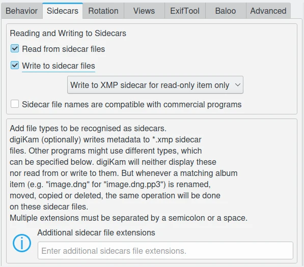

.. meta::
   :description: digiKam Metadata Settings
   :keywords: digiKam, documentation, user manual, photo management, open source, free, learn, easy

.. metadata-placeholder

   :authors: - digiKam Team

   :license: see Credits and License page for details (https://docs.digikam.org/en/credits_license.html)

.. _metadata_settings:

:ref:`Metadata Settings <setup_application>`
============================================

.. contents::

The **Metadata** options for digiKam are set from :menuselection:`Settings --> Configure digiKam... --> Metadata page`.

Image files can include embedded metadata in the image file format. These metadata can be stored in a number of standard formats as JPEG, TIFF, PNG, JPEG2000, PGF, and RAW files. Metadata can be read and written in the `Exif <https://en.wikipedia.org/wiki/Exif>`_, `IPTC <https://en.wikipedia.org/wiki/IPTC_Information_Interchange_Model>`_, and `XMP <https://en.wikipedia.org/wiki/Extensible_Metadata_Platform>`_ formats if they are present in the file.

Storing metadata directly in image files allows this information to be preserved when moving or sending image files to different systems.

.. _metadata_behavior:

Behavior Settings
-----------------

The **Behavior** tab allows you to select what metadata digiKam will write to image files and controls how digiKam will deal with this embedded information.

.. figure:: images/setup_metadata_behavior.webp
    :alt:
    :align: center

    The digiKam Metadata General Behavior Settings Page

The options available in the **Write This Information to the Metadata** section are:

    - **Image tags** will store the tag paths and keywords used to mark the contents. Usually this information is stored in IPTC and XMP.
    - **Captions and titles** will store the internationalized strings used to describe the contents. Usually this information is stored in Exif, IPTC, and XMP.
    - **Rating** will store the rating assigned to the image. Usually this information is stored in Exif and XMP.
    - **Pick label** will store the pick label indicating the quality of the contents. Usually this information is stored in XMP.
    - **Color label** will store the color flag you assigned to classify your contents according to your workflow. Usually this information is stored in XMP.
    - **Timestamps** will store the dates of the contents. Usually this information is stored in Exif, IPTC, and XMP.
    - **Metadata templates (Copyrights etc.)**: will store the set of internationalized strings used by agencies in their workflows. Usually this information is stored in IPTC and XMP.
    - **Face Tags (including face areas)**: will store the face tag paths and the rectangles corresponding to the zones around faces. Usually this information is stored in XMP.
    - **Geolocation information (GPS)**: will store the geographic position associated with the contents, usually where the image was taken. Usually this information is stored in Exif and XMP.

The options available in the **Reading and Writing Metadata** section are:

    - **Delegate to ExifTool backend all operations to write metadata to files** specifies that metadata should be written to image files using the `ExifTool <https://exiftool.org/>`_ backend instead of the default `Exiv2 <https://exiv2.org/>`_. Using ExifTool instead of Exiv2 will slow down the synchronization of file metadata with the database.
    - **Write metadata to DNG files** specifies that metadata should be written into DNG files using the ExifTool. This feature is disabled by default.
    - **If possible write metadata to RAW files** specifies that metadata should be written into RAW files using the ExifTool. This feature is disabled by default.

.. note::

    Also refer to the ExifTool backend configuration described in the :ref:`ExifTool Settings <metadata_exiftool>` section of this manual, and the section on `ExifTool write limitations <https://exiftool.org/#limitations>`_.

The three options on the bottom specify other behaviors:

    - **Use Lazy Synchronization** allows you to control when metadata are written. When unchecked, synchronization and writing of metadata occurs immediately. When checked, digiKam will only write metadata when the user clicks on the **Apply Pending Changes To Metadata** icon in the status bar or when the application is shutdown.
    - **Update file modification timestamp when files are modified** allows you to update file timestamps anytime files are changed, such as when you update metadata or image data. Note: disabling this option can introduce some issues with external applications that use file timestamp properties to automatically detect file modifications.
    - **Rescan file when files are modified** allows you to force digiKam to rescan files that have been modified outside the application. If a file has changed its file size or if the last modified timestamp has changed, a rescan of that file will be performed when digiKam starts.

.. _metadata_sidecars:

Sidecars Settings
-----------------

The **Sidecars** tab allows a user to control whether or not digiKam will read and write from/to XMP sidecars. You can also customize the granularity of write operations to XMP sidecar:

    - **Write to XMP sidecar only** will not write metadata into the item (image file).
    - **Write to item and XMP Sidecar** will write to both item and sidecar at the same time.
    - **Write to XMP sidecar for read-only item only** will write to sidecars for non-writable items only, such as video or RAW files.

The default filename for sidecars is automatically set to :file:`filename.ext.xmp`. For example, :file:`image1.dng` will have a sidecar file named :file:`image1.dng.xmp`. If the **Sidecar file names are compatible with commercial programs** option is enabled, digiKam will instead create the XMP sidecar files with a compatible file name (:file:`image1.xmp`) used by many commercial programs.

    The digiKam Metadata Sidecar Behavior Settings Page

.. note::

    If the box **Read from sidecar files** is checked, digiKam will only read the sidecar file and ignore the embedded metadata.

The option **Additional sidecar file extensions** allows you to add extra filename extensions to be processed alongside regular items, independent of the XMP sidecars. These files will be hidden, but regarded as an extension of the main file. Just write :file:`thm pp3` to support :file:`filename.thm` (extra Jpeg thumbnail for RAW) and :file:`filename.pp3` (RAWTheraPee metadata) sidecars.

.. _metadata_rotation:

Rotation Settings
-----------------

.. figure:: images/setup_metadata_rotation.webp
    :alt:
    :align: center

    The digiKam Metadata Rotation Behavior Settings Page

The first options specify digiKam's behavior when rotating a file.

**Show images/thumbnails rotated according to orientation tag**: this will use any orientation information that your camera has included in the Exif information to automatically rotate your photographs so that they are displayed the correct way up. It will not actually rotate the image file, only the display of the image on the screen. If you want to permanently rotate the image on file, you can click with the right mouse button on the thumbnail and select **Auto-rotate/flip according to Exif orientation**. The image will then be rotated on disk and the tag will be reset to "normal". If your camera routinely gets this orientation information wrong you might like to switch this feature off.

**Set orientation tag to normal after rotate/flip**: the auto-rotate option automatically corrects the orientation of images taken with digital cameras that have an orientation sensor. The camera adds an orientation tag to the image's Exif metadata. digiKam can read this tag to adjust the image accordingly. If you manually rotate an image, these metadata will be incorrect. This option will set the orientation tag to *Normal* after an adjustment, assuming that you rotated it to the correct orientation. Switch this off if you don't want digiKam to make changes to the orientation tag when you rotate or flip the image.

.. _metadata_viewers:

Views Settings
--------------

These settings allow you to specify the metadata contents displayed in Exif, Makernotes, IPTC, XMP, and ExifTool viewers from the right sidebar when using custom filters. For more details see :ref:`this section <metadata_view>` from the manual.

.. figure:: images/setup_metadata_views.webp
    :alt:
    :align: center

    The digiKam Settings For The Metadata Viewers

.. _metadata_exiftool:

ExifTool Settings
-----------------

`ExifTool <https://exiftool.org/>`_ is a backend engine that digiKam can use to process operations on metadata, such as view, read, and write. This tab indicates the presence of the ExifTool binary program, and lists the read and write support for supported formats.

.. figure:: images/setup_metadata_exiftool.webp
    :alt:
    :align: center

    The digiKam Settings For The ExifTool Backend

.. note::

    To replace the Exiv2 backend by ExifTool for all read and write metadata operations, see the :ref:`Metadata Behavior <metadata_behavior>` section of this manual.

.. _metadata_baloo:

Baloo Settings
--------------

**Baloo** is the file indexing and file search framework for **KDE Plasma** under Linux, with a focus on providing a very small memory footprint along with an extremely fast searching. Baloo is not an application, but a daemon to index files.

.. figure:: images/setup_metadata_baloo.webp
    :alt:
    :align: center

    The digiKam Settings For The Baloo Metadata Search Engine

This page allows the sharing of metadata stored in the digiKam database with the Baloo search engine. Extra applications such as the **KDE Dolphin** file manager can use the Baloo interface to provide file search results with items managed by the digiKam database.

.. note::

    This page is only available under Linux, not Windows and macOS. The KDE Plasma **Files Indexer** feature must be enabled in the KDE Plasma control Panel.

.. _metadata_advanced:

Advanced Settings
-----------------

The **Advanced** tab allows you to manage namespaces used by digiKam to store and retrieve tags, ratings and comments. This functionality is often used by advanced users to synchronize metadata between different software. Please leave the settings at their default values if you are not sure of what you are doing.

The categories that you can manage with these advanced settings are:

    - **Caption**: all languages-alternative comments (supported by XMP only), else the simple comments values (Exif and IPTC).
    - **Color Label**: the color labels properties to apply on items in your workflow.
    - **Rating**: the stars properties to apply on items in your workflow.
    - **Tags**: the nested keywords hierarchy to apply on items in your workflow (supported by XMP only), else the simple flat list of keywords (Exif and IPTC).
    - **Title**: all languages-alternative titles (supported by XMP only), else the simple title values (Exif and IPTC).

For each category you can set the read and write behavior in metadata. The default settings is to **Unify Read and Write** operations, but if you disable this option, you can customize **Read Options** and **Write Options** independently.

.. figure:: images/setup_metadata_advanced.webp
    :alt:
    :align: center

    The digiKam Advanced Metadata Settings For the **Caption** Category

On this example, the top **Caption** entry in the list is **Xmp.dc.description**, and it will be read by digiKam first. If it contains a valid value it will be used, otherwise the next entry named **Xmp.exif.UserComment** will be read, etc. The entries list priority is high on the top and low on the bottom. The entries in the list are used only if the item is enabled with the checkbox preceding the name.

With the buttons on the right side, you can customize the list:

    - **Add**: add a new entry to the tags list.
    - **Edit**: modify the selected entry in the list.
    - **Delete**: remove the selected entry in the list.
    - **Move up**: move the selected entry in the list to a higher priority.
    - **Move Down**: move the selected entry in the list to a lower priority.
    - **Revert Changes**: revert last changes made to the list.
    - **Save Profile**: saves the current configuration to a **Profile** file.
    - **Load Profile**: loads a saved configuration from a **Profile** file.
    - **Revert To Default**: resets the current list to the default values.

The **Profile** are simple ini-based text file used to store the advanced metadata settings to the disk. A profile can be loaded to overload the current configuration, depending on your workflow and the rules to apply for the best interoperability with other photo management programs. digiKam comes with a compatibility profile for **DarkTable**.

.. important::

    We recommend to always put XMP tags to the top priority on this list, as XMP has better features than IPC and Exif.

.. note::

    The **Tags** category provide an extra option named **Read All Metadata For Tags** to force operations on all the namespaces.
