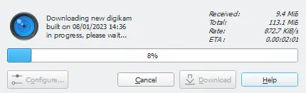
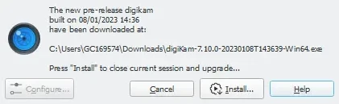
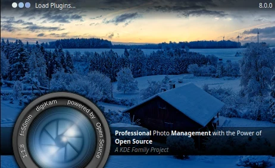
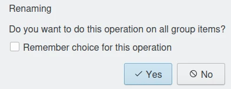
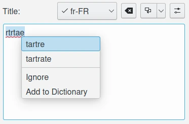
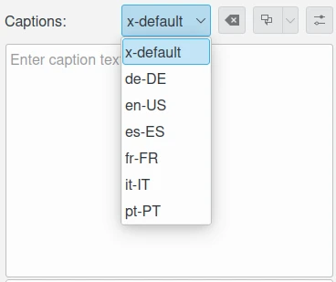
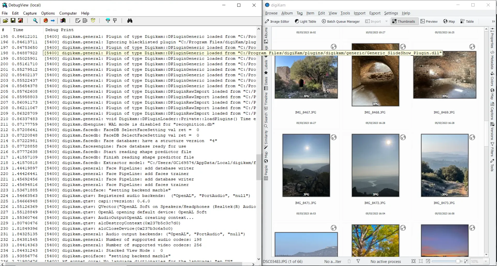

.. meta::
   :description: digiKam Miscellaneous Settings
   :keywords: digiKam, documentation, user manual, photo management, open source, free, learn, easy, setup, configure, miscs, behavior, appearance, spellcheck, localize, grouping, system, updates

.. metadata-placeholder

   :authors: - digiKam Team

   :license: see Credits and License page for details (https://docs.digikam.org/en/credits_license.html)

.. _miscs_settings:

:ref:`Miscellaneous Settings <setup_application>`
=================================================

.. contents::

The **Miscellaneous** options for digiKam are set from :menuselection:`Settings --> Configure digiKam... --> Miscellaneous page`. These settings group all application rules customizable by users but not covered in previous setting categories from the setup dialog.

.. _behavior_settings:

Behavior Settings
-----------------

Scan Operations
~~~~~~~~~~~~~~~

.. figure:: images/setup_miscs_behavior.webp
    :alt:
    :align: center

    The digiKam Behavior Configuration Page

The **Scan for new items at startup** forces digiKam to scan all collections for new items each time digiKam is run. The scan is performed in the background when the digiKam main interface is loaded. The progress of the scan is displayed in the status bar. If your computer is fast enough, digiKam should be perfectly usable while scanning for new items. You probably should disable this option if your collections are huge, or if you use a remote database. In these cases, you should perform manual scans for new items when needed using :menuselection:`Tool --> Scan for new items`.

The **Fast Scan** option significantly speeds up the scan, looking for new items, deleted items and renamed items. Disable this option if you need to scan for items that are not new, but have been changed.

The **Detect faces in newly added images** option will automatically perform face detection on items imported to the collections.

The **Remove obsolete core database objects** option forces digiKam to clean up the core database by removing obsolete item entries, which are entries that no longer point to an item stored in the collection. This option does not clean up the thumbnails or face recognition databases. (The maintenance tool provides options for cleaning up the other databases.) Enabling this option will slow down digiKam's startup.

.. _genericrules_settings:

Generic Settings
~~~~~~~~~~~~~~~~

The **Confirm when moving items to trash** and **Confirm when permanently deleting items** options control whether digiKam asks for confirmation before deleting a photograph or an Album. See the :ref:`Deleting a Photograph <deleting_photograph>` and the :ref:`Deleting an Album <deleting_album>` sections for more details.

The **Do not confirm when applying changes in the right sidebar** option controls whether digiKam asks for confirmation before changing items based on interactions with the right sidebar. Such changes are automatically applied if this option is enabled. Otherwise the **Apply changes** button must be pressed to apply changes.

The **Show only face tags for assigning names in people sidebar** option will restrict people tree-view contents to face tags available when you assign a name to an **Unconfirmed** face. If you want to learn more details about face management, take a look at :ref:`this section <people_view>` of the manual.

The **Initially select the first item in the album** option will automatically select and highlight the top left thumbnail whenever a new album is selected.

The **Expand current tree item with a single mouse click** option controls how the mouse button is used to expand a nested album branch.

The **Scroll current item to center of thumbbar** option controls the scrolling of the thumbbar. When enabled, the thumbbar scrolls to place the current selected item in the middle of the thumbbar. When disabled, the current selection may or may not be in the center of the thumbbar.

The **Get album date source** option specifies the source to use for setting the album date when new items are found during scanning. Possible values are:

    - **From The Newest Item Date**: takes the date from the newest item in the album.
    - **From The Oldest Item Date**: takes the date from the oldest item in the album.
    - **From The Average Date**: computes the date from an average of all items in the album.
    - **From The Folder Date**: takes the file system date.
    - **No Change Of Date**: does not modify the date.

The **String comparison type** option, sets the way in which strings are compared inside digiKam. This influences the sorting order for the tree views. Possible values are:

    - **Natural** compares strings using standard alphanumeric sorting, sorting numbers with fewer digits before numbers with more digits. In this mode, an album named *202409 Olympic* comes *before* an album named *20240625 Maydale*.
    - **Normal** uses a different approach that respects ISO dates, independent of the number of digits. In this mode, an album named *202409 Olympic* comes *after* an album named *20240625 Maydale*.

The **Lower bound for minimum similarity** option, selects the lower bound of the minimum similarity threshold for fuzzy and duplicate searches. The default value is 40. Selecting a lower value than 40 can significantly slow the search.

.. _updates_settings:

Application Updates
~~~~~~~~~~~~~~~~~~~

The three options in the **Updates** section determine how digiKam checks online for the latest version of digiKam. When checking for a new version you can either select **Only For Stable Releases** to receive notifications about official versions safe to use in production, or **Weekly Pre-Releases** to receive notifications about the latest releases suitable for testing new features, but not recommended for production use.

The option **Use Version With Debug Symbols** allows you to download versions of digiKam that include debug symbols. These versions are larger but can help developers trace errors in a debugger.

The **Check Now** button on the bottom sends a request for an update. The **Last check** date is indicated on the left side. If a new version is available online, the following dialog will appear:

.. figure:: images/setup_update_new.webp
    :alt:
    :align: center

    Dialog under Windows When a new digiKam Version is Available Online

Press the **Download** button to download the new version. A dialog will then appear to indicate the download progress.

    Progress Dialog under Windows to Get the new Version Available Online

When the download is complete, a checksum is computed to be sure that the files were not corrupted. If all is fine, a new dialog appears as below.

    Dialog under Windows When Install is Ready to be Processed

Just press **Install** button to complete the installation. The current digiKam session will be closed and the installer will be started.

.. note::

    The AppImage Linux bundle does not require installation on the system. The downloaded file is ready to use. In this case, the dialog will instead propose to open the desktop file manager.

.. _appearance_settings:

Appearance Settings
-------------------

.. figure:: images/setup_miscs_appearance.webp
    :alt:
    :align: center

    The digiKam Appearance Configuration Page

The **Show splash screen at startup** option switches off the display of the splash screen when the application first loads. This may slightly speed up starting the program.

    The Splash Screen Visible at Startup of a digiKam Session

The **Use native file dialogs from system** option switches from the basic (but universal) open-file dialog included in the application to the more powerful open-file dialog provided by the operating system.

+-------------------------------------------------------+------------------------------------------------------+
|    .. figure:: images/setup_openfile_basic.webp       |    .. figure:: images/setup_openfile_native.webp     |
|       :alt:                                           |        :alt:                                         |
|       :align: center                                  |        :align: center                                |
+-------------------------------------------------------+------------------------------------------------------+
|       Basic Open-File Dialog under macOS              |        Native Open-File Dialog under macOS           |
+-------------------------------------------------------+------------------------------------------------------+

The **Draw frames around grouped items** option applies a more visible decoration to the items grouped in the icon view.

+-------------------------------------------------------+------------------------------------------------------+
|    .. figure:: images/setup_grouped_noframe.webp      |    .. figure:: images/setup_grouped_frame.webp       |
|       :alt:                                           |        :alt:                                         |
|       :align: center                                  |        :align: center                                |
+-------------------------------------------------------+------------------------------------------------------+
|       Icon-View Grouped Items with no Frame           |        Icon-View Grouped Items with Frame            |
+-------------------------------------------------------+------------------------------------------------------+

The **Sidebar tab title** option sets how the tab titles are displayed in the left and right sidebars. Select the **Only For Active Tab** option if you use a small screen, such as with a laptop computer. Otherwise the **For All Tabs** option is a better choice for quickly accessing digiKam's features.

The **Widget style** option selects the default application window decoration and looks.

.. important::

    Even if different widget styles are available, the **Breeze** style gives the best experience on all desktops. It's highly recommended that you do not change this value.

The **Icon theme** option selects the default application icon theme. Theme availability is operating-system dependent. The **Breeze** icons-set is generally the best choice for all operating systems.

Finally, the **Application font** option customizes the font used everywhere in the application. Note that extra options also exist for customizing fonts for the :ref:`album tree-view <treeview_font>`, the :ref:`icon-view <iconview_font>`, and the :ref:`tooltip <tooltip_font>`.

.. _grouping_settings:

Grouping Settings
-----------------

.. figure:: images/setup_miscs_grouping.webp
    :alt:
    :align: center

    The digiKam Grouping Configuration Page

digiKam offers the powerful capability of grouping images together, but displays only the leading item from the group. This raises the question of which images should be affected when an operation is applied to grouped items. Does the operation apply to all of the items in the group, or just the leading (displayed) item? This section lists all the operations that can be performed on all grouped items, organized into 7 classes. The classes of possible operations are:

    - **Metadata**: when you change information stored in the files or in the database.
    - **Import/Export Tools**: to import and export items.
    - **Batch Queue Manager**: to process all items from a group.
    - **Light Table**: to display grouped items when reviewing by pair.
    - **Slideshow**: to show all grouped items on the screen.
    - **Renaming**: to rename all items from a group.
    - **Tools**: to post process all items from a group.

For each class of operations, you can select whether digiKam allies the commanded operation to all items within a group:

- **No**: apply operation only to the leading item
- **Yes**: apply operation to all items in the group.
- **Ask**: ask to confirm before applying each operation.

In the last case, the dialog below will appear during the operation. Selecting **Remember your choice for this operation** will adjust the operation settings accordingly.

    The Dialog to Warn about Grouped Renaming File Operations

.. _spellcheck_settings:

Spellcheck Settings
-------------------

This section controls the spellcheck operations that can be performed in the background in all text edit widgets.

.. figure:: images/setup_miscs_spellcheck.webp
    :alt:
    :align: center

    The digiKam Spellcheck Configuration Page

Spellcheck can be used on captions, titles, and other text-edit widgets to identify spelling errors and propose corrections. digiKam autodetects the language used for the spellcheck, since many text entry fields support multiple languages. Spellcheck depends on open-source **Backends**, including **Language Dictionaries**, to perform sentence analysis. The available backends and languages are listed in this view for your information. If you want to add new languages or dictionaries, you'll need to install the relevant packages onto your system.

    The Titles Text Editor from Captions Tab with Spellcheck Feature

The **Default Language** option sets the language to spellcheck with the *x-default* entry from the alternative-language string. If you select **Auto-detect**, the string contents will be automatically parsed to determine the language and the correct dictionary for spellchecking will be selected. Of course, the relevant dictionaries must be installed on your computer in order for spellchecking to work properly.

You can edit a list of words that Spellcheck should ignore during operations. digiKam already provide a list of common keywords to ignore.

.. _localize_settings:

Localize Settings
-----------------

The Configuration Page
~~~~~~~~~~~~~~~~~~~~~~

This section allows you to customize the rules for automatic translation of strings in text editor widgets using online translator engines.

.. figure:: images/setup_miscs_localize.webp
    :alt:
    :align: center

    The digiKam Localize Configuration Page

A list of **Alternative Languages** supported by digiKam is provided where you can select your preferred languages to be used in text editor widgets.

Another list shows the **Available Translator Languages**, supported by the selected **Online Translator** engine.

Each list has a huge number of entries, so a search engine is available to quickly find a language, along with an option to show only the current selection.

Using Strings Localization
~~~~~~~~~~~~~~~~~~~~~~~~~~

In digiKam, the localization is available in special text editor widgets supporting alternative-languages feature. Examples of this kind of widget can be seen in the :ref:`Captions tab <captions_view>` available in the **Right Sidebar** and in the :ref:`XMP Metadata Editor <xmp_editor>`.

    The Captions Text Editor with Translation Feature

Alternative-languages can make more than one translation available for a single string. The **x-default** entry is the native language used as a reference for translations. Typically, x-default is set to English, but that is not mandatory. When you ask to translate the string, the online translators will be able to auto-detect the current language used with **x-default**.

On the top of a text editor widget, you can select the translation entry for the string. The drop-down menu will only show your preferred languages set on the configuration page. The next button on the right clears the current translated entry. The next drop-down button creates a new translation entry using the configured online translator. Finally, the last button on the right side shows the Localize settings page to customize the translation behavior.

.. _system_settings:

System Settings
---------------

This section allows you to adjust special low-level configurations used by digiKam. Only change these settings if you know what you are doing.

.. figure:: images/setup_miscs_system.webp
    :alt:
    :align: center

    The digiKam System Configuration Page

- **Use high DPI scaling from the screen factor**: this option will scale coordinates in a device-independent manner according to the display scale factors provided by the operating system. It scales the graphical interface elements (buttons, text, etc.) in accordance with the Desktop settings. The digiKam graphical interface elements are therefore displayed larger by this factor and therefore should appear just as large as the graphical interface elements used in the native system. This option is only available with the **Qt5 version** of digiKam.

- **Use pixmaps with high DPI resolution**: this option sizes the pixmaps used internally by digiKam into a device-independent layout geometry, and activates high-resolution icons. If this option is disabled on a high-DPI display, the elements in digiKam may look very blurry when viewed at high resolutions. This option is also recommended for use when using multiple screens with different resolutions. This option is only available with the **Qt5 version** of digiKam.

- **Use the software OpenGL rendering**: this option will disable the GPU hardware accelerations and switch to a software-emulation for all calls to OpenGL.

- **Use the OpenCL hardware acceleration**: this option will enable the GPU hardware accelerations with the face management, image quality scanning, and auto-tags features. This option affects the `OpenCV <https://opencv.org/>`_ engine used in the background for intensive computation on images. To see the details about OpenCV hardware support, go to the :menuselection:`Help --> Components Information` menu item, and look at the :ref:`OpenCV section <help_componentsinfo>` in the dialog.

- **Use the OpenCL hardware acceleration for AI Models**: this option will enable the GPU hardware accelerations with the Artificial Intelligence data model. Typically, the Neural Processing Unit from your video card will be used to handle the inference engine data models. The **Test GPU AI Compatibilty** button allows to start a sequence of checks to report if your hardware supports these features.

- **Download Required Binary Data**: this button loads the deep-learning model files used with the face management, image quality scanning, and auto-tags features. Only use it if you bypassed this stage at the first-run of the application.

- **Use the video hardware acceleration**: this option must be used only with compatible hardware GPU devices with the FFmpeg backend. Disable this option if video media decoding errors occur.

- **Use the video texture conversion**: this option must be used to reduce CPU usage when video frames are rendered by using GPU-based conversion with the FFmpeg backend. Disable this option if video media decoding errors occur.

- **Decoding backend to render video**: this option chooses the backend used to render video media with the **Qt6 version** of application. Supported backends are:

    - **FFmpeg**: the default and recommended backend available on all platforms. `FFmpeg <https://en.wikipedia.org/wiki/FFmpeg>`_ always includes all necessary codecs to play media.
    - **GStreamer**: the alternative backend available **under Linux**. `GStreamer <https://en.wikipedia.org/wiki/GStreamer>`_ can require the installation of 3rd-party codecs on the system to work properly.
    - **WMF**: Windows Media Foundation is the alternative backend available **under Windows**. `WMF <https://en.wikipedia.org/wiki/Media_Foundation>`_ can require the installation of 3rd-party codecs on the system to work properly.
    - **AVFoundation**: the alternative backend available **under macOS**. `AVFoundation <https://en.wikipedia.org/wiki/AVFoundation>`_ can require the installation of 3rd-party codecs on the system to work properly.

.. important::

    To prevent washed out color issues when playing HDR video taken from modern devices, by experience better results can be obtained using an alternative backend.

- **Enable internal debug logging**: this option turns on the debug traces on the console used to investigate errors. Under Linux and macOS, just start the application from a console to show the messages. Under Windows, you need an extra Microsoft application named `DebugView <https://learn.microsoft.com/sysinternals/downloads/debugview>`_ to display the messages. The default settings from DebugView are enough to capture the traces from the application.

    digiKam Running Under Windows With DebugView

- **Network Proxy Server Settings**: use this group the options to setup the `proxy server <https://en.wikipedia.org/wiki/Proxy_server>`_ settings for your local network. Leave empty if no proxy is required to access the Internet. Available Proxy options are listed below:

    - **Proxy**: the address of the Proxy server on the network.
    - **Port**: the Proxy server port on the network.
    - **Proxy type**: the Proxy type available on the network. Two protocols are supported: **Http** or **Socks5**.
    - **Requires Authentication**: turn on this option if the connection to the Proxy server needs a **Username** and a **Password**.
    - **Username**: the name to use to be logged on the Proxy server over the network.
    - **Password**: the password to use to be logged on the Proxy server over the network.
