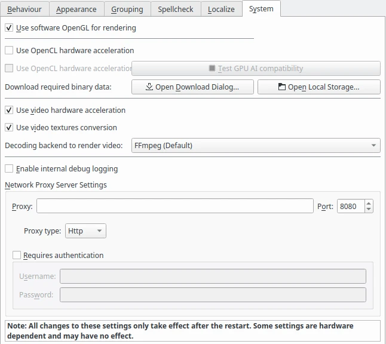

.. meta::
   :description: digiKam Miscellaneous Settings
   :keywords: digiKam, documentation, user manual, photo management, open source, free, learn, easy

.. metadata-placeholder

   :authors: - digiKam Team

   :license: see Credits and License page for details (https://docs.digikam.org/en/credits_license.html)

.. _miscs_settings:

Miscellaneous Settings
======================

.. contents::

Behavior Settings
-----------------

.. figure:: images/setup_miscs_behavior.webp

Scan for new items at startup option will force digiKam to scan the album library tree for new items added or removed between digiKam sessions. This may slow down the start time of digiKam. If any items have been removed from album library, digiKam will ask you confirmation before to remove definitely item references in database.

With the Scroll current item to center of thumbbar setting, you can force thumbbar to center current selected item with mouse pointer on the center of visible area.

With the String comparison type setting, you can set the way in which strings are compared inside digiKam. This influences the sorting of the tree views. Natural tries to compare strings in a way that regards some normal conventions. The result will be sort naturally even if they have a different number of digits inside. Normal uses a more technical approach. Use this style if you want to entitle albums with ISO dates (201006 or 20090523) and the albums should be sorted according to these dates.

With the Confirm when moving items to trash and Confirm when permanently deleting items settings you can set the verbosity of digiKam when you delete a photograph or an Album. See Deleting a Photograph and Deleting an Album sections for more details.

The editorial changes done through the right sidebar can be quietly applied by digiKam when setting the Apply changes in the right sidebar without confirmation option. Otherwise the changes must be applied by pressing the Apply changes button.

The updates settings allows to tune how the check for new application versions available online.

.. _appearance_settings:

Appearance Settings
-------------------

.. figure:: images/setup_miscs_appearance.webp

With the Show splash screen at startup setting, you can switch off the display of the splash screen when application loads. This may speed up the start time slightly.

With the Sidebar tab title setting, you can set how sidebars on the sides will show the tab titles. Use Only For Active Tab option only if you use a small screen resolution as with a laptop computer. Else For All Tabs will be a best choice to discover quickly all internal features of digiKam.

With the Widget style setting, you can choose the default application window decoration and looks. Fusion style is the best choice under all desktop.

With the Icon theme setting, you can choose the default application icon theme. Theme availability depends of desktop used to run digiKam.

Grouping Settings
-----------------

This section list the operations to perform on all grouped items depending on the usage context.

.. figure:: images/setup_miscs_grouping.webp

Spellcheck Settings
-------------------

This section allows to control the spellchecking operations done in background in all text edit widgets.

.. figure:: images/setup_miscs_spellcheck.webp

Localize Settings
-----------------

This section allows to customize the rules to translate automatically strings from text edit widgets using online translator engine.

.. figure:: images/setup_miscs_localize.webp

System Settings
---------------

This section allows to tune special low level configurations used by application. Only change these settings if you know what you do.

