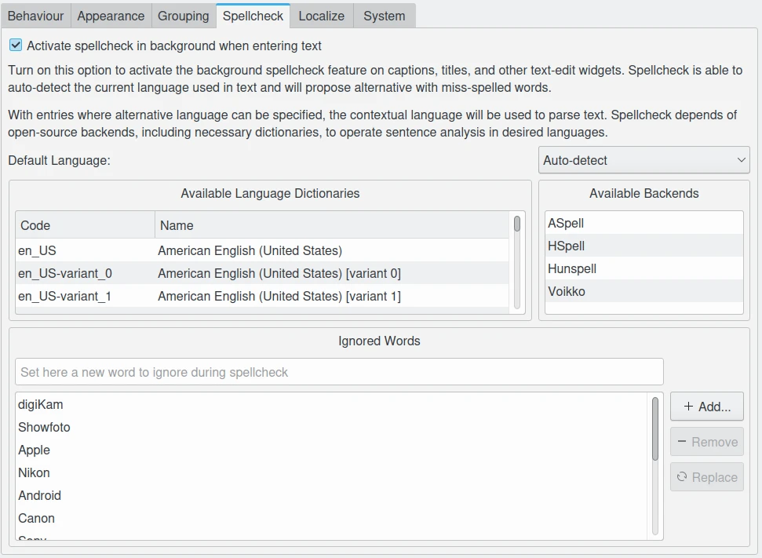

.. meta::
   :description: digiKam Miscellaneous Settings
   :keywords: digiKam, documentation, user manual, photo management, open source, free, learn, easy, setup, configure, miscs, behavior, appearance, spellcheck, localize, grouping, system, updates

.. metadata-placeholder

   :authors: - digiKam Team

   :license: see Credits and License page for details (https://docs.digikam.org/en/credits_license.html)

.. _miscs_settings:

Miscellaneous Settings
======================

.. contents::

These settings group all application rules customizable by users but not covered in previous setting categories from the setup dialog.

.. _behavior_settings:

Behavior Settings
-----------------

Scan Operations
~~~~~~~~~~~~~~~

.. figure:: images/setup_miscs_behavior.webp
    :alt:
    :align: center

    The digiKam Behavior Configuration Page

Set the option **Scan for new items at startup** to force digiKam to scan all collections for new items to register new elements in database. The scan is performed in the background through the progress manager available in the statusbar when digiKam main interface is loaded. If your computer is fast enough, this will have no effect on usability of digiKam while scanning. If your collections are huge or if you use a remote database, this can introduce low latency, and it is recommended to disable this option and to plan a manual scan through the maintenance tool at the right moment.

Set the option **Fast Scan** to significantly speed up the scan. New items, deleted and also renamed items are found. In order to find items that have been changed, this option must be deactivated.

**Detect faces in newly added images** option will perform automatically a face detection on items imported to the collections.

Set the option **Remove obsolete core database objects** to force digiKam to clean up the core database from obsolete item entries. Entries are only deleted if the connected item file was already removed, i.e. the database object wastes space. This option does not clean up other databases as the thumbnails or recognition db. For clean up routines for other databases, please use the maintenance tool. Take a care that option slow down startup stages.

.. _genericrules_settings:

Generic Rules
~~~~~~~~~~~~~

With the **Confirm when moving items to trash** and **Confirm when permanently deleting items** settings you can set the verbosity of digiKam when you delete a photograph or an Album. See the :ref:`Deleting a Photograph <deleting_photograph>` and the :ref:`Deleting an Album <deleting_album>` sections for more details.

The editorial changes done through the right sidebar can be quietly applied by digiKam when setting the **Do not confirm when applying changes in the right sidebar** option. Otherwise the changes must be applied by pressing the **Apply changes** button.

The option **Show only face tags for assigning names in people sidebar** will restrict people tree-view contents to face tags available when you assign a name to an **Unconfirmed** face. If you want to learn more details about face management, take a look to :ref:`this section of the manual <people_view>`.

The option **Initially select the first item in the album** will force to highlight the top left icon-view thumbnail when a new album is selected.

The option **Expand current tree item with a single mouse click** allows to customize how the mouse button will be used to expand a nested album branch.

With the **Scroll current item to center of thumbbar** setting, you can force thumbbar to center current selected item with mouse pointer on the center of visible area.

The **Get album date source** option allows to adjust the album date depending on the option set when new items are found during scanning. Possible values are:

    - **From The Newest Item Date**: to take the date from the newest item hosted in album.
    - **From The Oldest Item Date**: to take the date from the oldest item hosted in album.
    - **From The Average Date**: to compute the date from an average of all items hosted in album.
    - **From The Folder Date**: to take the file system date.
    - **No Change Of Date**: do not modify the date.

With the **String comparison type** setting, you can set the way in which strings are compared inside digiKam. This influences the sorting of the tree views. Possible values are:

    - **Natural** tries to compare strings in a way that regards some normal conventions. The result will be sort naturally even if they have a different number of digits inside.
    - **Normal** uses a more technical approach. Use this style if you want to entitle albums with ISO dates (as *201006* or *20090523*) and the albums should be sorted according to these dates.

With the **Lower bound for minimum similarity** option, you can select the lower bound of the minimum similarity threshold for fuzzy and duplicates searches. The default value is 40. Selecting a lower value than 40 can make the search really slow.

.. _updates_settings:

Application Updates
~~~~~~~~~~~~~~~~~~~

The **Updates** settings allows to tune how the check the online availability of a new application version. You can select **Only For Stable Releases** which are official versions safe to use in production. Another choice is **Weekly Pre-Releases** which is proposed to tests quickly new features but not recommended to use in production as bugs can remain.

The option **Use Version With Debug Symbols** allows to download version including debug symbols. This version is more heavy but can help developers to trace dysfunctions in debugger.

Finally, on the bottom, a **Check Now** button allow to send a request for an update. The **Last check** date is indicated on the left side. If a new version is available online, a dialog will appears as below.

.. figure:: images/setup_update_new.webp
    :alt:
    :align: center

    Dialog under Windows When a new digiKam Version is Available Online

From this dialog, press the **Download** button to process. A new progress dialog will appears as below.

.. figure:: images/setup_update_download.webp
    :alt:
    :align: center

    Progress Dialog under Windows to Get the new Version Available Online

When the download is complete, a checksum is computed to be sure that files is not corrupted. If all is fine, a new dialog appears as below.

.. figure:: images/setup_update_install.webp
    :alt:
    :align: center

    Dialog under Windows When Install is Ready to be Processed

Just press **Install** button to process the final stage. The current digiKam session will be closed and installer will be started.

.. note::

    AppImage Linux bundle do not require installation on the system. File is downloaded and ready to use. The dialog propose to open desktop files-manager at the download place instead.

.. _appearance_settings:

Appearance Settings
-------------------

.. figure:: images/setup_miscs_appearance.webp
    :alt:
    :align: center

    The digiKam Appearance Configuration Page

With the **Show splash screen at startup** setting, you can switch off the display of the splash screen when application loads. This may speed up the start time slightly.

.. figure:: images/setup_splash_screen.webp
    :alt:
    :align: center

    The Splash Screen Visible at Startup of a digiKam Session

With the **Use native file dialogs from system** setting, you can switch from the basic (but universal) open-file dialog included in the application to the more powerful open-file dialog provided by the desktop.

+-------------------------------------------------------+------------------------------------------------------+
|    .. figure:: images/setup_openfile_basic.webp       |    .. figure:: images/setup_openfile_native.webp     |
|       :alt:                                           |        :alt:                                         |
|       :align: center                                  |        :align: center                                |
+-------------------------------------------------------+------------------------------------------------------+
|       Basic Open-File Dialog under macOS              |        Native Open-File Dialog under macOS           |
+-------------------------------------------------------+------------------------------------------------------+

With the **Draw frames around grouped items** setting, a more visible decoration will be applied to the items grouped in icon-view.

+-------------------------------------------------------+------------------------------------------------------+
|    .. figure:: images/setup_grouped_noframe.webp      |    .. figure:: images/setup_grouped_frame.webp       |
|       :alt:                                           |        :alt:                                         |
|       :align: center                                  |        :align: center                                |
+-------------------------------------------------------+------------------------------------------------------+
|       Icon-View Grouped Items with no Frame           |        Icon-View Grouped Items with Frame            |
+-------------------------------------------------------+------------------------------------------------------+

With the **Sidebar tab title** setting, you can set how sidebars on the sides will show the tab titles. Use **Only For Active Tab** option only if you use a small screen resolution as with a laptop computer. Else **For All Tabs** will be a best choice to discover quickly all internal features of digiKam.

With the **Widget style** setting, you can choose the default application window decoration and looks.

.. important::

    Even if different widget styles are available, the **Breeze** style gives the best experience on all desktops. It's highly recommended to not change this value.

With the **Icon theme** setting, you can choose the default application icon theme. Theme availability depends of desktop used to run digiKam. **Breeze** icons-set is the best choice for all desktops.

Finally, the **Application font** option allow to customize the font to use everywhere in the application. Note that extra options exists also to customize fonts for the :ref:`album tree-view <treeview_font>`, the :ref:`icon-view <iconview_font>`, and the :ref:`tooltip <tooltip_font>`.

.. _grouping_settings:

Grouping Settings
-----------------

.. figure:: images/setup_miscs_grouping.webp
    :alt:
    :align: center

    The digiKam Grouping Configuration Page

This section list the operations to perform on all grouped items depending on the usage context. Operations supported are:

    - **Metadata**: when you change information to store in files or in the database.
    - **Import/Export Tools**: to import and export items.
    - **Batch Queue Manager**: to process all items from a group.
    - **Light Table**: to display grouped items when reviewing by pair.
    - **Slideshow**: to show all grouped items on the screen.
    - **Renaming**: to all items from a group.
    - **Tools**: to post process all items from a group.

For each case, you can select if digiKam can:

- **No**: do nothing.
- **yes**: operate items.
- **Ask**: ask to confirm before to continue.

For this last case, a dialog as below will appears during operation. You can remember your choice for the next time, this will adjust the operation settings accordingly.

.. figure:: images/setup_operation_warning.webp
    :alt:
    :align: center

    The Dialog to Warn about Grouped Renaming File Operations

.. _spellcheck_settings:

Spellcheck Settings
-------------------

This section allows to control the spellchecking operations done in background in all text edit widgets.

    The digiKam Spellcheck Configuration Page

Spellcheck can be used on captions, titles, and other text-edit widgets to auto-detect the current language used in text and will propose alternative with miss-spelled words. With entries where alternative-language can be specified, the contextual language will be used to parse text. Spellcheck depends of open-source **Backends**, including **Language Dictionaries**, to operate sentence analysis. Availability of both are listed in this view for information. If you want to add new language or dictionaries, you need to install relevant packages on your system.

.. figure:: images/setup_captions_spellcheck.webp
    :alt:
    :align: center

    The Titles Text Editor from Captions Tab with Spellcheck Feature

The **Default Language** allow to set the language to spellcheck with the *x-default* entry from the alternative-language string. If you select **Auto-detect** value, the string contents will be parsed to determine the language automatically and select the right dictionary for spellchecking. Of course, in all cases the relevant dictionaries must be installed on your computer to see the spellchecking works properly.

You can edit a list of words that Spellcheck must ignore during operations. digiKam already provide a list usual keywords to not verify.

.. _localize_settings:

Localize Settings
-----------------

The Configuration Page
~~~~~~~~~~~~~~~~~~~~~~

This section allows to customize the rules to translate automatically strings from text editor widgets using online translator engine.

.. figure:: images/setup_miscs_localize.webp
    :alt:
    :align: center

    The digiKam Localize Configuration Page

A list of **Alternative Languages** supported by digiKam is provided where you can select your preferred entries hosted in text editor widgets.

Another list allows to know the **Available Translator Languages**, supported by the selected **Online Translator** engine.

As number of entries are huge for the both lists, a search engine is available and an option to show only the current selection.

Using Strings Localization
~~~~~~~~~~~~~~~~~~~~~~~~~~

In digiKam, the localization is available in special text editor widgets supporting alternative-languages feature. You can see this kind of widget in the :ref:`Captions tab <captions_view>` from **Right Sidebar** and in the :ref:`XMP Metadata Editor <xmp_editor>` for example.

.. figure:: images/setup_captions_localize.webp
    :alt:
    :align: center

    The Captions Text Editor with Translation Feature

Alternative-languages mean more than one translation available for one string. The **x-default** entry is the native language used as a reference for translations. Typically, it's common to use English words with x-default, but it's not mandatory. When you ask to translate the string, the online translators will be able to auto-detect the current language used with **x-default**.

On the top of a text editor widget, you can select the translation entry for the string. The drop-down menu will only show your preferred languages set on the configuration page. The next button on the right allows clearing the current translated entry. The next drop-down button allows creating of a new translation entry using the configured online translator. Finally, the last button on the right side will show the Localize settings page to customize the translation behavior.

.. _system_settings:

System Settings
---------------

This section allows to tune special low level configurations used by application. Only change these settings if you know what you do.

.. figure:: images/setup_miscs_system.webp
    :alt:
    :align: center

    The digiKam System Configuration Page

- **Use high DPI scaling from the screen factor**: this option application will scale coordinates in device independent manner according to display scale factors provided by the operating system. It scales the graphical interface elements (buttons, text, etc.) with the Desktop settings. The digiKam graphical interface elements are therefore displayed larger by this factor and are therefore theoretically just as large as the graphical interface elements of the system. This option is only available with the Qt5 version of application.

- **Use pixmaps with high DPI resolution**: this option, pixmaps sizes used internally by application will have a device-independent layout geometry. It activates high-resolution icons, otherwise the elements in digiKam would look very blurry under high resolutions. Also, it's recommended to use this option in multi-screen context when resolutions are not the same. This option is only available with the Qt5 version of application.

- **Use the software OpenGL rendering**: this option will disable the GPU hardware accelerations and switch to a software-emulation for all OpenGL usages.

- **Use the OpenCL hardware acceleration**: this option will enable the GPU accelerations with the faces management, image quality sorting, and auto-tags features. This option affect the `OpenCV <https://opencv.org/>`_ engine used in background for the intensive computation on images. To see all details about the OpenCV hardware support, go to :menuselection:`Help --> Components Information` menu entry, and :ref:`OpenCV section from the dialog <help_componentsinfo>`.

- **Fix AMD-GPU video decoding issue**: this option is only available under Windows and must be used only with AMD hardware GPU devices to decode video media.

- **Decoding backend to render video**: this option allows to choice the backend used to render video media with the Qt6 version of application. Supported backends are:

    - **FFmpeg**: the default backend available on all plateforms.
    - **GStreamer**: the alternative backend available under Linux.
    - **WMF**: Windows Management Framework is the alternative backend available under Windows.
    - **AVFoundation**: the alternative backend available under macOS.

- **Enable internal debug logging**: this option will turn on the debug traces on the console used to investigate dysfunctions. Under Linux and macOS, just start the application from a console to show the messages. Under Windows, you needs an extra Microsoft application named `DebugView <https://learn.microsoft.com/sysinternals/downloads/debugview>`_ to display the messages. The default settings from DebugView is enough to capture the traces from the application.

    digiKam Running Under Windows With DebugView

- **Download Face Engine Data**: with this button you can load the deep-learning model files used with the faces management, image quality sorting, and auto-tags features. Only uses it only if you by-pass this stage at application first-run.

- **Network Proxy Server Settings**: these option group the `proxy server <https://en.wikipedia.org/wiki/Proxy_server>`_ settings for your local intranet. Leave empty if there is no proxy.
