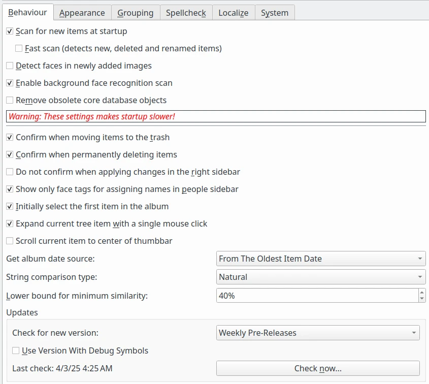

.. meta::
   :description: digiKam Miscellaneous Settings
   :keywords: digiKam, documentation, user manual, photo management, open source, free, learn, easy, setup, configure, miscs, behavior, appearance, spellcheck, localize, grouping, system, updates

.. metadata-placeholder

   :authors: - digiKam Team

   :license: see Credits and License page for details (https://docs.digikam.org/en/credits_license.html)

.. _miscs_settings:

Miscellaneous Settings
======================

.. contents::

These settings group all application rules customizable by users but not categorized in previous chapters.

.. _behavior_settings:

Behavior Settings
-----------------

    The digiKam Behavior Configuration Page

Set the option **Scan for new items at startup** to force digiKam to scan all collections for new items to register new elements in database. The scan is performed in the background throughthe progress manager available in the statusbar when digiKam main interface is loaded. If your computer is fast enough, this will have no effect on usability of digiKam while scanning. If your collections are huge or if you use a remote database, this can introduce low latency, and it is recommended to disable this option and to plan a manual scan through the maintenance tool at the right moment.

Set the option **Fast Scan** to significantly speed up the scan. New items, deleted and also renamed items are found. In order to find items that have been changed, this option must be deactivated.

**Detect faces in newly added images** option will perform automatically a face detection on items imported to the collections.

Set the option **Remove obsolete core database objects** to force digiKam to clean up the core database from obsolete item entries. Entries are only deleted if the connected item file was already removed, i.e. the database object wastes space. This option does not clean up other databases as the thumbnails or recognition db. For clean up routines for other databases, please use the maintenance tool. Take a care that option slow down startup stages.

With the **Confirm when moving items to trash** and **Confirm when permanently deleting items** settings you can set the verbosity of digiKam when you delete a photograph or an Album. See the :ref:`Deleting a Photograph <deleting_photograph>` and the :ref:`Deleting an Album <deleting_album>` sections for more details.

The editorial changes done through the right sidebar can be quietly applied by digiKam when setting the **Do not confirm when applying changes in the right sidebar** option. Otherwise the changes must be applied by pressing the **Apply changes** button.

The option **Show only face tags for assigning names in people sidebar** will restrict people tree-view contents to face tags where the name property is set.

The option **Expand current tree item with a single mouse click** allows to customize how the mouse button will be used to expand a nested album branch.

With the **Scroll current item to center of thumbbar** setting, you can force thumbbar to center current selected item with mouse pointer on the center of visible area.

The **Get album date source** option allows to adjust the album date depending on the option set when new items are found during scanning. Possible values are:

    - **From The Newest Item Date**: to take the date from the newest item hosted in album.
    - **From The Oldest Item Date**: to take the date from the oldest item hosted in album.
    - **From The Average Date**: to compute the date from an average of all items hosted in album.
    - **From The Folder Date**: to take the file system date.
    - **No Change Of Date**: do not modify the date.

With the **String comparison type** setting, you can set the way in which strings are compared inside digiKam. This influences the sorting of the tree views. Possible values are:

    - **Natural** tries to compare strings in a way that regards some normal conventions. The result will be sort naturally even if they have a different number of digits inside.
    - **Normal** uses a more technical approach. Use this style if you want to entitle albums with ISO dates (201006 or 20090523) and the albums should be sorted according to these dates.

With the **Lower bound for minimum similarity** option, you can select the lower bound of the minimum similarity threshold for fuzzy and duplicates searches. The default value is 40. Selecting a lower value than 40 can make the search really slow.

The **Updates** settings allows to tune how the check the online availablity of a new application version. You can select **Only For Stable Releases** which are official versions safe to use in production. Another choice is **Weekly Pre-Releases** which are proposed to tests quickly new features but not recommended to use in production as bugs can remain.

The option **Use Version With Debug Symbols** allows to download version including debug symbols. This version is more heavy but can help developers to trace dysfunctions in debugger.

Finally, on the bottom, a **Check Now** button allow to send a request for an update. The **Last check** date is indicated on the left side. If a new version is avaialble online, a dialog will appears as below.

.. figure:: images/setup_new_version.webp
    :alt:
    :align: center

    Dialog When a new digiKam Version is Avaialble Online

.. _appearance_settings:

Appearance Settings
-------------------

.. figure:: images/setup_miscs_appearance.webp
    :alt:
    :align: center

    The digiKam Appearance Configuration Page

With the Show splash screen at startup setting, you can switch off the display of the splash screen when application loads. This may speed up the start time slightly.

With the Sidebar tab title setting, you can set how sidebars on the sides will show the tab titles. Use Only For Active Tab option only if you use a small screen resolution as with a laptop computer. Else For All Tabs will be a best choice to discover quickly all internal features of digiKam.

With the Widget style setting, you can choose the default application window decoration and looks. Fusion style is the best choice under all desktop.

With the Icon theme setting, you can choose the default application icon theme. Theme availability depends of desktop used to run digiKam.

.. _grouping_settings:

Grouping Settings
-----------------

This section list the operations to perform on all grouped items depending on the usage context.

.. figure:: images/setup_miscs_grouping.webp
    :alt:
    :align: center

    The digiKam Grouping Configuration Page

.. _spellcheck_settings:

Spellcheck Settings
-------------------

This section allows to control the spellchecking operations done in background in all text edit widgets.

.. figure:: images/setup_miscs_spellcheck.webp
    :alt:
    :align: center

    The digiKam Spellcheck Configuration Page

.. _localize_settings:

Localize Settings
-----------------

This section allows to customize the rules to translate automatically strings from text edit widgets using online translator engine.

.. figure:: images/setup_miscs_localize.webp
    :alt:
    :align: center

    The digiKam Localize Configuration Page

.. _system_settings:

System Settings
---------------

This section allows to tune special low level configurations used by application. Only change these settings if you know what you do.

.. figure:: images/setup_miscs_system.webp
    :alt:
    :align: center

    The digiKam System Configuration Page
