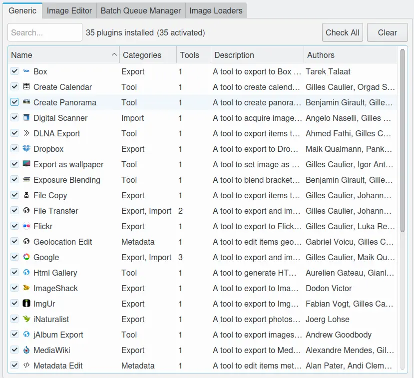
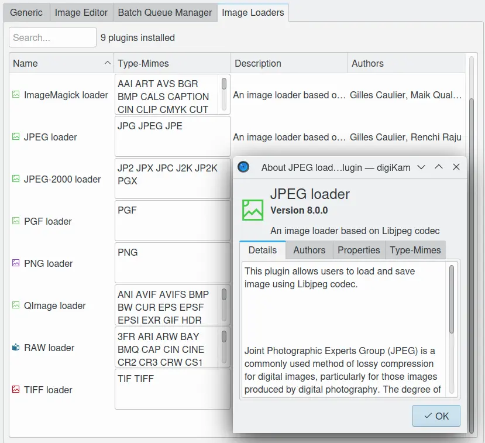

.. meta::
   :description: digiKam Plugins Settings
   :keywords: digiKam, documentation, user manual, photo management, open source, free, learn, easy

.. metadata-placeholder

   :authors: - digiKam Team (see Credits and License for details)

   :license: Creative Commons License SA 4.0

.. _plugins_settings:

Plugins Settings
================

.. contents::

This view allows to see the list of plugins available for different part of the program:

- Generic: tools shared between Album View, Light Table and Image Editor. These tools are also available in Showfoto.
- Image Editor: specific tools to edit item in editor. These tools are also available in Showfoto.
- Batch Queue Manager: specific tools to process item in batch.
- Image Loaders: tools to load item contents in memory.

If you doucle-click on one plugin entry in a list, you will open a dialog showing details about the tool.

