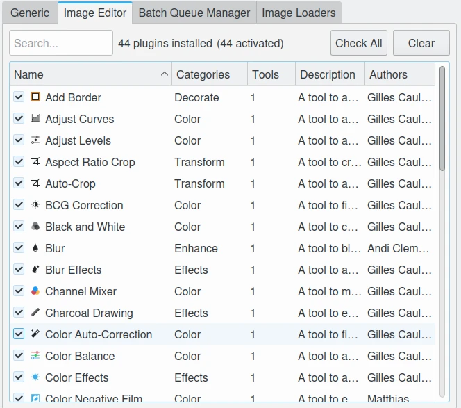
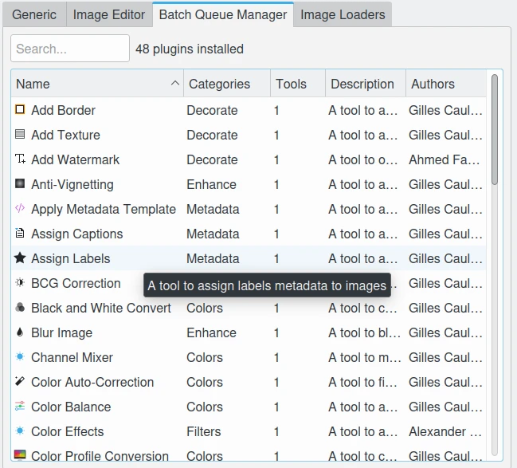

.. meta::
   :description: digiKam Plugins Settings
   :keywords: digiKam, documentation, user manual, photo management, open source, free, learn, easy, plugins, generic, editor, batch queue, loaders

.. metadata-placeholder

   :authors: - digiKam Team

   :license: see Credits and License page for details (https://docs.digikam.org/en/credits_license.html)

.. _plugins_settings:

Plugins Settings
================

The **Plugins** options for digiKam are configured via :menuselection:`Settings --> Configure digiKam... --> Plugins`. This page lists all available plugins for different parts of the application. Double-clicking a plugin entry opens a dialog with detailed information about the selected tool.

.. _plugins_settings_generic:

Generic Plugins
---------------

These tools are shared across the **Album View**, **Light Table**, and **Image Editor**.
They are also available in **Showfoto**. Access these plugins via the **Tools** tab in the right sidebar, under the **Post-Processing**, **Import**, and **Export** sections.

.. figure:: images/setup_plugins_generic.webp
   :alt: Generic Plugins Setup Page
   :align: center

   The Generic Plugins Setup Page

.. _plugins_settings_imageeditor:

Image Editor Plugins
---------------------

These tools are specifically designed for editing images. They are also available in **Showfoto**. Access these plugins via the **Tools** tab in the right sidebar, under the **Transform**, **Decorate**, **Effects**, **Enhance**, and **Colors** sections.

   The Image Editor Plugins Setup Page

.. _plugins_settings_batchqueuemanager:

Batch Queue Manager Plugins
----------------------------

These tools are dedicated to batch processing in digiKam. Access them via the **Base Tools** tab in the **Control Panel** (available on the right or bottom side of the interface). Use these tools to assign tasks to your current batch queue.

   The Batch Queue Manager Plugins Setup Page

.. _plugins_settings_loader:

Image Loaders
-------------

Image loaders are essential modules responsible for loading image data into memory.
They are used throughout digiKam whenever image processing is required.

**Native Loaders**
   The following formats are supported natively, listed by priority of usage:

   - **JPEG**: Standard format for lossy compression.
   - **JPEG-2000**: Advanced compression standard supporting both lossy and lossless modes.
   - **PNG**: Portable Network Graphics, a lossless format widely used for web and software applications.
   - **TIFF**: Tagged Image File Format, commonly used for high-quality, lossless images.
   - **PGF**: Progressive Graphics File, optimized for lossless compression.
   - **HEIF**: High Efficiency Image Format, offering improved compression over JPEG.

**Qt Framework Loaders**
   digiKam leverages the `Qt framework <https://doc.qt.io/qt-6/qtimageformats-index.html>`_ and its extended support via the `KImageFormats <https://invent.kde.org/frameworks/kimageformats>`_ component from the KDE frameworks.
   These loaders provide compatibility with additional native formats.

**ImageMagick Support**
   As a fallback, **ImageMagick** is used to support a wide range of `exotic and legacy formats <https://imagemagick.org/script/formats.php>`_.
   This ensures compatibility with less common file types not covered by native or Qt-based loaders.

.. figure:: images/setup_plugins_loaders.webp
   :alt: Image Loaders Plugins Setup Page
   :align: center

   The Image Loaders Plugins Setup Page
