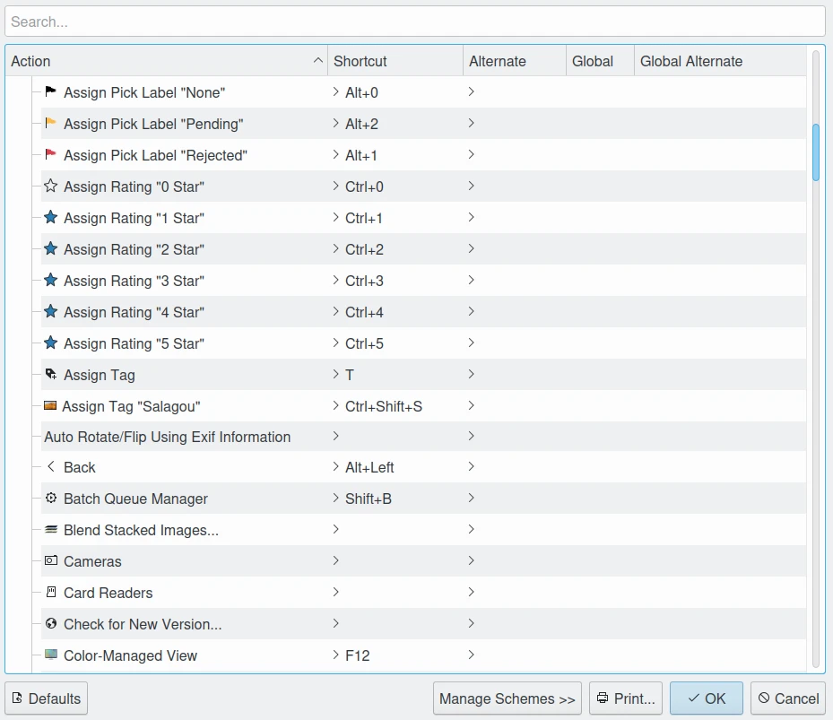

.. meta::
   :description: digiKam Shortcuts Settings
   :keywords: digiKam, documentation, user manual, photo management, open source, free, learn, easy, keyboard, shortcuts, setup, configure

.. metadata-placeholder

   :authors: - digiKam Team

   :license: see Credits and License page for details (https://docs.digikam.org/en/credits_license.html)

.. _shortcuts_settings:

Shortcuts Settings
==================

.. contents::

digiKam provide keyboard shortcuts that allow you to perform many tasks without touching your mouse. If you use your keyboard frequently, using these can save you lots of time.

digiKam has dedicated keyboard shortcut configuration dialog accessed via the :menuselection:`Settings --> Configure Shortcuts` main menu item.

    The digiKam Dialog To Configure The Keyboard Shortcuts

digiKam define these keyboard shortcuts by default:

- Rating assignment:

================================= =============
Rating                            Shortcut
================================= =============
No rating                         :kbd:`Ctrl+0`
1 star                            :kbd:`Ctrl+1`
2 stars                           :kbd:`Ctrl+2`
3 stars                           :kbd:`Ctrl+3`
4 stars                           :kbd:`Ctrl+4`
5 stars                           :kbd:`Ctrl+5`
================================= =============

- Pick Label assignment:

================================= ============
Pick Label                        Shortcut
================================= ============
None                              :kbd:`Alt+0`
Rejected                          :kbd:`Alt+1`
Pending                           :kbd:`Alt+2`
Accepted                          :kbd:`Alt+3`
================================= ============

- Color Label assignment:

================================= =================
Color Label                       Shortcut
================================= =================
None                              :kbd:`Ctrl+Alt+0`
Red                               :kbd:`Ctrl+Alt+1`
Orange                            :kbd:`Ctrl+Alt+2`
Yellow                            :kbd:`Ctrl+Alt+3`
Green                             :kbd:`Ctrl+Alt+4`
Blue                              :kbd:`Ctrl+Alt+5`
Magenta                           :kbd:`Ctrl+Alt+6`
Gray                              :kbd:`Ctrl+Alt+7`
Black                             :kbd:`Ctrl+Alt+8`
White                             :kbd:`Ctrl+Alt+9`
================================= =================

- Zooming:

================================= =================
Action                            Shortcut
================================= =================
Zoom in                           :kbd:`Ctrl++`
Zoom out                          :kbd:`Ctrl+-`
Zoom 100%                         :kbd:`Ctrl+.`
Fit to window                     :kbd:`Ctrl+Alt+E`
Fit to selection                  :kbd:`Ctrl+Alt+S`
================================= =================

- Slide-Show:

================================= ===================
Action                            Shortcut
================================= ===================
Play All                          :kbd:`F9`
Play Selection                    :kbd:`Alt+F9`
Play with Sub-Albums              :kbd:`Shift+F9`
Presentation                      :kbd:`Shift+Alt+F9`
================================= ===================

- Main Window:

================================= ====================
Action                            Shortcut
================================= ====================
Albums View                       :kbd:`Shift+Ctrl+F1`
Tags View                         :kbd:`Shift+Ctrl+F2`
Labels View                       :kbd:`Shift+Ctrl+F3`
Dates view                        :kbd:`Shift+Ctrl+F4`
Timeline View                     :kbd:`Shift+Ctrl+F5`
Search View                       :kbd:`Shift+Ctrl+F6`
Similarity View                   :kbd:`Shift+Ctrl+F7`
Map View                          :kbd:`Shift+Ctrl+F8`
People View                       :kbd:`Shift+Ctrl+F9`
Import Images                     :kbd:`Ctrl+Alt+I`
Rename                            :kbd:`F2`
Preview                           :kbd:`F3`
Open in Editor                    :kbd:`F4`
Open in Default Application       :kbd:`Ctrl+F4`
Place on Light Table              :kbd:`Ctrl+L`
Add to Light Table                :kbd:`Ctrl+Shift+L`
Add to Current Queue              :kbd:`Ctrl+B`
Add to new Queue                  :kbd:`Ctrl+Shift+B`
================================= ====================

- General Shortcuts:

================================= ===================
Action                            Shortcut
================================= ===================
Close                             :kbd:`Alt+F4`
Quit                              :kbd:`Ctrl+Q`
Delete items permanently          :kbd:`Shift+Del`
Turn On/Off Color Management View :kbd:`F12`
Adjust Date and Time              :kbd:`Ctrl+Shift+D`
Edit Geolocation                  :kbd:`Ctrl+Shift+G`
Edit Metadata                     :kbd:`Ctrl+Shift+M`
================================= ===================
