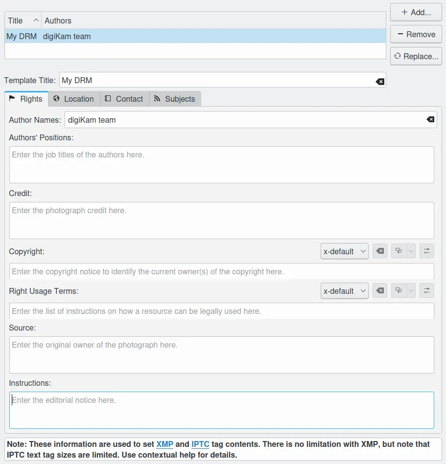
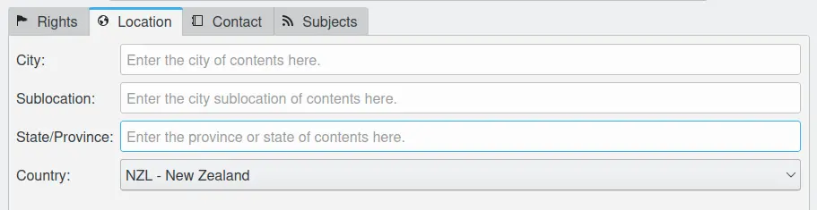
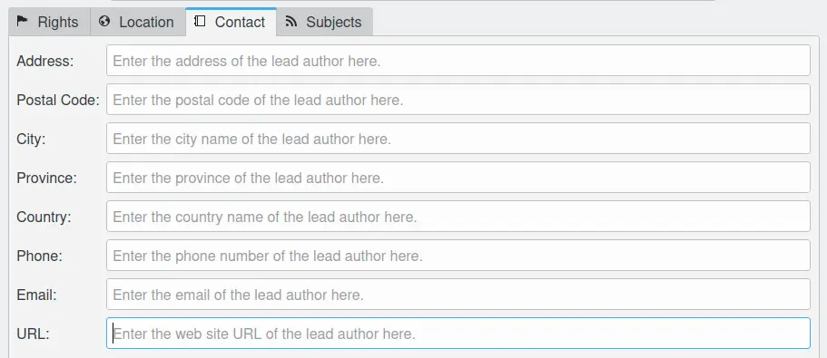
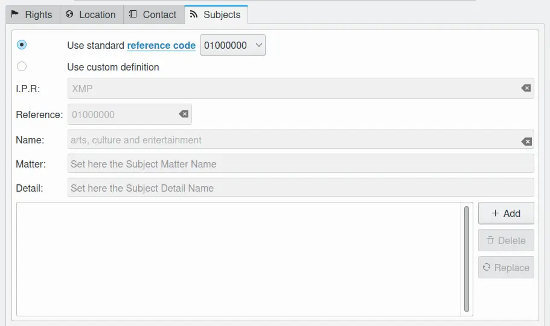

.. meta::
   :description: digiKam Templates Settings
   :keywords: digiKam, documentation, user manual, photo management, open source, free, learn, easy, configure, setup, template, metadata, copyright, author, title, credit, source, IPTC

.. metadata-placeholder

   :authors: - digiKam Team

   :license: see Credits and License page for details (https://docs.digikam.org/en/credits_license.html)

.. _templates_settings:

Templates Settings
==================

.. contents::

The **Metadata Templates Manager** is meant to create and manage metadata templates which can be used in:

    - The **Information** tab of the **Captions** view from the Right Sidebar.

    - The **On the Fly Operations (JPEG only)** section of the **Settings** view from the Right Sidebar in the :menuselection:`Import --> Cameras` Window.
    
The goal of templates is to apply more than one metadata information at the same time to items. You can create many profiles
corresponding to your workflow.

The Rights Information
----------------------

    The digiKam Template Rights Configuration Page

The top part shows a list of the already existing templates. The first row shows the title of the template, the second row shows the name of the author(s) in the “Author Names” field of that very template. To the right you have three editing buttons, below an input field for the template title. To create a new template you type a title in the input field and click the **Add** button. The new template will appear in the list. To edit an existing template you select it in the list, then you edit its fields (see next paragraph) and finally you click the **Replace** button. You can as well type in a new title for the edited template and save the new version with the **Add** button. To delete a template, very obviously, you select it in the list and click the **Remove** button.

.. warning::

    Note that all the changes you made to the templates will only be stored in the template file if you exit the settings dialog with **OK** button. The **Add** and **Replace** buttons only change the template list in the memory.

.. tip::

    The template file can be found in :file:`~/.local/share/digikam/` for manual backup or for managing different template sets by means of the file system.

The rest of the window is divided into four tabs, grouping the metadata fields into Rights, Location, Contact and Subjects.

The Rights tab (see above) contains the default identity and copyright data. This is an extract of the IPTC specifications for these fields:

    - Author (is synonymous to Creator and By-line): This field should contain your name, or the name of the person who created the photograph. If it is not appropriate to add the name of the photographer (for example, if the identity of the photographer needs to be protected) the name of a company or organization can also be used. Once saved, this field should not be changed by anyone. This field does not support the use of commas or semi-colons as separator.

    - Author title (synonymous with By-line title): This field should contain the job title of the photographer. Examples might include titles such as: Staff Photographer, Freelance Photographer, or Independent Commercial Photographer. Since this is a qualifier for the Author field, the Author field must also be filled out.

    - Credit (synonymous with Provider): Use the credit field to identify who is providing the photograph. This does not necessarily have to be the author. If a photographer is working for a news agency such as Reuters or the Associated Press, these organizations could be listed here as they are "providing" the image for use by others. If the image is a stock photograph, then the group (agency) involved in supplying the image should be listed here.

    - Source: The Source field should be used to identify the original owner or copyright holder of the photograph. The value of this field should never be changed after the information is entered following the image's creation. While not yet enforced by the custom panels, you should consider this to be a "write-once" field. The source could be an individual, an agency, or a member of an agency. To aid in later searches, it is suggested to separate any slashes "/" with a blank space. Use the form "photographer / agency" rather than "photographer/agency." Source may also be different from Creator and from the names listed in the Copyright Notice.

    - Copyright Notice: The Copyright Notice should contain any necessary copyright notice for claiming the intellectual property, and should identify the current owner(s) of the copyright for the photograph. Usually, this would be the photographer, but if the image was done by an employee or as work-for-hire, then the agency or company should be listed. Use the form appropriate to your country. For the United States you would typically follow the form of (c) {date of first publication} name of copyright owner, as in "(c)2005 John Doe." Note, the word "copyright" or the abbreviation "copr" may be used in place of the (c) symbol. In some foreign countries only the copyright symbol is recognized and the abbreviation does not work. Furthermore the copyright symbol must be a full circle with a "c" inside; using something like (c) where the parentheses form a partial circle is not sufficient. For additional protection worldwide, use of the phrase, "all rights reserved" following the notice above is encouraged. In Europe you would use: Copyright {Year} {Copyright owner}, all rights reserved. In Japan, for maximum protection, the following three items should appear in the copyright field of the IPTC Core: (a) the word, Copyright; (b) year of the first publication; and (c) name of the author. You may also wish to include the phrase "all rights reserved."

The Location Information
------------------------

    The digiKam Template Location Configuration Page

The fields in the Location tab are self explaining by their title and the gray hints in the empty fields. A little bit more elaborate description can be found under Settings --> Configure digiKam... --> Metadata --> Views --> IPTC viewer.

The Contact Information
-----------------------

    The digiKam Template Contact Configuration Page

The data in the Contact tab refer to the (lead) photographer under **Author Names** in the Rights tab.

The Subjects Information
------------------------

    The digiKam Template Subjects Configuration Page

In the Subjects tab you can assign one or more Subject Codes according to the IPTC Photo Metadata Standard to the template. If the first option “Use standard reference code” is selected you can choose a code from the drop down field and the meaning of it will then appear in the fields of the “Use custom definition” section. If you don't know the code for the subject you want to assign this way is a bit tedious since there are 1400 subjects in the standard. A better way is to look for your subject in this URL. There you select “Subject Codes” and your language (English recommended) and click “Show”. In the diagram you scroll and make additional levels of an item visible by clicking on one of the fields. In the field right of the diagram you can find the code of the selected subject.

In general the IPTC Subject Codes are quite comprehensive but on the other hand a bit incomplete in some fields, e.g. under Lifestyle and Leisure/Games you find just Go, chess, bridge and shogi. So you may want to add own subjects, even though they always remain private (or company) subjects. A way to do that in digiKam is to first check “Use standard reference code” and select 10001004 which brings you to Lifestyle and Leisure/Games/shogi - just to stay in our example. Then you check “Use custom definition” and change the last digit of “Reference:” to 5 and the text in the “Detail:” field to - say “domino”. You save this custom definition to the template by clicking Add... at the right side of the subjects list. Then you type in a template title (if it's a new template) and save the template by clicking Add... at the right side of the templates list. Don't mix up these two!
