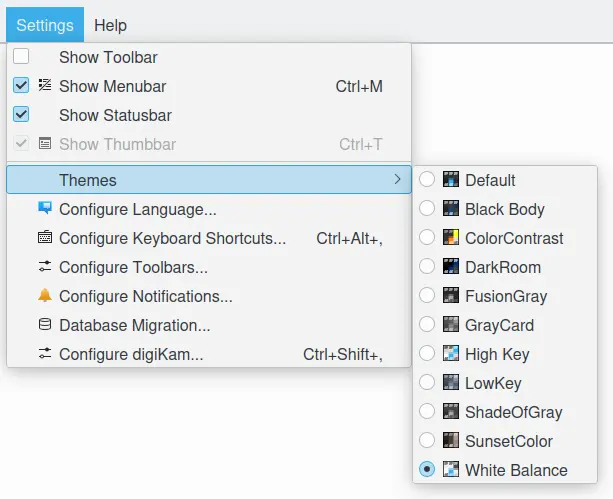

.. meta::
   :description: digiKam Theme Settings
   :keywords: digiKam, documentation, user manual, photo management, open source, free, learn, easy, colors, theme, configuration

.. metadata-placeholder

   :authors: - digiKam Team

   :license: see Credits and License page for details (https://docs.digikam.org/en/credits_license.html)

.. _theme_settings:

Theme Settings
==============

.. contents::

Color schemes are supplied like themes to personalize digiKam main interface for you pleasure. To access these settings select :menuselection:`Settings --> Themes` from the menubar and select your preferred theme to use.

    The digiKam Color Themes Menu

When theme is selected all elements from the graphical interface must change accordingly with the colors scheme.
    
.. note::

    Depending of the color theme used, it must be mandatory to restart application to load relevant icons-set working with colors scheme.

    Pairing some application colors scheme and widget style can give a wrong user experience. We recommend to adjust if necessary the **Widget Style** from the **Setup / Misc / Appearance** configuration panel, especially with dark color schemes. See :ref:`this section <appearance_settings>` from this manual for more details about the **Appearance** options.
