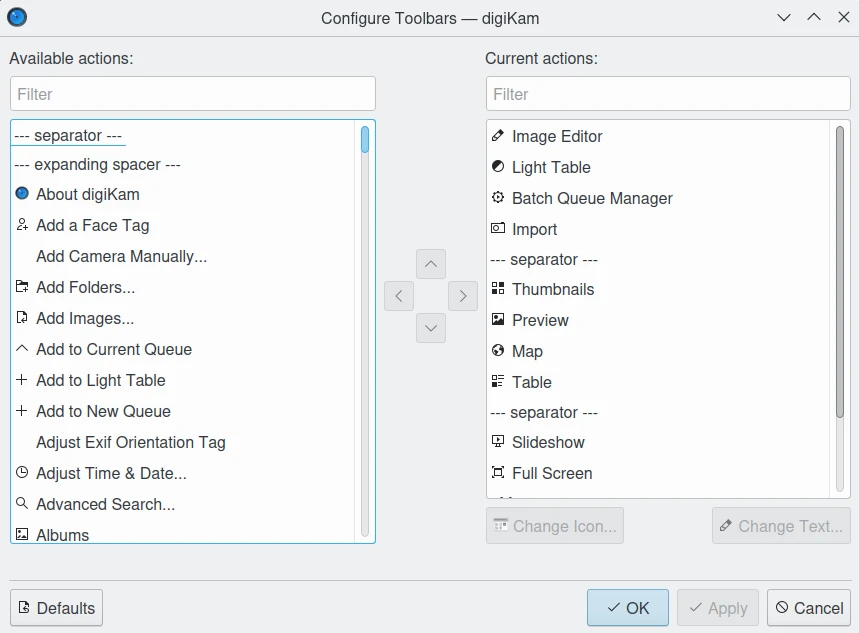

.. meta::
   :description: digiKam Toolbars Settings
   :keywords: digiKam, documentation, user manual, photo management, open source, free, learn, easy, camera, configuration, setup, toolbar

.. metadata-placeholder

   :authors: - digiKam Team

   :license: see Credits and License page for details (https://docs.digikam.org/en/credits_license.html)

.. _toolbars_settings:

Toolbars Settings
=================

.. contents::

Overview
--------

digiKam interface can be customized with toolbar located below the main menu. An editor is available from the :menuselection:`Settings --> Configure Toolbars` main menu item or right-click on a toolbar and select Configure Toolbars...

    The digiKam Toolbars Configuration Dialog

On the left side of the toolbar configuration dialog, the available items that you can put in your toolbar are shown. On the right, the ones that already appear on the toolbar are shown. Above each side of the panel there is a Filter text box you can use to easily find items in the list.

You can add an item to your toolbar by selecting it from the left side and clicking on the right arrow button. You can remove an item by selecting it and clicking the left arrow button.

You can change the position of the items by moving them lower or higher in the list. To move items lower, press the down arrow button, while to move items higher press the up arrow button. You can also change items' position by dragging and dropping them.

On horizontal toolbars, the item that's on top will be the one on the left. On vertical toolbars, items are arranged as they appear in the toolbar.

You can add separator lines between items by adding a **--- separator ---** item to the toolbar.

You can restore your toolbar to the way it was when you installed the application by pressing the **Defaults** button at the bottom of the dialog and then confirming your decision.

You can change the icon and text of individual toolbar items by selecting an item and clicking either the **Change Icon...** or **Change Text...** button.

Changing Text and Icons
-----------------------

You can change the icon and text of individual toolbar items by selecting an item and clicking either the Change Icon... or Change Text... button.

Customizing Toolbar Appearance

You can change the appearance of toolbars by right-clicking on a toolbar to access it's context menu.

Text Position

You can change the appearance of text on toolbars in the Text Position submenu of a toolbar's context menu.

You can choose from:

    Icons - only the icon for each toolbar item will appear.

    Text - only the text label for each toolbar item will appear.

    Text Alongside Icons - the text label will appear to the right of each toolbar item's icon

    Text Under Icons - the text label will appear underneath each toolbar item's icon 

You can also show or hide text for individual toolbar items by right-clicking on an item and checking or unchecking the item under Show Text.
Icon Size

You can change the size of toolbar items' icons by selecting Icon Size from the toolbar's context menu.

You can choose from the following options: (each lists the icon size in pixels)

    Small (16x16)

    Medium (22x22) [the default value]

    Large (32x32)

    Huge (48x48)

Moving Toolbars

In order to move toolbars, you must “unlock” them. To do so, uncheck Lock Toolbar Positions from a toolbar's context menu. To restore the lock, simply recheck this menu item.

You can change a toolbar's position from the Orientation submenu of its context menu.

You can choose from:

    Top [the default in many applications]

    Left

    Right

    Bottom

You can also move a toolbar by clicking and holding onto the dotted line at the left of horizontal toolbars or the top of vertical toolbars and dragging it to your desired location.
Show/Hide Toolbars

You can hide the toolbar by deselecting Show Toolbar from either the toolbar's context menu or the Settings menu. To restore the toolbar, select Show Toolbar from the Settings menu. Note that toolbars must be “unlocked” to hide them from their context menu; see the section called “Moving Toolbars” for more information.
