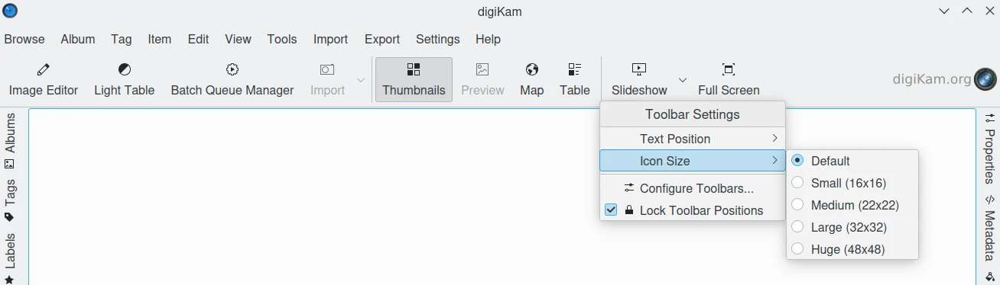

.. meta::
   :description: digiKam Toolbars Settings
   :keywords: digiKam, documentation, user manual, photo management, open source, free, learn, easy, camera, configuration, setup, toolbar

.. metadata-placeholder

   :authors: - digiKam Team

   :license: see Credits and License page for details (https://docs.digikam.org/en/credits_license.html)

.. _toolbars_settings:

:ref:`Toolbars Settings <setup_application>`
============================================

.. contents::

Toolbar Editor
--------------

The digiKam interface can be customized by selection which tools are displayed in the toolbar located below the main menu. The toolbar editor is available from the :menuselection:`Settings --> Configure Toolbars` menu item or from the toolbar context menu (right-click on any tool in the toolbar and select **Configure Toolbars...**).

.. figure:: images/setup_toolbars_dialog.webp
    :alt:
    :align: center

    The digiKam Toolbars Configuration Dialog

The available items that you can display in the toolbar are listed on the left side of the toolbar configuration dialog. The actions that already appear in the toolbar are listed on the right. There is a Filter text box above each list you can use to easily find items in the list.

You can add an item to your toolbar by selecting it from the left side and clicking on the right arrow button. You can remove an item, by selecting it from the right side and clicking the left arrow button.

You can change the position of the items by moving them lower or higher in the list. To move a selected item lower, press the down arrow button. The up arrow button will move selected items higher in the list. You can also change an items' position by dragging and dropping.

On horizontal toolbars, the item that's on top will be the one on the left. On vertical toolbars, items are arranged as they appear in the toolbar.

You can add separator lines between items by adding a **--- separator ---** item to the toolbar.

You can restore your toolbar to the way it was when you installed the application by pressing the **Defaults** button at the bottom of the dialog and then confirming your decision.

You can change the icon and text of individual toolbar items by selecting an item and clicking either the **Change Icon...** or **Change Text...** button.

Customizing Toolbar Appearance
------------------------------

You can change the appearance of toolbars by right-clicking on a toolbar to access it's context menu. The **Text Position** sub-menu allows you to customize the button icon and title on the toolbar.

    The digiKam Toolbars Context Menu

You can choose from:

    - **Icons**: only the icon for each toolbar item will appear.
    - **Text**: only the text label for each toolbar item will appear.
    - **Text Alongside Icons**: the text label will appear to the right of each toolbar item's icon.
    - **Text Under Icons**: the text label will appear underneath each toolbar item's icon.

You can also show or hide text for individual toolbar items by right-clicking on an item and checking or unchecking the item under Show Text.

You can change the size of toolbar items' icons by selecting **Icon Size** from the toolbar's context menu. You can choose from the following sizes in pixels:

    - **Small (16x16)**.
    - **Medium (22x22)** [the default value].
    - **Large (32x32)**.
    - **Huge (48x48)**.

Customize Toolbar Position
--------------------------

The toolbar can be moved to another position, but it must be first “unlocked” by unchecking the **Lock Toolbar Positions** option from the toolbar's context menu. To restore the lock, simply recheck this menu item.

You can change a toolbar's position from the **Orientation** sub-menu of its context menu.

You can choose from:

    - **Top** [the default position]
    - **Left**
    - **Right**
    - **Bottom**

You can also move the toolbar by clicking and holding onto the dotted line at the left of a horizontal toolbar or the top of a vertical toolbar and dragging it to your desired location.

You can hide the toolbar by deselecting **Show Toolbar** from either the toolbar's context menu or the **Settings** menu. To restore the toolbar, select **Show Toolbar** from the **Settings** menu. Note that the toolbar must be “unlocked” to hide it from the context menu.
