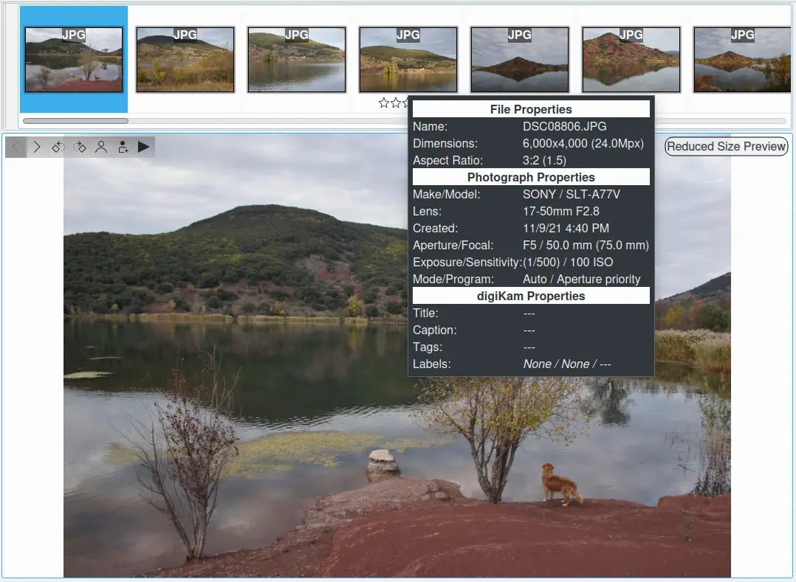
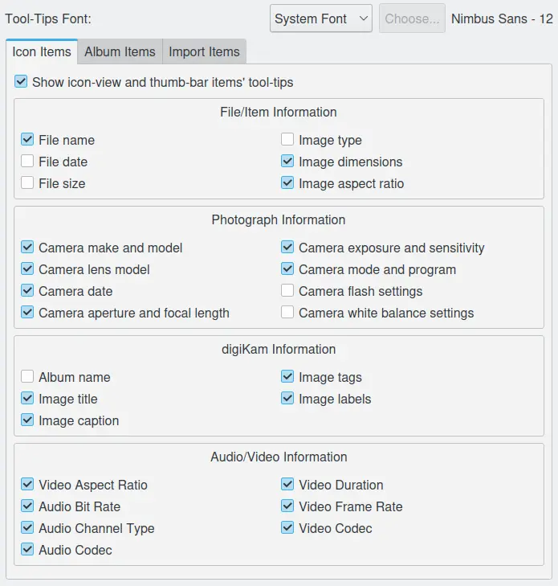

.. meta::
   :description: digiKam Tooltip Settings
   :keywords: digiKam, documentation, user manual, photo management, open source, free, learn, easy, setup, configure, tooltip

.. metadata-placeholder

   :authors: - digiKam Team

   :license: see Credits and License page for details (https://docs.digikam.org/en/credits_license.html)

.. _tooltip_settings:

Tooltip Settings
================

.. contents::

This setup page covers all options of information appearing when the mouse hovers over a file icon in the Image Area. According to the checked options they will be shown or not.

    A Tooltip Visible Over A Thumbbar Item

This view presents the information displayed in a tooltip over the **Icon Items** with the relevant settings done in the configuration page. 

    The Icon Items Tooltip Configuration View

On the top a common option is available to customize the **Font** used to render tooltips everywhere in the application.

Two other configuration views exists to customize:

    - The tooltips visible over the **Album Items**, as the **Albums** or **Tags** tree-views from **Main Window**.

    - The tooltips visible over the **Import Items** from the camera import tool icon-view.
