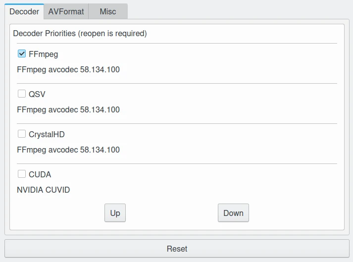
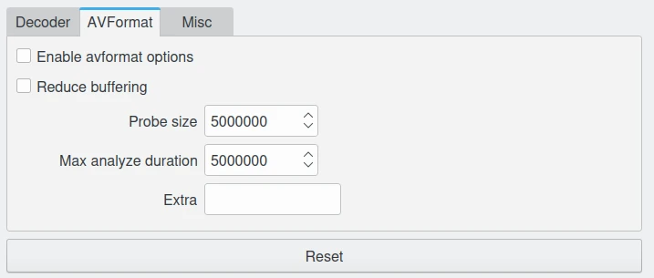
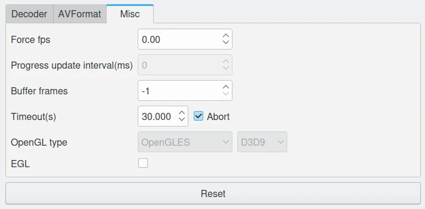

.. meta::
   :description: digiKam Video Settings
   :keywords: digiKam, documentation, user manual, photo management, open source, free, learn, easy, camera, configuration, setup, video

.. metadata-placeholder

   :authors: - digiKam Team

   :license: see Credits and License page for details (https://docs.digikam.org/en/credits_license.html)

.. _video_settings:

Video Settings
==============

.. contents::

digiKam relies on `FFMpeg Multimedia framework <https://ffmpeg.org/>`_ to handle video files. FFmpeg is a powerful video toolkit, which include all codecs that digiKam needs to play video files.

This section describes all advanced video settings used to tune media playing features on digiKam.

.. warning::

    Changing values from this page can break video player functionalities.

.. note::

     The **Reset** button on the bottom of views from this page allows to clear all settings to default values.

Decoder View
------------

This view allow to define the priority of decoders to use while playing media. In a flat list, you can enable or disable a decoder with the check-box on the left side. Selecting a entry, you can move **Up** or move **Down** with the buttons on the bottom side. The upper entries are taken in the high priority in the list by the player. At least one entry must be enabled in this list to render contents in the media-player.

    The digiKam Video Configuration Panel with the Decoder View

AVFormat View
-------------

This view allows to customize advanced settings to the `FFMpeg AVFormat component <https://ffmpeg.org/ffmpeg-formats.html#Format-Options>`_.

The **Enable avformat options** pass to ffmpeg space separated key-value definitions hosted in **Extra** string setting.

The **Reduce buffering** must minimize the delay between frames processed from a stream but this might break the audio-video synchronization.

The **Probe Size** value sets probing size in bytes, i.e. the size of the data to analyze to get stream information. A higher value will enable detecting more information in case it is dispersed into the stream, but will increase latency. Must be an integer not lesser than 32. It is 5000000 by default.

The **Max analyze duration** value specifies how many microseconds are analyzed to probe the input. A higher value will enable detecting more accurate information, but will increase latency. It defaults to 5,000,000 microseconds = 5 seconds.

    The digiKam Video Configuration Panel with the AVFormat View

Misc View
---------

This view allows to customize advanced rendering settings of the video frames on screen.

The **Force fps** value will force to render an amount of frames per seconds on screen. A null value disable this setting.

The **Buffer frames** value will set the number of frames to cache in memory before rendering. Using -1 will let the program to automatize frames storage in memory. 

The **Timeout** value will specify the delay in seconds to considerate a broken stream. The **Abort** option will stop to play the stream in video player in this case. 

The **OpenGL type** options are available under Windows to optimize support of accelerated OpenGL rendering with video card.

The **EGL** option is available under Linux to turn on support of OpenGL with X11 windows manager, only if X11 XCB extension is present. 

    The digiKam Video Configuration Panel with the Misc View
