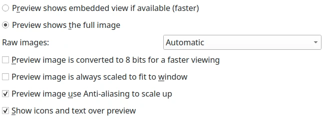

.. meta::
   :description: digiKam Views Settings
   :keywords: digiKam, documentation, user manual, photo management, open source, free, learn, easy, setup, configure, icon-view, tree-view, preview, full-screen, mime-type, categories

.. metadata-placeholder

   :authors: - digiKam Team

   :license: see Credits and License page for details (https://docs.digikam.org/en/credits_license.html)

.. _views_settings:

Views Settings
==============

.. contents::

With this settings page, you can customize by the following groups of settings for the Views of digiKam as Albums tree-view, Tags tree-view, icon-view, preview, full-screen, etc.

.. _iconview_settings:

Icon Settings
-------------

.. figure:: images/setup_album_iconview.webp
    :alt:
    :align: center

    The digiKam Icon-View Configuration Page

The first series of settings on the left side of this view allows to customize the technical information shown below the icon thumbnail, as the filename, the file size, the creation date, the image dimensions, and the aspect ratio.

The **Show file modification date** option shows the file modification date only if it's different from the creation date. This function is useful to identify quickly which items have been modified.

On the right side, the options allows to customize other properties to show over and below the icon thumbnail, as the **Image Format**, the **Title**, the **Caption**, the **labels**, and the **Rating**.

The **Show rotation overlay buttons** option shows overlay buttons over the image thumbnail to be able to process left or right image rotation.

The **Show fullscreen overlay button** option shows an overlay button over the image thumbnail to open it in fullscreen mode.

The **Show Geolocation Indicator** option shows an icon over the image thumbnail if the item has geolocation information.

An example of an icon-view item is given below:

.. figure:: images/setup_album_iconview_item.webp
    :width: 500px
    :alt:
    :align: center

    An Icon-View Item Example **Using Large Thumbnail Size** Option

On the bottom side of this settings panel, you can tune the behavior of the icon with user actions.

.. _thumbnails_action:

The **Thumbnail click action** option allows to choose what should happen when you click on a thumbnail. Four settings are available:

    - **Show preview** to display the item in Preview Mode :kbd:`F3`.

    - **Start image editor** to open the image in a separate Image Editor window :kbd:`F4`.

    - **Show on Light Table** top open the image in a separate Light Table window.

    - **Open with Default Application** to open item in default desktop application.

.. _iconview_font:

The **Icon View font** option allows to select the font used to display text under icon-view items.

.. _thumbnails_resolution:

The **Use large thumbnail size for high screen resolution** option renders the icon-view items with large thumbnail size, for example in case of 4K monitor is used. By default this option is turned off and the maximum thumbnail size is limited to 256 x 256 pixels. When this option is enabled, the thumbnail size can be extended to 512 x 512 pixels. This option will store more data in the thumbnail database and will use more system memory. digiKam needs to be restarted for the option to take effect and the :ref:`Rebuild Thumbnails <maintenance_thumbnails>` option from the **Maintenance Tools** dialog needs to be processed over all collections.

.. _treeview_settings:

Tree View Settings
------------------

These settings allows to customize the tree views of the Left and Right Sidebar.

The **Tree View icon size** option configures the size in pixels of the Tree View icons in digiKam's sidebars. Use large value for HiDPI screen.

The **People Tree View icon size** option configures the size in pixels of the Tree View icons in digiKam's people sidebar.

.. _treeview_font:

The **Tree View font** option sets the font used to display text in nested album hierarchies.

The option **Show a count of items in Tree Views** will display the number of items inside a folder or assigned to a tag behind the album/tag name. The count shown depends on whether the subfolders/-tags are folded out or not and on the :menuselection:`View --> Include Album Sub-Tree` and the :menuselection:`View --> Include Tag Sub-Tree` settings in the main menu.

.. figure:: images/setup_album_treeview.webp
    :alt:
    :align: center

    The digiKam Tree-View Configuration Page

.. _preview_settings:

Preview Settings
----------------

Instead of opening the image in the editor, the digiKam preview mode :kbd:`F3` will show the image within the main window in the Image Area. The advantage of the preview is that it is faster than opening the image editor and that the icons of the other images remain visible so that you are able to review the list of current images quickly. Depending on your computer features, you can customize the best way to load images into the preview. Raw files can be processed differently, as this kind of container can require long computation.

The option **Preview shows embedded view if available** will try to open a small version of the photograph embedded in the file. It will be found in all RAW files and can be found in all files that support IPTC or XMP like PNG, JPEG, TIFF, JPEG2000, PGF. If an embedded preview cannot be found some image decoders (JPEG, JPEG2000, and PGF, WebP) are able to create a reduced version of the photograph by themselves which is still faster than using the whole image. Depending on the size of the image, the size of the embedded preview and the size available for the preview on your screen the effect of this option can be visible or not.

The option **Preview shows the full image** will always use the full image data for the preview regardless of whether there is a reduced version embedded in the file or not. This can result in a better quality of the preview but is usually slower.

Only if the last option is checked, the drop down field to the right of **Raw images** is accessible. It offers three options: with **Automatic** selected, the Libraw decoder will decode the RAW data automatically without any adjustments from the user. This may lead to weird results sometimes. The algorithm also takes screen resolution and CPU speed into account to achieve an optimum regarding speed and rendering quality. **Embedded preview** will try to use the (JPEG) preview embedded in RAW files. **Raw data in half size** will show unprocessed RAW data in reduced size.

The option **Preview is converted to 8 bits for a faster viewing** must be unchecked if you do not want to convert a 16 bits preview image to 8 bits. This will improve performances.

The option **Show icons and text over preview** will show elements for rotation, face tags, full screen mode, etc. in the top left corner of the image preview and a text indicating which data the preview is showing in the top right corner.

    The digiKam Preview Configuration Page

Full-Screen Settings
--------------------

The options in this tab apply only to the Full Screen Mode you can access via the Full Screen button on the Toolbar or via :menuselection:`View --> Full Screen Mode` :kbd:`Ctrl-Shift-F` in the main menu or the context menu. It does not apply to the Full Screen Mode you access by clicking the “Show Fullscreen” icon either on a thumbnail or on the preview.

.. figure:: images/setup_album_fullscreen.webp
    :alt:
    :align: center

    The digiKam Full-Screen Configuration Page

If first option is activated the only way to leave the Full Screen Mode is the context menu, the keyboard shortcut :kbd:`Ctrl-Shift-F`. You can work on the images also by choosing functions from the context menu of an icon or the preview.

.. _mime_types_settings:

Mime Types Settings
-------------------

digiKam can understand lots of different image file types as well as some video and audio formats. To control which types of files digiKam will try to display you can add or remove file extensions from these lists. Any files that are in the digiKam Album folders that do not match these extensions will be ignored by digiKam.

.. note::

    The default settings can be easily restored by clicking on the update buttons to the right of each category.

.. figure:: images/setup_album_mimetypes.webp
    :alt:
    :align: center

    The digiKam Mime-Type Configuration Page

You can add the extensions of image files (including RAW files) to be displayed in the Album view. Just put **xyz abc** to display files with the **xyz** and **abc** extensions in your Album view. You can also remove file formats that are shown by default by putting a minus sign in front of the extension: e.g. **-gif** would remove all GIF files from your Album view and any trace of them in your database. They would not be deleted, just not shown in digiKam.

.. warning::

    Removing files from the database means losing all of their tags and ratings.

Album Categories Settings
-------------------------

In the Album View you can choose from :menuselection:`View --> Sort Albums --> By Category` to have the Albums in the Album Tree of the Left Sidebar sorted by category. Here you can manage these categories, which is **Add** or **Remove** categories or rename them by using the **Replace** button. To assign categories to an Album you got to use the Album Properties dialog.

.. figure:: images/setup_album_categories.webp
    :alt:
    :align: center

    The digiKam Album Categories Configuration Page
