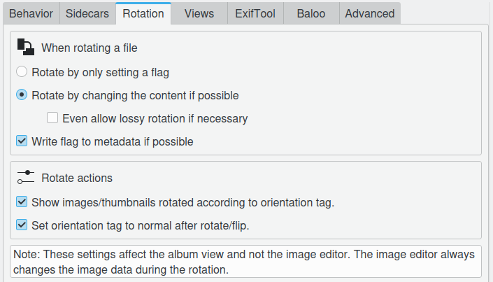

.. meta::
   :description: digiKam Metadata Settings
   :keywords: digiKam, documentation, user manual, photo management, open source, free, learn, easy

.. metadata-placeholder

   :authors: - Gilles Caulier <caulier dot gilles at gmail dot com>

   :license: Creative Commons License SA 4.0

.. _metadata_settings:

Metadata Settings
=================

.. contents::

Image files can have some metadata embedded into the image file format. These metadata can be stored in a number of standard formats as JPEG, TIFF, PNG, JPEG2000, PGF, and RAW files. Metadata can be read and written in the EXIF, IPTC, and XMP formats if they are present in the file.

Behavior Settings
-----------------

The Behavior tab allows you to select what information digiKam will write to the metadata and control how digiKam will deal with this embedded information.

.. figure:: images/setup_metadata_behavior.png

.. note::

    If the lazy synchronization is turned on digiKam will only write metadata when user clicks on the Apply pending changes to metadata icon in the status bar or on exit.

Sidecars Settings
-----------------

The Sidecars tab allows user to control whether digiKam will read/write from/to XMP sidecars or not. Filename for the sidecars set to filename.ext.xmp. For example, image1.dng will have a sidecar file named image1.dng.xmp.

.. figure:: images/setup_metadata_sidecars.png

.. note::

    If the box "Read from sidecar files" is checked digiKam will only read the sidecar while ignoring the embedded metadata.

Rotation Settings
-----------------

Show images/thumbnails rotated according to orientation tag : this will use any orientation information that your camera has included in the EXIF information to automatically rotate your photographs so that they are the correct way up when displayed. It will not actually rotate the image file, only the display of the image on the screen. If you want to permanently rotate the image on file, you can click with the right mouse button on the thumbnail and select Auto-rotate/flip according to EXIF orientation. The image will then be rotated on disk and the tag will be reset to "normal". If your camera routinely gets this orientation information wrong you might like to switch this feature off.

Set orientation tag to normal after rotate/flip : the Auto Rotate option automatically corrects the orientation of images taken with digital cameras that have an orientation sensor. The camera adds an orientation tag to the image's EXIF metadata. digiKam can read this tag to adjust the image accordingly. If you manually rotate an image, these metadata will be incorrect. This option will set the orientation tag to "Normal" after an adjustment, assuming that you rotated it to the correct orientation. Switch this off if you don't want digiKam to make changes to the orientation tag, when you rotate or flip the image.

Views Settings
--------------

These settings allows to customize the metadata contents, in Exif, Makernotes, Iptc, XMP, and Exiftool views.

.. figure:: images/setup_metadata_views.png

Advanced Settings
-----------------

The Advanced tab allows you to manage namespaces used by digiKam to store and retrieve tags, ratings and comments. This functionality is often used by advanced users to synchronize metadata between different software. Please leave the default settings if you are not sure what to do here.

.. figure:: images/setup_metadata_advanced.png

