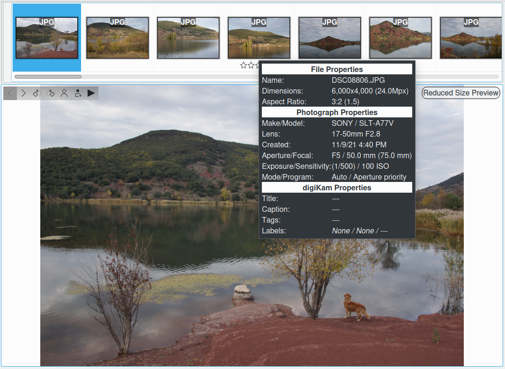
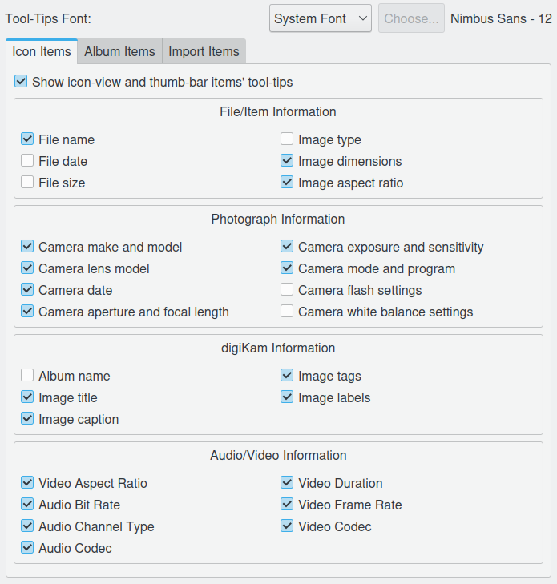

.. meta::
   :description: digiKam Tooltip Settings
   :keywords: digiKam, documentation, user manual, photo management, open source, free, learn, easy

.. metadata-placeholder

   :authors: - Gilles Caulier <caulier dot gilles at gmail dot com>

   :license: Creative Commons License SA 4.0

.. _tooltip_settings:

Tooltip Settings
================

This setup page covers all options of information appearing when the mouse hovers over a file icon in the Image Area. According to the checked options they will be shown or not.

This example present the information displayed in a tooltip over an icon with the relevant settings done in the configuration page. 

