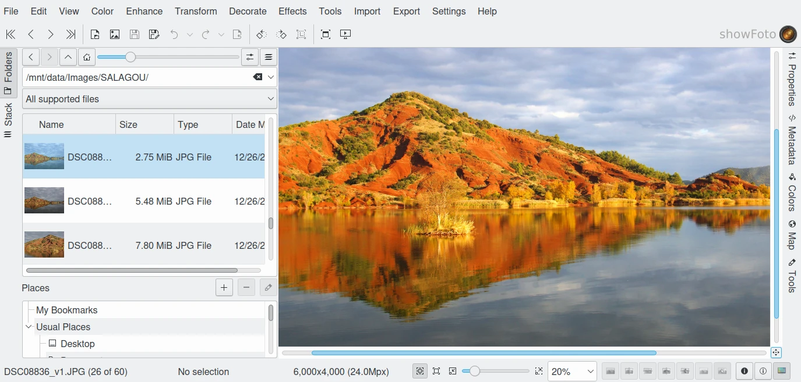

.. meta::
   :description: The Showfoto Stand Alone Image Editor
   :keywords: digiKam, documentation, user manual, photo management, open source, free, help, learn, image editor, showfoto

.. metadata-placeholder

   :authors: - digiKam Team

   :license: see Credits and License page for details (https://docs.digikam.org/en/credits_license.html)

.. _showfoto_editor:

########
Showfoto
########

This section explain how to use the Showfoto image editor.

.. toctree::
   :maxdepth: 2
   :caption: Contents:
   :glob:

   showfoto_editor/showfoto_overview.rst
   showfoto_editor/showfoto_leftsidebar.rst
   showfoto_editor/showfoto_setup.rst
