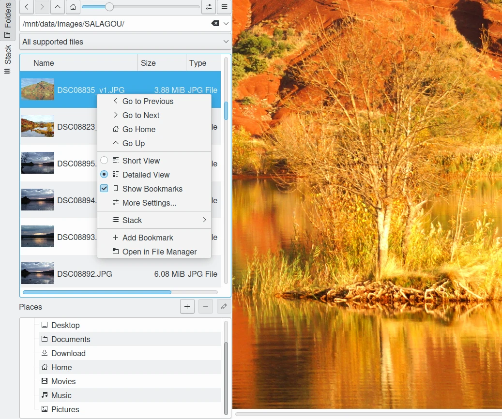
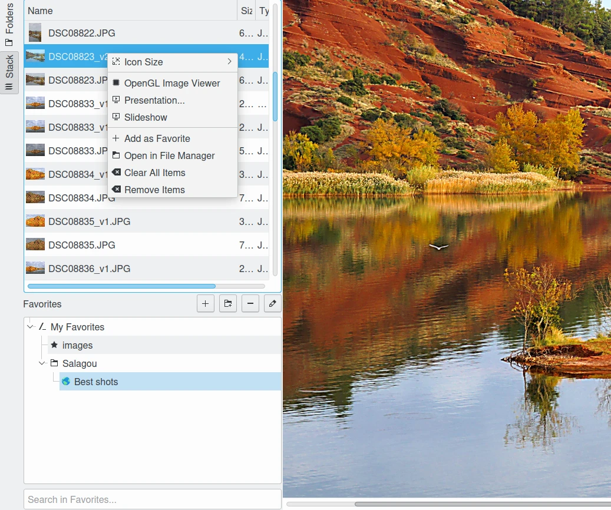

.. meta::
   :description: Overview to Showfoto Left Sidebar
   :keywords: digiKam, documentation, user manual, photo management, open source, free, learn, easy, image, editor, showfoto, left, sidebar, folders, stack, bookmark, favorite

.. metadata-placeholder

   :authors: - digiKam Team

   :license: see Credits and License page for details (https://docs.digikam.org/en/credits_license.html)

.. _showfoto_leftsidebar:

:ref:`Left Sidebar <showfoto_editor>`
=====================================

.. contents::

The left sidebar is the main difference in the Showfoto user interface compared to the digiKam Image Editor. digiKam used the left sidebar to manage many of its advanced Digital Asset Management capabilities, and these capabilities are not supported in Showfoto. ShowFoto does add the **Folders** and **Stack** tabs to the left sidebar giving the user the essential ability to explore, reference, and quickly access image files stored on the computer. All settings adjusted in the left sidebar are saved and restored between Showfoto sessions.

.. _showfoto_folderstab:

Folders Tab
-----------

The **Folders** tab provides a complete tool for navigating your system directory hierarchy to find files, similar to the capabilities provided by a desktop file manager.

    The Showfoto Stand-Alone Editor Folders Tab from Left Sidebar

The Foders tab view is divided into three sections from top to bottom:

    - The **Navigation settings** view providing:

        - A **toolbar** on the top to navigate the directory hierarchy, return to your personal folder, adjust the size of the thumbnails, a button to access advanced settings, and a button to manage the current folder contents with the **Stack** and Slideshow tools.

        - An editable combo-box showing the **current directory path** and the history of previous places visited from this tab.

        - A combo-box where you can apply a **type-mime filter** to restrict the thumbnails list to the desired file formats.

    - The **Thumbnails list** that displays thumbnail images, file names, and other file properties for all the files in the current selected folder that is set in the directory combo-box. You can adjust what is displayed in this list from the setting button in the toolbar, or from the list's context menu. Those same controls also allow you to assign content to the **Places** or to the **Stack**. Double clicking on an item from the list loads the contents into the canvas.

    .. figure:: images/showfoto_places_view.webp
        :alt:
        :align: center

        The Showfoto Places and Bookmarks View

    - The preferred **Bookmarks** and **Usual Places**. This view is optional and can be disabled in the settings available from thumbnails list context menu or in tools-bar on the top. **Bookmarks** references your preferred places (folders) that you can save when navigating in the folder hierarchies. **Bookmark** properties includes a **Path**, an **Icon**, and a **Title**. These properties can be modified later as you wish. The **Usual Places** is a read-only group to give a quick access to the standard folders from your personal directory.

    .. figure:: images/showfoto_new_bookmark.webp
        :alt:
        :align: center

        The Showfoto Dialog to Register a New Bookmark

.. note::

    The vertical layout of the **Folders** tab view can be adjusted by dragging the splitter adjustment between the **Thumbnails list** and the **Places view**.

.. _showfoto_stacktab:

Stack Tab
---------

The **Stack** tab is a helper view to allow quick access to your preferred pictures or folders. Pictures in the stack can be hosted in different folders if necessary. This gives you quick access to your best images for easy sharing.

    The Showfoto Stand-Alone Editor Stack Tab from Left Sidebar

The Stack tab view is divided into two sections from top to bottom:

    - The **Thumbnails list** showing the current stack contents. You can access the primary features of this view from the context menu that pops up when you right click on this list. The stack contents can be tuned with this context menu, or from the **Folders** tab. When you are satisfied with the list of items in the stack, you can register the entire container as a **Favorite**.

    .. figure:: images/showfoto_favorites_view.webp
        :alt:
        :align: center

        The Showfoto Favorites View

    - The **Favorites** tree-view is a list of the preferred stacks classified using a hierarchy (similar to Tags in digiKam). This hierarchy can be nested under **My Favorites** to host your stacks (**Favorite item**). You can edit stack properties which includes **Name**, **Type**, **Description**, **Creation Date**, **Icon**, and the list of **Stacked items**. Double clicking on an item from the hierarchy inserts the stack contents into the top of the thumbnails list, and loads the last opened file from the stack into the canvas. If there is no last opened file, then first item from the list is loaded into the canvas.

    .. figure:: images/showfoto_edit_favorite.webp
        :alt:
        :align: center

        The Showfoto Dialog to Edit Favorite Properties

.. note::

    The vertical layout of the **Stack** tab view can be adjusted by dragging the splitter adjustment between the **Thumbnails list** and the **Favorites view**.
