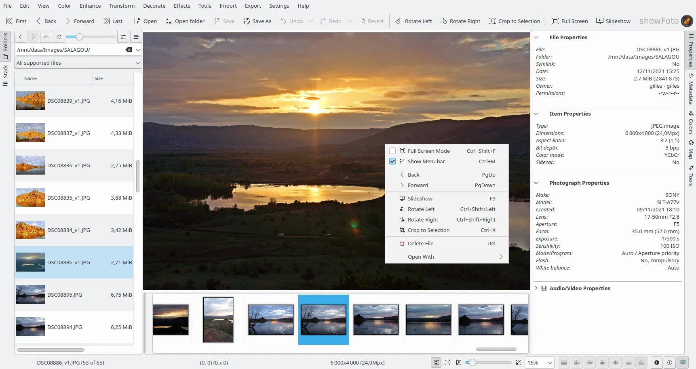

.. meta::
   :description: Overview to Showfoto Image Editor
   :keywords: digiKam, documentation, user manual, photo management, open source, free, learn, easy, image, editor, showfoto

.. metadata-placeholder

   :authors: - digiKam Team

   :license: see Credits and License page for details (https://docs.digikam.org/en/credits_license.html)

.. _showfoto_overview:

Overview
========

.. contents::

Showfoto is a stand alone version of the famous :ref:`digiKam Image Editor <image_editor>`. It works mostly like this one, but with slight differences and supplemental features that we will see in this section of the manual.

    The Showfoto Stand-Alone Editor Main Window

Differences with Image Editor
=============================

One main difference between Showfoto and digiKam Image Editor is the **non-support of any database**. For all files loaded in the editor, Showfoto deal directly with the file-metadata. As Showfoto is just an editor and do not supports all capabilities for photo management program (as a powerful search tool), it's not necessary to cache files-information in a database.

Other difference with digiKam Image Editor is the **Left sidebar**. In digiKam there left sidebar do not exists as all phoyo management is delegate to the Main Window. In Showfoto, the left sidebar host two tab to navigate in file-system.

First one, named **Folders** allows to go in-deep in directory hierarchies as a standard files manager. You can see the image thumbnails and the current path. Clicking on a thumbnail will load the contents to the canvas.

Second one, named **Stack** allows to host you prefered items previously selected in **Folders** tab.

The **Right Sidebar** is exactly the same than Image Editor, excepted the tabs depending exclusively to the database. **Captions** and **Versions** are not available in Showfoto. Looks in :ref:`this section of this manual <right_sidebar>` to found information about tabs present in Showfoto.
