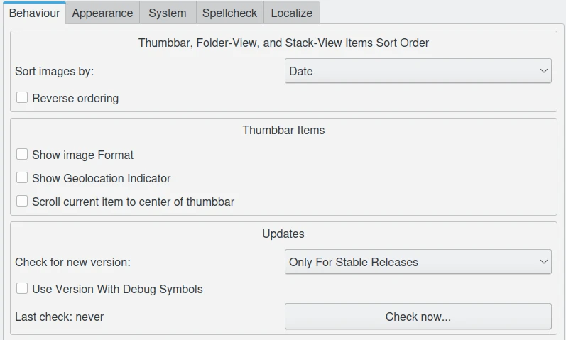
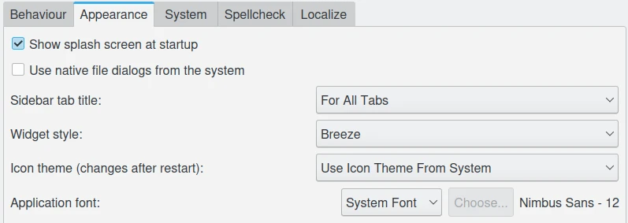
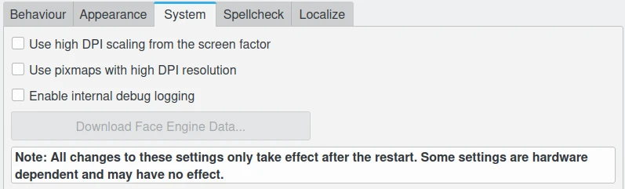

.. meta::
   :description: The Showfoto Setup
   :keywords: digiKam, documentation, user manual, photo management, open source, free, learn, easy, image, editor, showfoto, setup

.. metadata-placeholder

   :authors: - digiKam Team

   :license: see Credits and License page for details (https://docs.digikam.org/en/credits_license.html)

.. _showfoto_setup:

Setup
=====

.. contents::

Overview
--------

Showfoto has a limited configuration entries compared to digiKam, but you will found mostly the same views for the shared features between both applications. Also, this section will presents the slight differences and supplemental features available in Showfoto. To access these settings select :menuselection:`Settings --> Configure Showfoto...` from the menu-bar.

.. figure:: images/showfoto_setup_dialog.webp
    :alt:
    :align: center

    The Showfoto Stand-Alone Editor Setup Dialog

Editor Window
-------------

The Showfoto **Editor Window** settings page is the same than digiKam Image Editor. Look  :ref:`this section <window_settings>` from the manual for details.

Metadata
--------

The Showfoto **Metadata** settings page only includes few common options that you can found into  :ref:`this section <metadata_rotation>` from the digiKam manual.

.. figure:: images/showfoto_setup_metadata.webp
    :alt:
    :align: center

    The Showfoto Stand-Alone Editor Setup Metadata Page

Tool Tip
--------

.. figure:: images/showfoto_setup_tooltip.webp
    :alt:
    :align: center

    The Showfoto Stand-Alone Editor Setup Tooltip Page

RAW Decoding
------------

The Showfoto **RAW Decoding** settings page is the same than digiKam Image Editor. Look  :ref:`this section <setup_raw>` from the manual for details.

Color Management
----------------

The Showfoto **Color Management** settings page is the same than digiKam Image Editor. Look  :ref:`this section <cm_settings>` from the manual for details.

Save Images
-----------

The Showfoto **Save Images** settings page is the same than digiKam Image Editor. Look  :ref:`this section <saveimage_settings>` from the manual for details.

Plugins
-------

The Showfoto **Plugins** settings page is mostly the same than digiKam Image Editor. Look  :ref:`this section <plugins_settings>` from the manual for details.

.. note::

    Showfoto does not support the **Batch Queue Manager** plugins. This part does not exist in this view compared to digiKam

Miscellaneous
-------------

    The Showfoto Stand-Alone Editor Setup Misc Behaviour Page

    The Showfoto Stand-Alone Editor Setup Misc Appearance Page

    The Showfoto Stand-Alone Editor Setup Misc System Page
