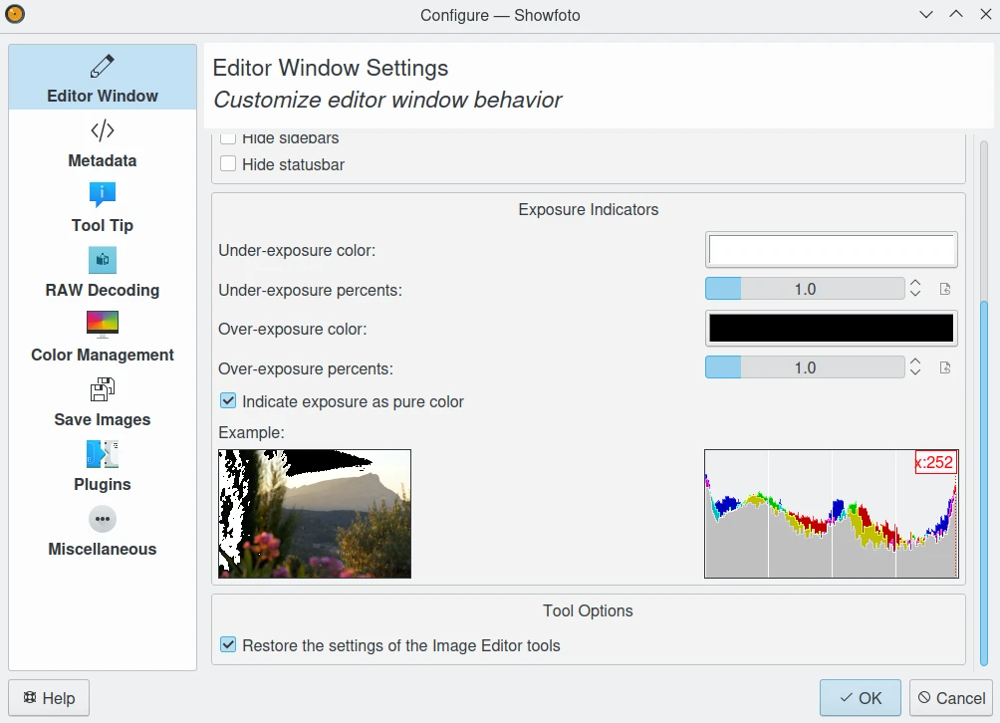

.. meta::
   :description: The Showfoto Setup
   :keywords: digiKam, documentation, user manual, photo management, open source, free, learn, easy, image, editor, showfoto, setup

.. metadata-placeholder

   :authors: - digiKam Team

   :license: see Credits and License page for details (https://docs.digikam.org/en/credits_license.html)

.. _showfoto_setup:

Setup
=====

.. contents::

Showfoto has a limited configuration entries compared to digiKam, but you will found mostly the same views for the shared features between both applications. Also, this section will presents the slight differences and supplemental features available in Showfoto.

    The Showfoto Stand-Alone Editor Setup Dialog

