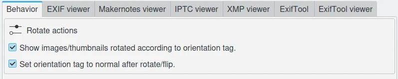
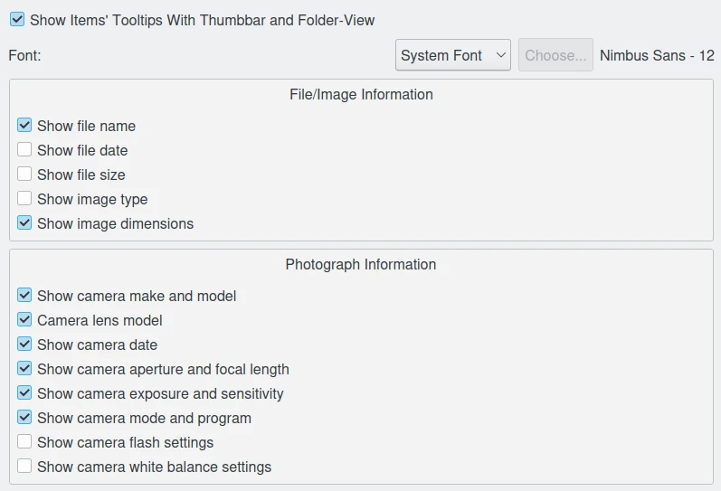

.. meta::
   :description: The Showfoto Setup
   :keywords: digiKam, documentation, user manual, photo management, open source, free, learn, easy, image, editor, showfoto, setup

.. metadata-placeholder

   :authors: - digiKam Team

   :license: see Credits and License page for details (https://docs.digikam.org/en/credits_license.html)

.. _showfoto_setup:

Setup
=====

.. contents::

Overview
--------

Showfoto has a limited configuration entries compared to digiKam, but you will found mostly the same views for the shared features between both applications. Also, this section will presents the slight differences and supplemental features available in Showfoto. To access these settings select :menuselection:`Settings --> Configure Showfoto...` from the menu-bar.

.. figure:: images/showfoto_setup_dialog.webp
    :alt:
    :align: center

    The Showfoto Stand-Alone Editor Setup Dialog

Editor Window
-------------

The Showfoto **Editor Window** settings page is the same than digiKam Image Editor. Look :ref:`this section <window_settings>` from the manual for details.

Metadata
--------

The Showfoto **Metadata** settings page only includes few common options that you can found into :ref:`this section <metadata_rotation>` from the digiKam manual.

    The Showfoto Stand-Alone Editor Setup Metadata Page

Tool Tip
--------

The Showfoto **Tooltip** settings page is similar :ref:`than digiKam <tooltip_settings>`. The main difference with digiKam is the non support of extra information stored in database and the video metadata. Tooltips are displayed over the **Thumbbar** items and the list-view thumbnails (eg. **Folders** tab, **Stack** tab, and plugins).

    The Showfoto Stand-Alone Editor Setup Tooltip Page

RAW Decoding
------------

The Showfoto **RAW Decoding** settings page is the same than digiKam Image Editor. Look :ref:`this section <setup_raw>` from the manual for details.

Color Management
----------------

The Showfoto **Color Management** settings page is the same than digiKam Image Editor. Look :ref:`this section <cm_settings>` from the manual for details.

Save Images
-----------

The Showfoto **Save Images** settings page is the same than digiKam Image Editor. Look :ref:`this section <saveimage_settings>` from the manual for details.

Plugins
-------

The Showfoto **Plugins** settings page is mostly the same than digiKam Image Editor. Look :ref:`this section <plugins_settings>` from the manual for details.

.. note::

    Showfoto does not support the **Batch Queue Manager** plugins. This tab does not exist in this view compared to digiKam.

Miscellaneous
-------------

The Showfoto **Miscellaneous** settings page is less complex :ref:`than digiKam <miscs_settings>`, but **SpellCheck** and **Localize** tabs are exactly the same. The **Grouping** tab present in digiKam does not exist in Showfoto due to the lack of database support. The differences are located mostly in tabs listed below:

    - In **Behaviour** tab, Showfoto propose some options to **Sort Order** the icon-views as the **Thumbbar** and list-view available in **Folders** and **Stack** tabs from left side-bar. Information show as overlay with **Thumbbar** can be also customized. The **Updates** view to checkout new program version is exactly the same than digiKam.

    .. figure:: images/showfoto_setup_misc_behaviour.webp
        :alt:
        :align: center

        The Showfoto Stand-Alone Editor Setup Misc Behaviour Page

    - The **Appearance** tab is a reduced version than digiKam. Less options are presented here, but fundamentally, it's the same. See :ref:`this section <appearance_settings>` for details.

    .. figure:: images/showfoto_setup_misc_appearance.webp
        :alt:
        :align: center

        The Showfoto Stand-Alone Editor Setup Misc Appearance Page

    - As Appearance, the **System** tab is also a reduced version than digiKam one. See :ref:`this section <system_settings>` for details.

    .. figure:: images/showfoto_setup_misc_system.webp
        :alt:
        :align: center

        The Showfoto Stand-Alone Editor Setup Misc System Page
