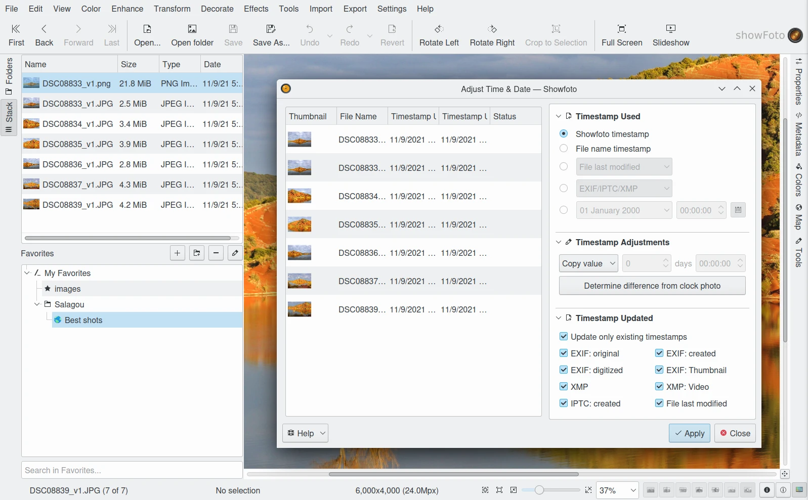
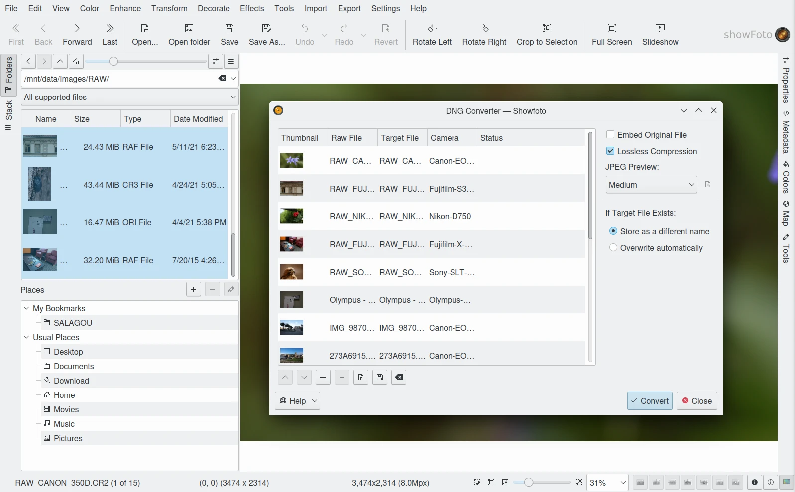

.. meta::
   :description: The Showfoto Tools
   :keywords: digiKam, documentation, user manual, photo management, open source, free, learn, easy, image, editor, showfoto, tools

.. metadata-placeholder

   :authors: - digiKam Team

   :license: see Credits and License page for details (https://docs.digikam.org/en/credits_license.html)

.. _showfoto_tools:

Tools
=====

.. contents::

Overview
--------

Mostly, Showfoto provides the same tools from digiKam Image Editor, in native or as plugins. All :ref:`Colors <colors_tools>`, :ref:`Effects <effects_tools>`, :ref:`Transform <transform_tools>`, :ref:`Decorate <decorate_tools>`, and :ref:`Enhancement <enhancement_tools>` tools are there. Showfoto inherits also of **Raw Import** tool to handle RAW demosaicing operations.

.. figure:: images/showfoto_apple_proraw.webp
    :alt:
    :align: center

    The Showfoto RAW Import Tool Processing a ProRAW File Taken with an Apple Iphone

With Showfoto, you can also export items with :ref:`web-service tools <export_tools>`, as Flickr or Google, exactly like you can do in digiKam.

Post-Processing
---------------

Even if Showfoto do not provides something like the digiKam **Batch Queue Manager**, it can process files in batch. Plugins as **Time Adjust**, **Print Wizzard**, **Metadata Editor**, **HTML Gallery**, etc. are compatible with Showfoto. The main difference to deal with this tools compared to digiKam is the way to pass items to process in the tools. Showfoto do not have an Icon-View as digiKam, but it have the **Stack View** and **Thumbbar** containers. When a :ref:`Post Processing <post_processing>` tool is called from Showfoto, the contents of the Stack or the Thumbbar are loaded in the tool, and of course, you can personalize this list later in the in plugin.

    The Showfoto Running Time Adjust Plugin Over the Contents loaded from the Current Stack

DNG Converter
-------------

One very important tool available in digiKam Batch Queue Manager is also usable in Showfoto. It's the famous :ref:`DNG Converter <dng_converter>` used to migrate proprietary RAW data containers to the open-standardized `Digital Negative format <https://en.wikipedia.org/wiki/Digital_Negative>`_.

In Showfoto, this tool run as stand-alone version like **Time Adjust** plugin. It work Mostly like the original from the digiKam Batch Queue Manager. You can start it from the :menuselection:`Tools --> DNG Converter...` menu entry.

    The Showfoto Running DNG Converter Plugin
