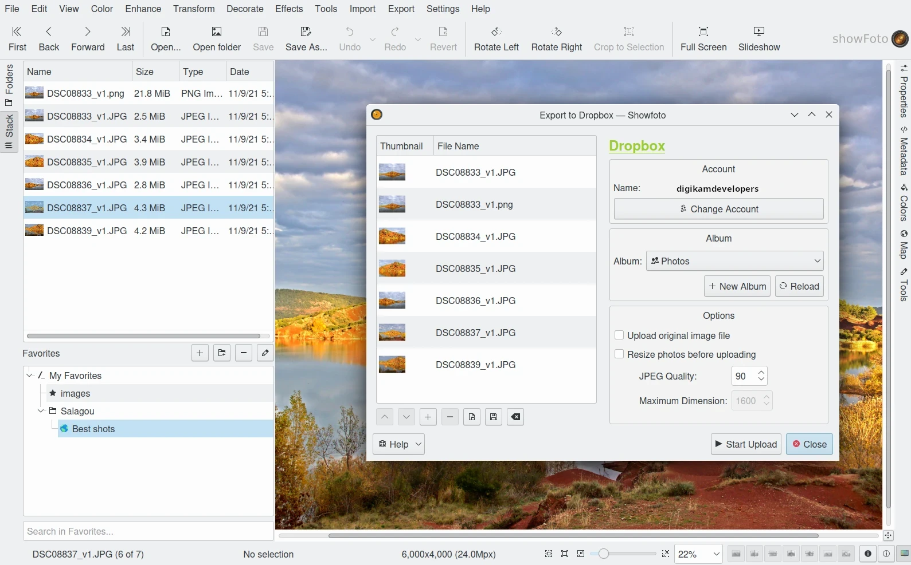

.. meta::
   :description: The Showfoto Tools
   :keywords: digiKam, documentation, user manual, photo management, open source, free, learn, easy, image, editor, showfoto, tools

.. metadata-placeholder

   :authors: - digiKam Team

   :license: see Credits and License page for details (https://docs.digikam.org/en/credits_license.html)

.. _showfoto_tools:

:ref:`Tools <showfoto_editor>`
==============================

.. contents::

Overview
--------

Showfoto mostly provides the same tools as the digiKam Image Editor, in native form or as plugins. All :ref:`Colors <colors_tools>`, :ref:`Effects <effects_tools>`, :ref:`Transform <transform_tools>`, :ref:`Decorate <decorate_tools>`, and :ref:`Enhancement <enhancement_tools>` tools are there. Showfoto also inherits the **Raw Import** tool to handle RAW demosaicing operations.

.. figure:: images/showfoto_apple_proraw.webp
    :alt:
    :align: center

    The Showfoto loading a DNG-Based Apple ProRAW File Taken with an iPhone

.. _showfoto_postprocessing:

Post-Processing
---------------

Even if Showfoto does not provide something like the digiKam **Batch Queue Manager**, it can batch process files. Plugins such as **Time Adjust**, **Print Wizard**, **Metadata Editor**, **HTML Gallery**, etc. are compatible with Showfoto. The main difference with these tools compared to digiKam is the way items are passed into the tools for processing. Showfoto does not have an Icon-View like digiKam, but it has the **Stack View** and **Thumbbar** containers. When a :ref:`Post Processing <post_processing>` tool is called from Showfoto, the contents of the Stack or the Thumbbar are loaded into the tool, and of course, you can make adjustments to this list later in the plugin.

.. figure:: images/showfoto_time_adjust.webp
    :alt:
    :align: center

    The Showfoto Running Time Adjust Plugin Over the Contents loaded from the Current Stack

With Showfoto, you can also export items with :ref:`web-service tools <export_tools>`, such as Flickr or Google, exactly like you can do in digiKam.

    The Showfoto Exporting the Current Stack to Dropbox Web-Service

.. _showfoto_dngconvert:

DNG Converter
-------------

One very important tool available in digiKam's Batch Queue Manager is also usable in Showfoto. It's the famous :ref:`DNG Converter <dng_converter>` used to migrate proprietary RAW data containers to the open-standardized `Digital Negative format <https://en.wikipedia.org/wiki/Digital_Negative>`_.

In Showfoto, this tool runs as a stand-alone version like the **Time Adjust** plugin. It works mostly like the original from the digiKam Batch Queue Manager. You can start it from the :menuselection:`Tools --> DNG Converter...` menu entry.

.. figure:: images/showfoto_dng_converter.webp
    :alt:
    :align: center

    The Showfoto Running DNG Converter Plugin
