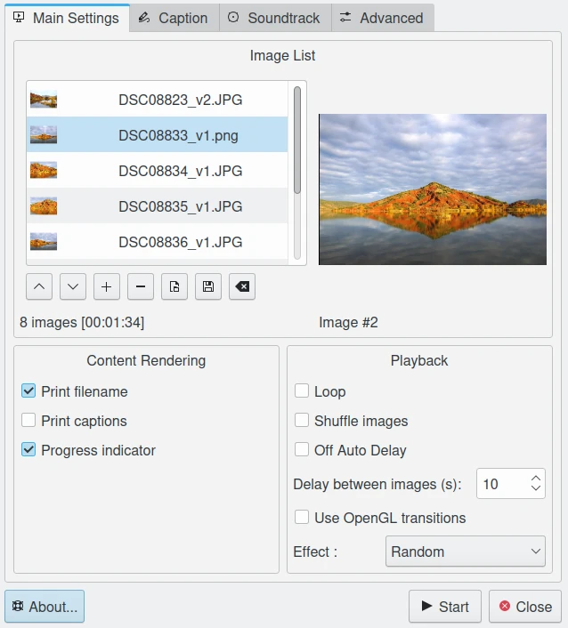
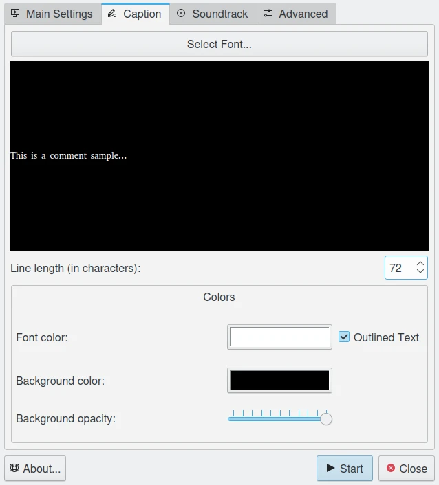
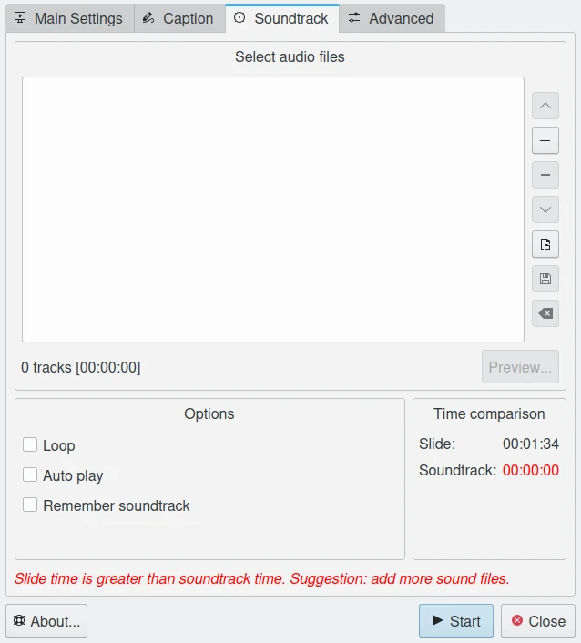
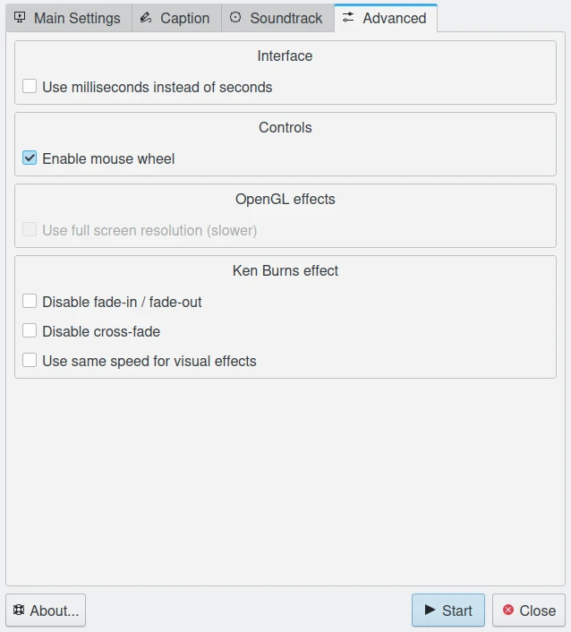
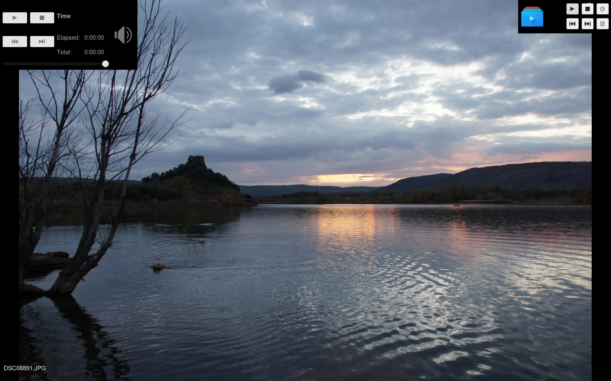

.. meta::
   :description: Using digiKam Presentation Tool
   :keywords: digiKam, documentation, user manual, photo management, open source, free, learn, easy, slide, presentation

.. metadata-placeholder

   :authors: - digiKam Team

   :license: see Credits and License page for details (https://docs.digikam.org/en/credits_license.html)

.. _presentation_tool:

Presentation Tool
=================

.. contents::

The “Presentation” tool creates a configurable full screen slide-show of your images using advanced visual effects.

With this tool you can create a perfect slide show with just three mouse clicks. When opening the tool from the View --> Presentation menu, the Presentation window **Main** page will appear asking questions as to how you want to stage your slide show. You can choose between the selected images or all images in the same album.

The **Use OpenGL Transitions** checkbox enables very smooth image transitions using the OpenGL display mode. Be sure you have OpenGL enabled on your graphics card, since otherwise the slideshow will be very slow.

The **Print Filename** checkbox enables displaying the image filename in the lower left corner.

The **Loop** checkbox will enable running the whole show in an endless loop (until manually stopped with Esc).

The **Shuffle Images** checkbox will enable displaying the images randomly (not using the current images collection order).

The **Delay Between Images** may be set in millisecond steps. 1500 milliseconds correspond to 1.5 seconds and is a good default value. The best timing depends also a bit on your computer power and the transition effect. Try it out before you show it to your friends!

There are more than a dozen **Transition Effects** available to choose from. The **Random** selection will change the transition effect with every image. 

The **Caption** page from the tool allows to customize the font properties to render item description over the screen.

The **Soundtrack** page from the tool allows to append audio tracks to play while slideshow.

The **Advanced** page from the tool allows to customize special slideshow settings to use in particular conditions.

During the slide show, you can access a toolbar on the upper left screen corner. Move the mouse cursor to the top left of the screen to access it.

With this tool bar, you can drive the progress of the slide show. You can pause or play the slide show, go back to the preview image, go to the next image, and stop the slide show.

In the lower left screen corner you can see the current image file name, the current image ID, and the total number of images included in the slide show.

