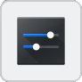

.. meta::
   :description: Using digiKam Basic Slide Tool
   :keywords: digiKam, documentation, user manual, photo management, open source, free, learn, easy, slide

.. metadata-placeholder

   :authors: - digiKam Team

   :license: see Credits and License page for details (https://docs.digikam.org/en/credits_license.html)

.. _slide_tool:

:ref:`Basic Slide Show <slideshow_tools>`
=========================================

.. |exit| image:: images/slideshow_icon_exit.webp
    :height: 20px

This tool renders a series of items as a basic slide-show. To run this tool you can use the menu entry :menuselection:`View --> Slideshow` sub-menus, click on **Slideshow** in the toolbar, or simply press the **Show FullScreen** button on top of any Icon-View item.

.. figure:: images/slide_button.webp
    :alt:
    :align: center

    The Icon-View Item Show FullScreen Overlay Button

.. note::

    The **Show FullScreen** button will be visible only if you turn on the right option from :menuselection:`Settings --> Configure digiKam... --> Views page --> Icons tab`.

The basic slideshow tool will render items in the full screen without visual effects and without zooming. It is a powerful to quickly review album items. This tool can play album contents in a recursive mode that includes any nested child albums.

.. figure:: images/slide_view.webp
    :alt:
    :align: center

    The Basic Slide-Show View Displaying Item and Properties

Lots of item properties can be displayed as overlay while displaying contents. The ones below are shown on the bottom left side as an **OSD (On Screen Display)**.

.. figure:: images/slide_osd.webp
    :alt:
    :align: center

    The Basic Slide-Show Provides an OSD to Show Details and Control the Contents

The on-screen controls for the slideshow are:

    - |pause| |play| Pause / Play
    - |previous| |next| Previous / Next item
    - |exit| Exit slideshow
    - |time| Set time between images
    - |trash| Delete the current slide (asks for confirmation)
    - |settings| Adjust slideshow settings

Clicking the |settings| button brings up the slide show configuration dialog.

.. figure:: images/slide_config.webp
    :alt:
    :align: center

    The Basic Slide-Show Configuration Dialog

The basic slide show configuration should be easy to understand. The upper slider adjusts the time between image transitions; usually a time of 4-5 seconds is good. The other check boxes enable/disable the metadata to be shown on the bottom of the slide show images during display.

.. note::

    The **Shuffle Images** mode is only available in automatic playback, i.e. when you start the slide show via the menu or toolbar button. It does not work in **Preview** mode when you start from the **Play** button icon in the thumbnail or image preview.

The keyboard and mouse can be used to quickly navigate between items in the slideshow:

- Item Access

    Previous Item:
        :kbd:`Up` key
        :kbd:`PgUp` key
        :kbd:`Left` key
        Mouse wheel up
        Left mouse button

    Next Item:
        :kbd:`Down` key
        :kbd:`PgDown` key
        :kbd:`Right` key
        Mouse wheel down
        Right mouse button

    Pause/Start:
        :kbd:`Space` key

    Slideshow Settings:
        :kbd:`Alt+P` key

    Hide/Show Properties:
        :kbd:`Alt+Y` key

    Quit:
        :kbd:`Esc` key

- Item Properties

    Change Tags:
        Use Tags keyboard shortcuts

    Change Rating:
        Use Rating keyboard shortcuts

    Change Color Label:
        Use Color label keyboard shortcuts

    Change Pick Label:
        Use Pick label keyboard shortcuts

- Others

    Show help dialog:
        :kbd:`F1` key
