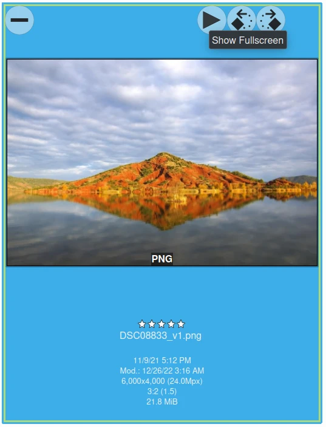
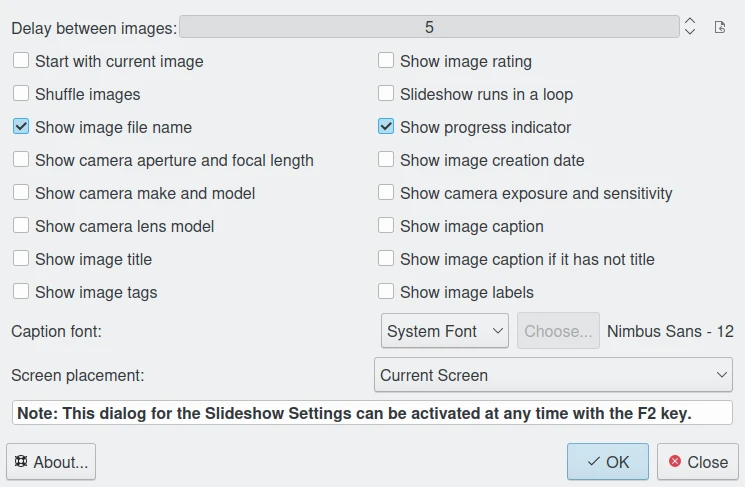

.. meta::
   :description: Using digiKam Basic Slide Tool
   :keywords: digiKam, documentation, user manual, photo management, open source, free, learn, easy, slide

.. metadata-placeholder

   :authors: - digiKam Team (see Credits and License for details)

   :license: Creative Commons License SA 4.0

.. _slide_tool:

Basic Slide Show
================

.. contents::

This tool render a series of items as a basic slide-show. To run this tool you can use the menu entry View --> Slideshow sub-menus or simply press the **Show FullScreen** button on top of icon-view item.

The basic slideshow tool will render items on full screen without visual effects and without zomming support. It powerfull to review quickly album items.
This tool can play album contents in recursive mode with children albums if any.

Plenty of items properties can be displayed as overlay while running. These one are show on bottom left side as an OSD (On Screen Display).

.. figure:: images/slide_osd.webp

The basic slide show configuration should be easy to understand. The upper slider adjusts the time between image transitions; usually a time of 4-5 seconds is good. The other check boxes enable/disable the metadata to be shown on the bottom of the slide show images during display.

.. note::

    The **Shuffle Images** mode is only available in automatic playback, i.e. when you start the slide show via the menu or toolbar button. It do not work in **Preview** mode when you start on the "play" button icon in the thumbnail or image preview.

Usage from Keyboard and mouse to quickly navigate between items is listen below:

- Item Access

    Previous Item:
        Up key
        PgUp key
        Left key
        Mouse wheel up
        Left mouse button

    Next Item:
        Down key
        PgDown key
        Right key
        Mouse wheel down
        Right mouse button

    Pause/Start:
        Space key

    Slideshow Settings:
        F2 key

    Hide/Show Properties:
        F4 key

    Quit:
        Esc key

- Item Properties

    Change Tags:
        Use Tags keyboard shortcuts

    Change Rating:
        Use Rating keyboard shortcuts

    Change Color Label:
        Use Color label keyboard shortcuts

    Change Pick Label:
        Use Pick label keyboard shortcuts

- Others

    Show help dialog:
        F1 key
