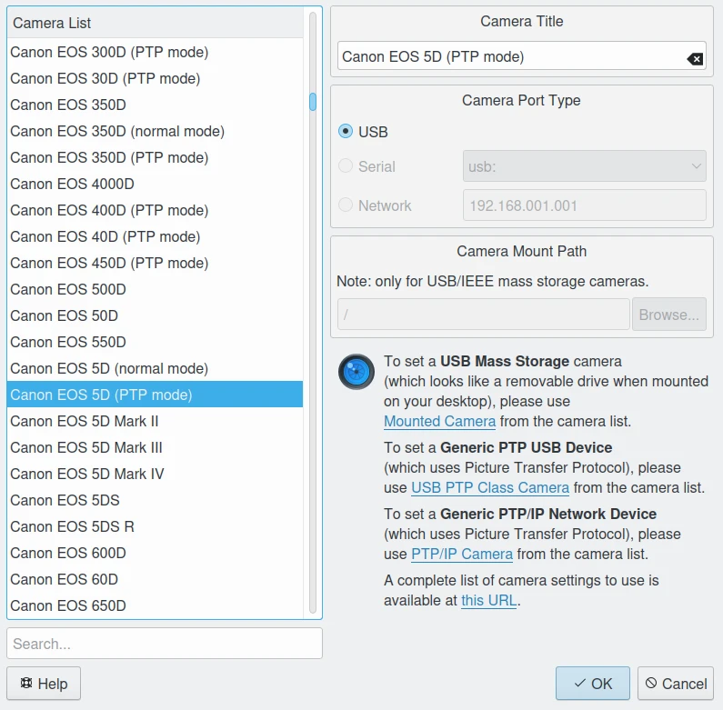

.. meta::
   :description: Camera and Mass Storage Devices Supported by digiKam
   :keywords: digiKam, documentation, user manual, photo management, open source, free, learn, easy, camera, gphoto, usb, mass, storage

.. metadata-placeholder

   :authors: - digiKam Team

   :license: see Credits and License page for details (https://docs.digikam.org/en/credits_license.html)

.. _camera_devices:

Cameras and Mass Storage Devices
================================

.. contents::

Introduction
------------

An easy-to-use camera interface is provided that will download photographs directly from your digital camera into digiKam Albums. More than `2700 digital cameras <http://www.gphoto.org/proj/libgphoto2/support.php>`_ are supported by the gPhoto library. Of course, any media or card reader supported by your operating system will also interface with digiKam.

.. note::

     Camera import is currently not supported on Windows Systems due limitations in the Gphoto2 library.

.. note::

     digiKam fully supports RAW files, using the libraw library for reading and processing RAW image files. You can find out if your particular camera is supported by accessing the :menuselection:`Help --> Supported RAW Cameras` menu.

     See the :ref:`RAW Decoding Settings <setup_raw>` section for information on setting up digiKam to work with RAW files. And see the :ref:`RAW Workflow <rawprocessing_workflow>` section for a description of how to work with RAW files in digiKam.

Most current digital cameras store data on Compact Flash™ Memory cards and use USB or FireWire (IEEE-1394 or i-link) connections for data transmission. The actual transfers to a host computer are commonly carried out using the USB Mass Storage device class (so that the camera appears as a disk drive) or using the Picture Transfer Protocol (PTP) and its derivatives. Alternatively, older cameras may use a Serial Port (RS-232) connection.

Transfers using gPhoto: PTP and Serial Port
--------------------------------------------

digiKam employs the gPhoto library to communicate with digital still cameras. Gphoto is a free, redistributable set of digital camera software applications which supports a growing number of cameras. Gphoto has support for the Picture Transfer Protocol, which is a widely supported protocol developed by the International Imaging Industry Association to allow the transfer of images from digital cameras to computers and other peripheral devices without the need of additional device drivers.

Many old digital still cameras used the Serial Port to communicate with host computers. Because photographs are big files and serial port transfers are slow, this connection is now obsolete. digiKam still supports these cameras and performs image transfers using the gPhoto program. You can find a complete list of supported digital cameras at `this url <http://www.gphoto.org/proj/libgphoto2/support.php>`_.

.. note::

    Gphoto needs to be built with libexif to properly retrieve thumbnails for use in digiKam. Exif support is required for thumbnail retrieval on some libgphoto2 camera drivers. If Exif support is not set with gPhoto, you might not see thumbnails or the thumbnail extraction may be very slow.

    The digiKam Setup Dialog to Configure a gPhoto Camera Device

Transfers using Mass Storage device
-----------------------------------

For devices that are not directly supported by gPhoto, there is support for the Mass Storage protocol, which is well supported under GNU/Linux®. This includes many digital cameras and Memory Card Readers. Mass Storage interfaces are:

    - **USB Mass Storage**: a computer interface using communication protocols defined by the USB Implementers Forum that runs on the Universal Serial Bus. This standard provides an interface to a variety of storage devices, including digital cameras.  Almost all recent digital cameras support USB version 1 and eventually will support USB version 2.

    - **FireWire Mass Storage**: a computer interface using communication protocols developed primarily by Apple Computer in the 1990s. FireWire offers high-speed communications and isochronous real-time data services. Like USB Mass Storage, this standard provides an interface to a variety of storage devices, including digital still cameras, although few cameras support FireWire.

To use a generic Mass Storage device with digiKam, select :menuselection:`Import --> Camera --> Add Camera Manually...`, add your device and set the correct mount point path.

For details see the :ref:`Camera settings <camera_settings>` section of the Setup Application chapter.
