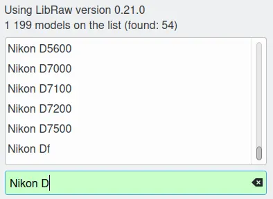

.. meta::
   :description: Image File Formats Supported by digiKam
   :keywords: digiKam, documentation, user manual, photo management, open source, free, learn, easy, JPEG, PNG, TIFF, PGF, RAW

.. metadata-placeholder

   :authors: - digiKam Team

   :license: see Credits and License page for details (https://docs.digikam.org/en/credits_license.html)

.. _image_formats:

Image Files
===========

.. contents::

Introduction
------------

digiKam relies on a number of libraries and support packages to load and save image formats. Which image formats are available will depend on the availability of these libraries on your system and, in some cases, on the way that those libraries have been compiled. On most distributions you will find that a wide range of image formats are viewable within digiKam.

This dependence on other libraries means that it is not possible to give a definitive list of all of the formats that will be available on your system. At the very least JPEG, PNG, and TIFF should be available.

digiKam only displays files that are in formats that it understands. It does this by looking at the file extension on the files and checking this against a predefined list. If the file extension is in the list digiKam will show the file in the Image View, provided the appropriate library is installed. You can change the list of file extensions that digiKam will accept; see :ref:`this configuration section <mime_types_settings>` for more details.

Almost all digital cameras store photographs in one of two formats: JPEG or RAW. Many cameras enable you to select which of these formats to use. A full description of these formats can be found `at the Wikipedia <https://en.wikipedia.org/wiki/Image_file_formats>`_. digiKam supports both of these formats.

Still Image Compression
-----------------------

Image compression is the application of data compression schemes on digital images. It is done through reducing redundancy of the image data in order to be able to store or transmit data in an efficient form.

Image compression can be lossy or lossless. Lossless compression methods are always preferred for their high preservation value for archival purposes before applying transformations like cropping, resizing, color corrections, etc. This is because lossy compression methods, especially when used at low bit rates, introduce compression artifacts. Lossy methods are suitable for natural images such as photos in applications where minor (sometimes imperceptible) loss of fidelity is acceptable to achieve a substantial reduction in file size. Lossy compression is good for image publishing on the Internet. 

.. _image_jpeg:

JPEG
----

`Joint Photographic Experts Group <https://en.wikipedia.org/wiki/JPEG>`_ is a compressed format that trades some of the image quality to keep file sizes small. In fact, most cameras save their images in this format unless you specify otherwise. A JPEG image is stored using lossy compression, and you can vary the amount of compression. This allows you to choose between lower compression and higher image quality or greater compression and poorer quality. The only reason to choose higher compression is because it creates smaller files so you can store more images, and it's easier to send them by e-mail or post them on the Web. Most cameras give you two or three choices equivalent to good, better, best, although the names vary.

.. _image_jpeg2000:

JPEG 2000
---------

`JPEG 2000 <https://en.wikipedia.org/wiki/JPEG_2000>`_ is an improvement intended to replace the older JPEG by the JPEG committee, introduced in 2000. It provides for the same compression ratio with better (smoother) results compared to JPEG. The 2000 version has the option of being lossless if so specified in the settings. It supports metadata and 12 bits color depth.

.. _image_tiff:

TIFF
----

`Tagged Image File Format <https://en.wikipedia.org/wiki/TIFF>`_ has been widely accepted and widely supported as an image format. Commonly, TIFF may be stored by the camera in uncompressed form or using a lossless compression algorithm (Deflate). It maintains higher image quality but at the expense of much larger file sizes. Some cameras let you save your images in this format, and it is a popular format because of its lossless compression algorithm. The problem is that the format has been altered by so many people that there are now 50 or more flavors and not all are recognizable by programs.

.. _image_png:

PNG
---

`Portable Network Graphics <https://en.wikipedia.org/wiki/Portable_Network_Graphics>`_ is an image format that was developed as a replacement for a number of older, in the 1990's widely used, image file formats. It is a lossless format like TIFF but it is much more compact and saves disk space. Although your camera is unlikely to support PNG, some people like to convert their photographs to PNG as soon as they get them on their computer. Unlike JPEG, PNG images do not lose quality every time you re-encode them after modification. digiKam fully supports PNG images and the Batch Queue Manager can convert a batch of images from any supported format to PNG (and other formats) in one step.

PNG is an extensible file format for the lossless, portable, well-compressed storage of raster images. PNG provides a patent-free replacement for GIF and can also replace many common uses of TIFF. PNG is designed to work well in on-line viewing applications, such as the World Wide Web, so it is fully streamable with a progressive display option. Also, PNG can store gamma and chromaticity data for improved color matching on heterogeneous platforms. PNG supports 8 and 16 bits / colors /pixels depth. It's the perfect file format to archive your photographs.

.. _image_pgf:

PGF
---

`Progressive Graphics File <https://en.wikipedia.org/wiki/Progressive_Graphics_File>`_ is another not so known but open file image format. Wavelet-based, it allows lossless and lossy data compression. PGF compares well with JPEG 2000 but it was developed for speed (compression/decompression) rather than to be the best at compression ratio. At the same file size a PGF file looks significantly better than a JPEG one, while remaining very good at progressive display too. Thus it should be well-suited for photo archiving and **digiKam uses this format in database to store thumbnails**.

.. _image_webp:

WEBP
----

`Web Photo <https://en.wikipedia.org/wiki/WebP>`_ is an image file format developed by Google intended as a replacement for JPEG, PNG, and GIF file formats for the Internet uses. It supports both lossy and lossless compression as well as animation and alpha transparency. It supports metadata but colors depth is limited to 8 bits. WebP was first announced by Google in 2010 and produce files that were smaller than JPEG files for comparable image quality.

.. _image_heif:

HEIF
----

`High Efficiency Image File Format <https://en.wikipedia.org/wiki/High_Efficiency_Image_File_Format>`_ is a container format introduced in 2015 for storing individual digital images and image sequences. The standard covers multimedia files that can also include other media streams, such as timed text, audio and video. HEIF can store images encoded with multiple coding formats, for example both SDR and HDR images. HEVC is an image and video encoding format and the default image codec used with HEIF. HEIF files containing HEVC-encoded images are also known as HEIC files. Such files require less storage space than the equivalent quality JPEG. HEIF support 12 bits color depth and metadata. This format have been adopted in 2017 to store images in Apple devices.

.. _image_avif:

AVIF
----

`AV1 Image File Format <https://en.wikipedia.org/wiki/AVIF>`_ is an open, royalty-free image file format specification introduced in 2019 for storing images or image sequences compressed with AV1 in the HEIF container format. It competes with HEIC, which uses the same container format built upon ISOBMFF, but HEVC for compression. AVIF showed better compression efficiency than JPEG as well as better detail preservation, fewer blocking artifacts and less color bleeding around hard edges in composites of natural images, text, and graphics. AVIF support 12 bits color depth and metadata.

.. _image_jxl:

JXL
---

`JPEG XL <https://en.wikipedia.org/wiki/JPEG_XL>`_ is a royalty-free raster-graphics file format that supports both lossy and lossless compression. It is designed to outperform existing raster formats and thus become their universal replacement.
JPEG XL is particularly optimised for responsive Web environments, so that content renders well on a wide range of devices. Moreover, it includes several features that help transition from the legacy JPEG format. JPEG XL was introduced at the end of 2020. JPEG XL support 16 bits color depth and metadata.

.. note::

    Digital still image formats supports is provided by digiKam Loader Plugins. You can see a list of available plugins in **Plugins/Image Loaders** section from Setup dialog.

    .. figure:: images/setup_image_loaders.webp
        :alt:
        :align: center

        The Image Loaders list from digiKam Setup dialog

.. _image_raw:

RAW
---

Some, typically more expensive, cameras allow you to store images in RAW format. RAW format is not really an image standard at all. It is different for every make of camera. RAW format images contain all the data that is taken directly from the camera's image sensor before the software in the camera applies things like white balance, sharpening etc. Storing photographs in a camera's RAW format allows you to alter settings, such as white balance, after the photograph has been taken. Most professional photographers use RAW format, because it offers them maximum flexibility. The downside is that RAW image files can be very large indeed.

If you want to learn more about RAW image format visit the very helpful guides `Wikipedia <https://en.wikipedia.org/wiki/Raw_image_format>`_, and `Cambridge in Colour <https://www.cambridgeincolour.com/tutorials/RAW-file-format.htm>`_. You can convert RAW format images into JPEG, PNG, or TIFF in digiKam using the :ref:`Image Editor <rawprocessing_workflow>` or the :ref:`Batch Queue Manager <raw_converter>`.

digiKam supports RAW image loading only, relying on the `Libraw library <https://www.libraw.org/>`_ which is included in digiKam core and supports over **1000** RAW file formats. The table below shows a short list of camera RAW files supported by digiKam:

======================= ======================================================
RAW File Format         Description
======================= ======================================================
CRW, CR2, CR3           Canon digital camera RAW file formats
NEF, NRW                Nikon digital camera RAW file format
ORF, ORI                Olympus digital camera RAW file format
RAF                     Fuji digital camera RAW file format
RWL                     Leica camera RAW file format
PEF, PTX                Pentax digital camera RAW file format
X3F                     Sigma digital camera RAW file format
DCR, KDC, DC2, K25      Kodak digital camera RAW file format
SRF, SR2, ARW, MRW, MDC Sony/Minolta digital camera RAW file format
RAW                     Panasonic, Casio, Leica digital camera RAW file format
DNG (CS1, HDR)          Adobe RAW file format (Digital Negative), Apple ProRAW
BAY                     Casio RAW (Bayer)
ERF                     Epson digital camera RAW file format
FFF, 3FR                Imacon/Hasselblad RAW format
RW2                     Panasonic RAW file format
IIQ, CAP                Phase One digital camera Raw image format
RDC                     Ricoh RAW format
======================= ======================================================

If you want to know if your camera RAW file is supported by digiKam, go to :menuselection:`Help --> Supported RAW Cameras` dialog for details.

    List of RAW Camera Formats Supported in digiKam

.. _image_others:

Other Formats
-------------

digiKam relies on `ImageMagick <https://en.wikipedia.org/wiki/ImageMagick>`_ to support exotic still images when others modules fails to load file. This is the case for FITS astro-photo, JBIG, PhotoCD, FLIF, BPG, etc.  
    
.. note::

    We recommend also to read the chapter about the **file formats used for long time archiving**, from the :ref:`Digital Asset Management section <dam_fileformats>` in this manual.
