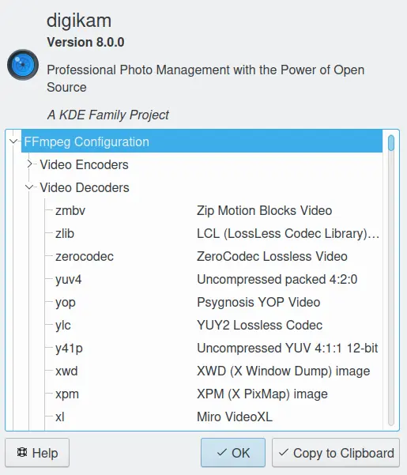

.. meta::
   :description: Movie File Formats Supported by digiKam
   :keywords: digiKam, documentation, user manual, photo management, open source, free, learn, easy, movies, formats

.. metadata-placeholder

   :authors: - digiKam Team

   :license: see Credits and License page for details (https://docs.digikam.org/en/credits_license.html)

.. _movie_formats:

:ref:`Movie Files <supported_materials>`
========================================

.. contents::

Introduction
------------

Many digital cameras support taking short movie clips. These clips are usually stored in AVI, MOV, or MP4 format. digiKam understands metadata from these formats and will generate thumbnails for these movie files.

However, digiKam is not a movie editing application and it does not have any built-in movie editing capabilities. If you double click on a movie in digiKam, you can preview the video or choose a dedicated viewing / editing application through your desktop settings. Movie files can also be viewed from within a slideshow.

Video Formats
-------------

digiKam relies on the `FFMpeg Multimedia framework <https://ffmpeg.org/>`_ to handle video files. FFmpeg is a powerful video toolkit, which include all codecs that digiKam needs to play video files.

FFmpeg codec is available under Linux® desktop, macOS, and Windows. You don't need to install extra video codecs on your computer.

    FFmpeg Features List is Available in digiKam :menuselection:`Help --> Components Info Dialog`

Video Features
--------------

digiKam is capable of reading video metadata, such as movie length, video frames per second, video size, and encoding options. Video metadata is automatically read during files scans and stored in the digiKam database so you can search for videos based on their metadata. digiKam allows you to play video in embedded preview mode, and from within a slideshow. If you are using the USB Mass Storage connection mode, then digiKam even allows previewing video from your camera device before downloading.

.. figure:: videos/preview_video_player.webp
    :alt:
    :align: center

    Screencast of digiKam Preview Mode Playing A Movie Taken with an iPhone
