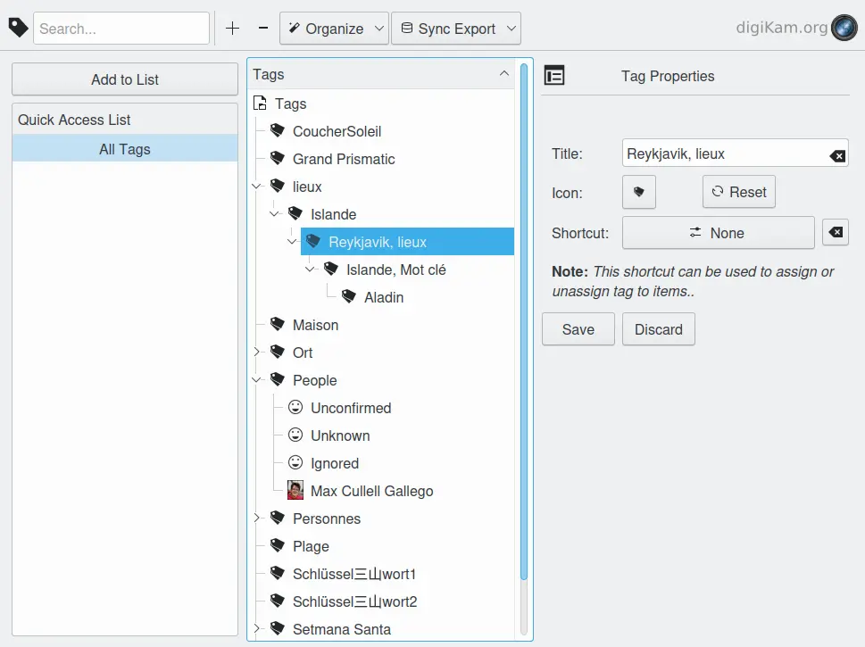

.. meta::
   :description: Overview to digiKam Tag Manager
   :keywords: digiKam, documentation, user manual, photo management, open source, free, learn, easy

.. metadata-placeholder

   :authors: - Gilles Caulier <caulier dot gilles at gmail dot com>

   :license: Creative Commons License SA 4.0

.. _tagmanager_overview:

Overview
========

.. contents::

There are certain possibilities to manage tags from the context menu on tags in the digiKam sidebars like New Tag... or Delete Tag. The Tag Manager offers a more comfortable and comprehensive way to organize your tags. For general information about tags, why and how to use them see Tags View in the Main digiKam Window chapter.

The toolbar at the top offers:

    - An adaptive search field to find certain tags in a big tree.

    - A button to add a tag as a sub-tag to the current (last clicked) tag.

    - A button to delete a tag or a selection of tags.

    - The drop down menu Organize which contains:

        - Edit Tag Title.

        - Reset Tag Icon to the standard tag icon.

        - Create Tag from Address Book.

        - Invert Selection, useful if you want to select most but not all of your tags.

        - Expand Tag Tree expands all of the nodes of the tag tree.

        - Expand Selected Nodes.

        - Remove Tag from Images un-assigns selected tag(s) from all images.

        - Delete Unassigned Tags, useful to clean up your tag tree.

    - And the drop down menu Sync Export which contains:

        - Write Tags from Database to Image.

        - Read Tags from Image (and write them to the database).

        - Wipe all Tags from Database only.

The Tag Manager window consists of two parts, the Quick Access List to the left and the Tag Tree (or parts of it) to the right. On the right sidebar you fold out additionally the properties dialog for the selected tag.

The Quick Access List allows you to display only a certain node (and its sub-nodes) in the tag tree window. Select a tag in the tag tree and click Add to List. The tag will appear in the Quick Access List. If you select it there the tag tree will show only that node which you can still expand to see the sub-nodes. Note that the tag tree will also show only a limited number of tags while using the search field. It will show only those tags that contain the string in the search field.

The Tag Properties dialog allows you to change the name of the tag, the icon used in the Tag tree and the shortcut.
